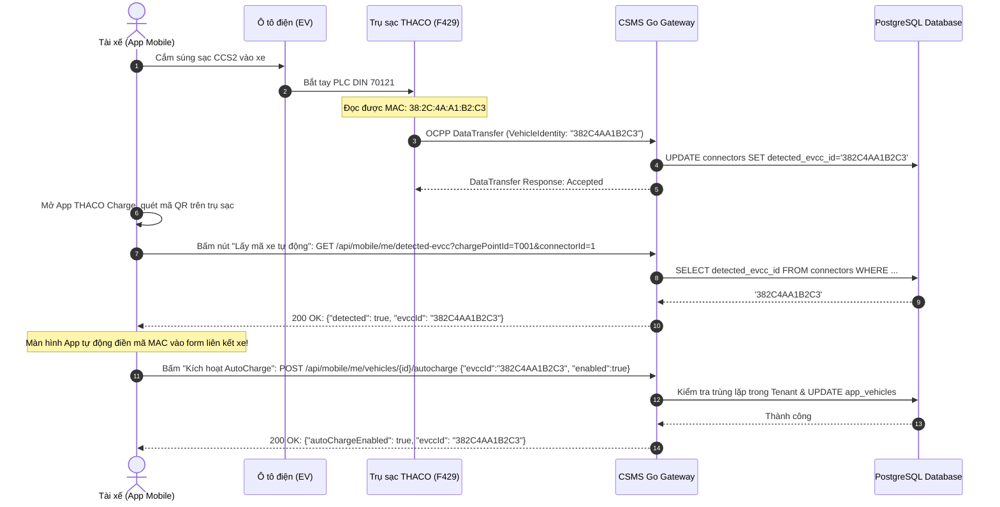
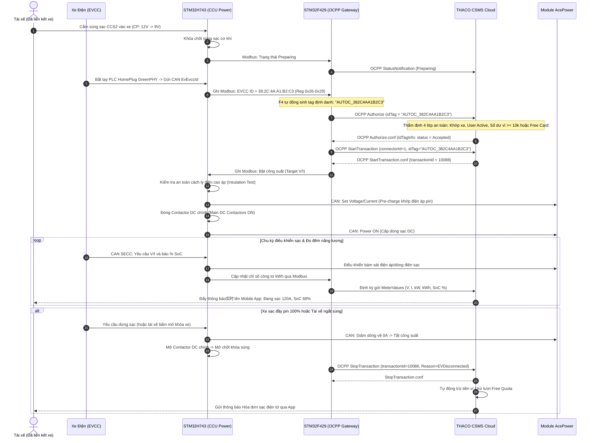

# ĐẶC TẢ KỸ THUẬT: CƠ CHẾ TRÍCH XUẤT EVCCID, LIÊN KẾT TÀI KHOẢN & CHU TRÌNH SẠC TỰ ĐỘNG (AUTOCHARGE)
## (PLUG & CHARGE VIA HARDWARE EVCCID / MAC SPECIFICATION)
### Hệ sinh thái: THACO EVSE DC Fast Charger & CSMS Cloud Platform
**Đơn vị chủ trì:** Trung tâm R&D THACO INDUSTRIES & Nhóm Kỹ thuật Firmware / Cloud  
**Phiên bản:** 2.0.0 | **Ngày ban hành:** 22/09/2026 | **Trạng thái:** Production Standard  

---

## MỤC LỤC
1. [Tóm Lược  ( Summary)](#1-tóm-lược-dành-cho-ban-lãnh-đạo-executive-summary)
   - 1.1. AutoCharge là gì và tại sao khách hàng cần?
   - 1.2. Tại sao bắt buộc phải sử dụng bản tin OCPP DataTransfer?
   - 1.3. Lợi ích kinh tế và trải nghiệm khách hàng
2. [Cơ Chế Kỹ Thuật Trích Xuất & Truyền Nhận EVCCID (Hardware to Cloud)](#2-cơ-chế-kỹ-thuật-trích-xuất--truyền-nhận-evccid-hardware-to-cloud)
   - 2.1. Tầng vật lý & Giao thức xe điện (EV <-> SECC qua PLC HomePlug GreenPHY)
   - 2.2. Tầng CAN Bus: SECC chuyển tiếp EVCCID sang STM32H743 (CCU)
   - 2.3. Tầng Inter-MCU: STM32H743 ghi thanh ghi Modbus RTU sang STM32F429
   - 2.4. Tầng OCPP 1.6J: STM32F429 gửi DataTransfer(VehicleIdentity) lên CSMS
3. [Quy Trình Thao Tác Liên Kết EVCCID Với Tài Khoản (Onboarding & Binding)](#3-quy-trình-thao-tác-liên-kết-evccid-với-tài-khoản-onboarding--binding)
   - 3.1. Phương thức 1: Nhận diện tự động tại đầu súng sạc (Zero-Touch Onboarding)
   - 3.2. Phương thức 2: Nhập thủ công hoặc Nhân viên hỗ trợ (Admin Binding)
   - 3.3. Cơ chế kiểm soát an toàn & cô lập dữ liệu phía CSMS Go Backend
4. [Chu Trình Sạc Tự Động Thực Tế Sau Khi Đã Liên Kết (End-to-End Autocharge)](#4-chu-trình-sạc-tự-động-thực-tế-sau-khi-đã-liên-kết-end-to-end-autocharge)
   - 4.1. Ma trận thứ tự ưu tiên xác thực EIM (AutoCharge > QR App > Thẻ RFID)
   - 4.2. Sơ đồ tuần tự toàn trình (End-to-End Sequence Diagram)
   - 4.3. Thẩm định an toàn 4 lớp tại CSMS Gateway (Safety & Financial Pre-auth)
   - 4.4. Đóng điện, giám sát chu kỳ sạc và kết thúc quyết toán tự động
5. [Cơ Chế An Toàn, Chống Gian Lận & Xử Lý Sự Cố](#5-cơ-chế-an-toàn-chống-gian-lận--xử-lý-sự-cố)

---

## 1. TÓM LƯỢC DÀNH CHO BAN LÃNH ĐẠO (EXECUTIVE SUMMARY)

### 1.1. AutoCharge là gì và tại sao khách hàng cần?
* **Khái niệm:** **AutoCharge** (hay Cắm là Sạc) là công nghệ định danh xe điện tự động bằng phần cứng. Khi tài xế đưa xe vào trụ sạc, họ **chỉ cần cầm súng sạc cắm vào cổng sạc của xe là quá trình sạc tự động kích hoạt** trong vòng 5–8 giây, tiền tự động trừ vào ví điện tử khi hoàn tất.
* **Xóa bỏ rào cản:** Khách hàng không cần phải mở điện thoại dưới trời mưa/nắng để quét mã QR, cũng không cần phải mang theo thẻ vật lý RFID dễ thất lạc.
* **Tương thích 100%:** Hoạt động ngay với mọi dòng ô tô điện chuẩn CCS2 đang lưu hành tại Việt Nam (VinFast VF e34, VF5, VF6, VF7, VF8, VF9; Porsche Taycan; Hyundai Ioniq 5; Audi e-tron; BMW iX...).

### 1.2. Tại sao bắt buộc phải sử dụng bản tin OCPP DataTransfer?

Để giải thích ngắn gọn, dễ hiểu và thuyết phục cho Ban Lãnh đạo:

> [!IMPORTANT]
> **3 Điểm then chốt giải thích lý do kỹ thuật sử dụng OCPP DataTransfer:**
> 
> 1. **Chuẩn quốc tế OCPP 1.6J chưa có sẵn "ô" chứa thông tin xe:**
>    - Phiên bản OCPP 1.6J (chuẩn kết nối trạm sạc toàn cầu) vốn ra đời từ thời kỳ chỉ có quẹt thẻ RFID. Chuẩn này **hoàn toàn không có trường dữ liệu chuẩn nào cho mã xe (EVCCID / MAC hay số khung VIN)**.
>    - Để gửi được mã xe lên máy chủ Cloud mà không bị lỗi tương thích chuẩn, tổ chức Open Charge Alliance (OCA) quy định bắt buộc phải sử dụng bản tin **`DataTransfer`** (kênh mở rộng dữ liệu tiêu chuẩn).
>
> 2. **Mang lại trải nghiệm "Cắm là nhận diện xe" (Zero-Touch Onboarding) cho khách hàng:**
>    - Khách hàng đi xe điện **không thể tự biết hay nhớ địa chỉ MAC của xe mình** (vì mã này nằm sâu trong chip vi mạch ẩn trên ô tô).
>    - Khi cắm súng vào xe lần đầu: Trạm sạc tự động trích xuất mã MAC và gửi lên Cloud qua `DataTransfer`. Khách hàng chỉ cần mở ứng dụng THACO Charge bấm *"Nhận diện xe"* là hệ thống tự điền mã xe — **tiện lợi, nhanh chóng, không phải gõ tay và không sợ sai sót**.
>
> 3. **Tách bạch an toàn giữa "Nhận diện thiết bị" và "Cấp điện thu tiền":**
>    - **`DataTransfer` (Giống Camera quét biển số):** Chỉ làm nhiệm vụ thông báo: *"Có xe mang mã này vừa cắm vào súng số 1"*. Bản tin này **không** kích hoạt đóng rơ-le cao áp và **không** trừ tiền khách.
>    - **`Authorize` (Giống Cổng soát vé / Trừ tiền):** Chỉ khi xe đã được liên kết hợp lệ và ví đủ tiền, trạm mới gửi bản tin `Authorize` để kích hoạt chu trình bơm điện DC.

### 1.3. Bảng so sánh phương thức sạc

| Tiêu chí | Quét mã QR qua App | Quẹt thẻ RFID vật lý | AutoCharge (EVCCID / MAC) |
| :--- | :--- | :--- | :--- |
| **Thao tác tài xế** | Mở app, bật camera, quét QR, bấm sạc | Lấy ví, rút thẻ, áp thẻ vào đầu đọc trụ | **Chỉ cần cắm súng sạc vào xe** |
| **Thời gian bắt đầu sạc** | 15 - 30 giây | 5 - 10 giây | **5 - 8 giây** |
| **Rủi ro người dùng** | Mất sóng 4G, hết pin điện thoại, màn hình lóa | Rơi thẻ, mất thẻ, quên mang thẻ | **Không rủi ro, xe chính là chiếc thẻ** |
| **Bảo mật thanh toán** | OTP/Xác thực App | Dễ bị mượn thẻ / sao chép thẻ | **Định danh duy nhất theo modem phần cứng của xe** |

---

## 2. CƠ CHẾ KỸ THUẬT TRÍCH XUẤT & TRUYỀN NHẬN EVCCID (HARDWARE TO CLOUD)

Quá trình trích xuất và vận chuyển mã định danh EVCCID diễn ra tự động qua 4 tầng kiến trúc:

```
┌────────────────────────────────────────────────────────────────────────────────────────┐
│                        KIẾN TRÚC TRÍCH XUẤT & TRUYỀN NHẬN EVCCID                      │
│                                                                                        │
│   [ XE ĐIỆN (EV) ]                                                                     │
│         │                                                                              │
│         │ Sóng mang PLC (HomePlug GreenPHY) trên chân Control Pilot (CP)               │
│         │ Chuẩn DIN 70121 / ISO 15118-2                                                │
│         ▼                                                                              │
│   [ MODULE SECC ] (Supply Equipment Communication Controller)                          │
│         │                                                                              │
│         │ CAN Bus 2.0B / FDCAN (Bản tin EvEvccId, độ dài 6-byte MAC)                   │
│         ▼                                                                              │
│   [ STM32H743 CCU ] (Bo mạch điều khiển nguồn & phối ghép công suất)                   │
│         │                                                                              │
│         │ RS485 Modbus RTU (Holding Registers 0x26 - 0x29)                             │
│         ▼                                                                              │
│   [ STM32F429 BRIDGE ] (Bo mạch Gateway truyền thông & OCPP)                           │
│         │                                                                              │
│         │ WebSocket JSON qua mạng 4G/Ethernet (OCPP 1.6J DataTransfer)                 │
│         ▼                                                                              │
│   [ THACO CSMS CLOUD ] (Go Backend Gateway & PostgreSQL)                               │
└────────────────────────────────────────────────────────────────────────────────────────┘
```

### 2.1. Tầng vật lý & Giao thức xe điện (EV <-> SECC)
* Khi tài xế cắm súng CCS2, chân **Control Pilot (CP)** sụt áp từ `12V (State A)` xuống `9V (State B)`.
* Trạm phát tín hiệu PWM tần số 1kHz, chu kỳ 5% để thông báo hỗ trợ truyền thông số mức cao **HLC (High-Level Communication)**.
* Modem viễn thông **EVCC** trên ô tô và modem **SECC** trong trụ sạc thiết lập liên kết mạng vật lý thông qua sóng mang **PLC (HomePlug GreenPHY)** trên chân CP và PE.
* Trong giai đoạn bắt tay mạng **SLAC (Signal Level Attenuation Characterization)** và thiết lập phiên **V2G (Vehicle-to-Grid)**, modem EVCC trao đổi thông tin phần cứng. Địa chỉ MAC 6-byte của modem này (ví dụ: `38:2C:4A:A1:B2:C3`) được SECC ghi nhận chính xác.

### 2.2. Tầng CAN Bus: SECC chuyển tiếp EVCCID sang STM32H743 (CCU)
* Module SECC đóng gói 6 byte địa chỉ MAC vào khung tin CAN định kỳ:
  * **Cấu trúc CAN frame:** Bản tin `SECC_EvEvccId` (định nghĩa trong `Core/secc/ccu_secc_can.h`).
* **Hàm giải mã trên STM32H743 (`Core/secc/ccu_secc_can.c`):**
  ```c
  static void decode_evcc_id(const uint8_t *d, SECC_EvEvccId_t *o) {
      o->evcc_id_len = d[0]; /* Độ dài MAC (thường là 6) */
      if (o->evcc_id_len > 6) o->evcc_id_len = 6;
      memcpy(o->evcc_id, &d[1], o->evcc_id_len);
      CCU_LOG_RX("EvEvccId: len=%u id=%02X:%02X:%02X:%02X:%02X:%02X",
                 o->evcc_id_len, o->evcc_id[0], o->evcc_id[1], o->evcc_id[2],
                 o->evcc_id[3], o->evcc_id[4], o->evcc_id[5]);
  }
  ```
* Dữ liệu sau giải mã được lưu an toàn vào biến trạng thái `secc_soc.evccId`.

### 2.3. Tầng Inter-MCU: STM32H743 ghi Modbus RTU sang STM32F429
* STM32H743 ánh xạ 6 byte MAC vào bản đồ thanh ghi Modbus chuẩn (`Core/protocol/evse_modbus_regs.h`):

| Địa chỉ Thanh ghi | Tên Macro Thanh ghi | Ý nghĩa | Ví dụ Dữ liệu |
| :---: | :--- | :--- | :--- |
| **`0x26`** | `EVSE_MB_CON_EVCC_ID_0_1` | Byte MAC 0 (High) & Byte MAC 1 (Low) | `0x382C` |
| **`0x27`** | `EVSE_MB_CON_EVCC_ID_2_3` | Byte MAC 2 (High) & Byte MAC 3 (Low) | `0x4AA1` |
| **`0x28`** | `EVSE_MB_CON_EVCC_ID_4_5` | Byte MAC 4 (High) & Byte MAC 5 (Low) | `0xB2C3` |
| **`0x29`** | `EVSE_MB_CON_EVCC_ID_LEN` | Độ dài byte thực tế (1 word) | `0x0006` |

* **Hàm đọc và chuyển đổi trên STM32F429 (`Core/app/h7_status_cache.c`):**
  ```c
  uint16_t evcc_len = con[EVSE_MB_CON_EVCC_ID_LEN];
  if (evcc_len == 6U) {
      s_cache.evcc_id_len = 6U;
      s_cache.evcc_id[0] = (uint8_t)(con[EVSE_MB_CON_EVCC_ID_0_1] >> 8);
      s_cache.evcc_id[1] = (uint8_t)(con[EVSE_MB_CON_EVCC_ID_0_1] & 0xFFU);
      s_cache.evcc_id[2] = (uint8_t)(con[EVSE_MB_CON_EVCC_ID_2_3] >> 8);
      s_cache.evcc_id[3] = (uint8_t)(con[EVSE_MB_CON_EVCC_ID_2_3] & 0xFFU);
      s_cache.evcc_id[4] = (uint8_t)(con[EVSE_MB_CON_EVCC_ID_4_5] >> 8);
      s_cache.evcc_id[5] = (uint8_t)(con[EVSE_MB_CON_EVCC_ID_4_5] & 0xFFU);
      snprintf(s_cache.evcc_id_hex, sizeof(s_cache.evcc_id_hex),
               "%02X%02X%02X%02X%02X%02X",
               s_cache.evcc_id[0], s_cache.evcc_id[1], s_cache.evcc_id[2],
               s_cache.evcc_id[3], s_cache.evcc_id[4], s_cache.evcc_id[5]);
  }
  ```
  Kết quả thu được chuỗi Hex 12 ký tự in hoa: `"382C4AA1B2C3"`.

### 2.4. Tầng OCPP 1.6J: STM32F429 gửi DataTransfer lên CSMS
* Ngay khi phát hiện địa chỉ MAC mới cắm vào súng, bo mạch F429 gửi bản tin `DataTransfer` qua WebSocket lên CSMS (`Core/app/ocpp_evse_bridge.c`):
  ```json
  [
    2,
    "msg_vehicle_id_101",
    "DataTransfer",
    {
      "vendorId": "EVSE_H743",
      "messageId": "VehicleIdentity",
      "data": "{\"vin\":\"\",\"evccId\":\"382C4AA1B2C3\",\"emaid\":\"\"}"
    }
  ]
  ```
* CSMS Gateway tiếp nhận bản tin, phản hồi `[3, "msg_vehicle_id_101", {"status": "Accepted"}]` và cập nhật thông tin này vào cơ sở dữ liệu:
  ```sql
  UPDATE connectors 
  SET detected_evcc_id = '382C4AA1B2C3', 
      detected_at = NOW() 
  WHERE charge_point_id = 'T001' AND connector_id = 1;
  ```

---

## 3. QUY TRÌNH THAO TÁC LIÊN KẾT EVCCID VỚI TÀI KHOẢN (ONBOARDING & BINDING)

### 3.1. Phương thức 1: Nhận diện tự động tại đầu súng sạc (Zero-Touch Onboarding)
Đây là quy trình tối ưu mang lại trải nghiệm 5 sao cho tài xế lần đầu sử dụng AutoCharge:



### 3.2. Phương thức 2: Nhập thủ công hoặc Nhân viên hỗ trợ (Admin Binding)
* Trường hợp tài xế có sẵn địa chỉ MAC từ sổ bảo hành hoặc kỹ thuật viên đại lý xe kiểm tra bằng máy quét cổng OBD:
  * Khách hàng vào mục **Hồ sơ xe** trên App ➔ Nhập chuỗi MAC vào ô **Mã AutoCharge**.
  * Hoặc Nhân viên vận hành trạm vào trang **Quản trị CSMS Staff Dashboard**:
    * Đường dẫn: Quản lý Khách hàng ➔ Chi tiết Xe ➔ Kích hoạt AutoCharge.
    * Gọi API: `POST /api/csms/customers/{id}/vehicles/{vehicleId}/autocharge`.

### 3.3. Cơ chế kiểm soát an toàn & cô lập dữ liệu phía CSMS Go Backend
Để ngăn ngừa hành vi gian lận hoặc xung đột dữ liệu giữa các khách hàng, backend Go áp dụng các lớp kiểm tra nghiêm ngặt (`internal/http/mobile_account.go`):

1. **Chuẩn hóa chuỗi ký tự (Normalization):**
   - Loại bỏ toàn bộ ký tự phân cách `:` và `-`, loại bỏ khoảng trắng, chuyển toàn bộ thành chữ in hoa (Uppercase).
   - Kiểm tra độ dài: `6 <= len(cleanEvcc) <= 32`. Nếu sai trả về `400 Bad Request: INVALID_EVCC_ID`.
2. **Kiểm tra tính độc bản trong Tenant (Tenant Isolation):**
   - Một địa chỉ MAC chỉ được gắn duy nhất vào **một chiếc xe đang hoạt động (`status = 'ACTIVE'`)** trong cùng một đơn vị quản lý (Tenant).
   ```sql
   SELECT id FROM app_vehicles 
   WHERE tenant_id = $1 
     AND UPPER(REPLACE(REPLACE(evcc_id, ':', ''), '-', '')) = $2 
     AND status = 'ACTIVE' 
     AND id <> $3::uuid 
   LIMIT 1;
   ```
   - Nếu đã tồn tại xe khác sở hữu MAC này, hệ thống từ chối ngay lập tức với mã lỗi `409 Conflict: EVCC_ALREADY_BOUND`.
3. **Lưu trữ & Ghi nhật ký kiểm toán (Audit Trail):**
   - Cập nhật thông tin vào bảng `app_vehicles`:
     ```sql
     UPDATE app_vehicles 
     SET evcc_id = $1, 
         auto_charge_enabled = true, 
         auto_charge_enrolled_at = NOW(), 
         updated_at = NOW() 
     WHERE id = $2 AND app_user_id = $3 AND tenant_id = $4;
     ```
   - Ghi lại vết thay đổi vào bảng `audit_logs` phục vụ tra cứu bảo mật.

---

## 4. CHU TRÌNH SẠC TỰ ĐỘNG THỰC TẾ SAU KHI ĐÃ LIÊN KẾT (END-TO-END AUTOCHARGE)

### 4.1. Ma Trận Thứ Tự Ưu Tiên Xác Thực EIM (EIM Priority Hierarchy)

Trong kiến trúc phần mềm trạm sạc (`Core/app/ocpp_evse_bridge.c`), hệ thống thiết lập thứ tự ưu tiên nghiêm ngặt giữa 3 phương thức xác thực ngoại vi EIM (External Identification Means):

```
┌─────────────────────────────────────────────────────────────────────────────┐
│  ƯU TIÊN 1 (Cao nhất) │ AUTOCHARGE (Định danh tự động qua MAC/EVCCID xe)    │
├───────────────────────┼─────────────────────────────────────────────────────┤
│  ƯU TIÊN 2            │ QUÉT MÃ QR QUA MOBILE APP (RemoteStartTransaction) │
├───────────────────────┼─────────────────────────────────────────────────────┤
│  ƯU TIÊN 3 (Dự phòng) │ QUẸT THẺ RFID VẬT LÝ TẠI TRỤ (Local Authorize)      │
└─────────────────────────────────────────────────────────────────────────────┘
```

#### Nguyên lý vận hành & Luồng Fallback tự động:
1. **Ưu tiên 1 - AutoCharge (`AUTOC_<MAC>`):**
   - Khi cắm súng sạc, modem SECC và EVCC bắt tay PLC đọc địa chỉ MAC của xe trong 2–5 giây đầu.
   - Nếu đọc được MAC hợp lệ (`h7->evcc_id_len == 6`), trạm **luôn ưu tiên số 1** sinh mã `AUTOC_<MAC>` để yêu cầu cấp quyền sạc. Chiếc xe là định danh trung tâm (True Plug & Charge), không cần thao tác điện thoại.
2. **Cơ chế Fallback (Tự động chuyển tiếp khi xe chưa bật AutoCharge):**
   - Nếu xe chưa đăng ký AutoCharge, cờ AutoCharge bị tắt, hoặc ví tiền tài khoản không đủ: CSMS Gateway sẽ trả về từ chối (`Blocked / Invalid`).
   - Lúc này, trạm sạc không báo lỗi ngắt súng mà tự động giữ trạng thái chờ (`Preparing`), sẵn sàng nhận tiếp:
     - **Ưu tiên 2:** Lệnh quét mã QR kích hoạt từ xa từ ứng dụng THACO Charge (`s_remote_id_tag`).
     - **Ưu tiên 3:** Quẹt thẻ RFID vật lý tại đầu đọc trên thân trụ sạc (`DEFAULT_AUTH_ID_TAG`).
3. **Mã nguồn thực thi trong Firmware STM32F429 (`Core/app/ocpp_evse_bridge.c`):**
   ```c
   char autoc_tag[32] = {0};
   const char *tag = NULL;
   if (h7->evcc_id_len == 6U && h7->evcc_id_hex[0] != '\0') {
       /* Ưu tiên 1: AutoCharge tự động qua phần cứng MAC / EVCCID của xe */
       snprintf(autoc_tag, sizeof(autoc_tag), "AUTOC_%s", h7->evcc_id_hex);
       tag = autoc_tag;
   } else if (s_remote_id_tag[0] != '\0') {
       /* Ưu tiên 2: Quét mã QR / RemoteStart từ ứng dụng di động CSMS */
       tag = s_remote_id_tag;
   } else {
       /* Ưu tiên 3: Dự phòng / Thẻ mặc định / RFID */
       tag = "VN-THACO-TEST001";
   }
   ```

---

### 4.2. Sơ đồ tuần tự toàn trình (End-to-End Sequence Diagram)



### 4.3. Thẩm định an toàn 4 lớp tại CSMS Gateway (Safety & Financial Pre-auth)

Khi nhận bản tin `Authorize(idTag="AUTOC_382C4AA1B2C3")`, gateway Go (`cmd/ocpp-gateway/main.go`) kiểm tra tuần tự 4 điều kiện:

```
                          [ Nhận Authorize(idTag="AUTOC_...") ]
                                           │
                                           ▼
             [ LỚP 1: Kill-switch hệ thống có đang BẬT không? ] ───(Không)───► BLOCKED
                                           │ (Có)
                                           ▼
             [ LỚP 2: Khớp xe trong DB (app_vehicles & charge_points)? ] ─(Không)─► INVALID
                                           │ (Khớp)
                                           ▼
             [ LỚP 3: Tài khoản chủ xe có đang ACTIVE không? ] ────(Không)───► BLOCKED
                                           │ (Active)
                                           ▼
             [ LỚP 4: Điều kiện tài chính có thỏa mãn không? ]
             ├─ Có thẻ sạc miễn phí VIP/Free? ────────────► ACCEPTED
             ├─ Còn hạn mức lượt sạc miễn phí tháng? ──────► ACCEPTED
             ├─ Số dư ví khả dụng >= 10,000 VNĐ? ─────────► ACCEPTED
             └─ Không thỏa bất kỳ điều kiện nào? ─────────► BLOCKED
```

### 4.4. Đóng điện, giám sát chu kỳ sạc và kết thúc quyết toán tự động
1. **Khởi động nguồn:** F429 gửi `StartTransaction`. CSMS mở phiên sạc, gán hình thức xác thực `auth_method = 'AUTO_CHARGE'`. H743 thực hiện kiểm tra cách điện (Insulation Test), nâng điện áp đầu ra bộ nguồn AcePower bằng đúng điện áp pin xe (Pre-charge), sau đó mới đóng contactor DC chính để triệt tiêu tia lửa điện.
2. **Theo dõi thời gian thực:** H743 liên tục đọc dòng, áp, nhiệt độ và chỉ số công tơ chuyển sang F429 gửi `MeterValues` lên Cloud. Hệ thống đồng thời giám sát số dư ví để cảnh báo nếu tài khoản sắp cạn tiền.
3. **Quyết toán tự động:** Khi ngắt sạc, F429 gửi `StopTransaction`. Hệ thống CSMS tự động hạch toán năng lượng tiêu thụ (kWh), tính toán giá tiền dựa trên bảng giá bậc thang theo khung giờ cao/thấp điểm, thực hiện trừ tiền trong ví điện tử của tài xế và gửi hóa đơn VAT điện tử qua Email/App.

---

## 5. CƠ CHẾ AN TOÀN, CHỐNG GIAN LẬN & XỬ LÝ SỰ CỐ

### 5.1. Khóa an toàn toàn hệ thống (Global Kill-Switch)
* Trong trường hợp xảy ra sự cố an ninh hoặc phát hiện nghi vấn gian lận địa chỉ MAC, Quản trị viên cấp cao có thể ngắt tính năng AutoCharge trên toàn quốc chỉ bằng 1 thao tác:
  * **API:** `PUT /api/csms/settings` với payload `{"autocharge_whitelist_enabled": false}`.
  * Khi cờ này tắt, tất cả các yêu cầu AutoCharge tại mọi trạm sạc sẽ lập tức bị từ chối (`Blocked`). Trụ sạc sẽ yêu cầu khách hàng quét mã QR hoặc quẹt thẻ để tiếp tục sạc.

### 5.2. Ngắt nguồn Fail-Safe trong < 20ms
* Tuân thủ quy chuẩn kỹ thuật an toàn sạc xe điện THACO EVSE:
  * Nếu tín hiệu Control Pilot (CP) bị ngắt (tài xế giật súng sạc khi đang sạc), bộ vi điều khiển H743 phát hiện tức thời và ngắt kích hoạt contactor DC trong vòng **dưới 20 mili-giây**, đảm bảo tuyệt đối không xảy ra hồ quang điện gây nguy hiểm cho người và phương tiện.

### 5.3. Xử lý tranh chấp và chuyển nhượng xe (Vehicle Ownership Transfer)
* Khi một khách hàng bán xe hoặc chuyển nhượng phương tiện:
  * Chủ xe cũ chỉ cần vào App chọn **"Hủy kích hoạt AutoCharge"** hoặc **"Xóa xe"** ➔ Trường `evcc_id` được giải phóng.
  * Nếu chủ xe cũ không chủ động hủy, chủ xe mới có thể đem đăng ký xe và căn cước công dân đến trung tâm dịch vụ khách hàng THACO. Nhân viên CSMS Staff có thẩm quyền xác minh quyền sở hữu và giải phóng mã MAC cũ để cấp phát cho chủ xe mới.
