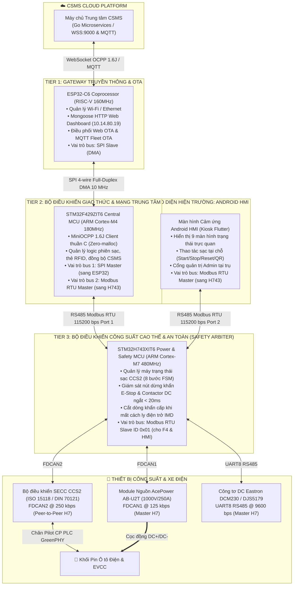
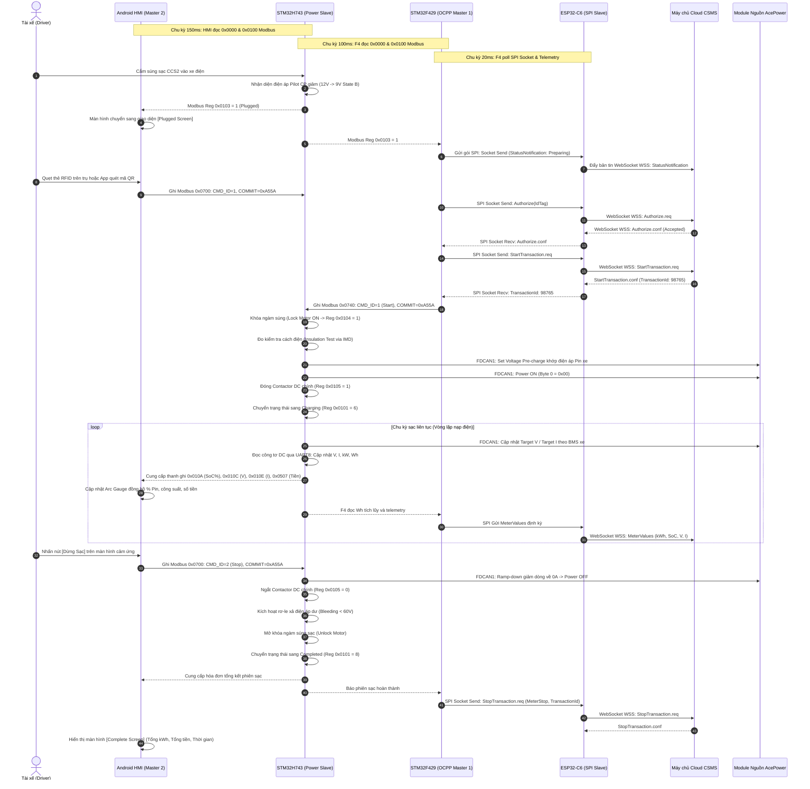
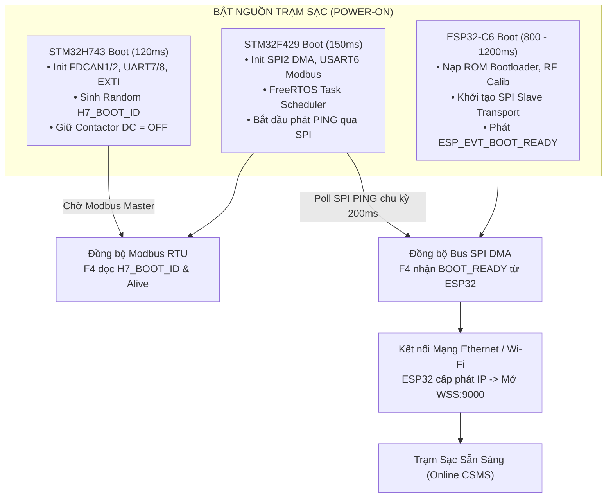
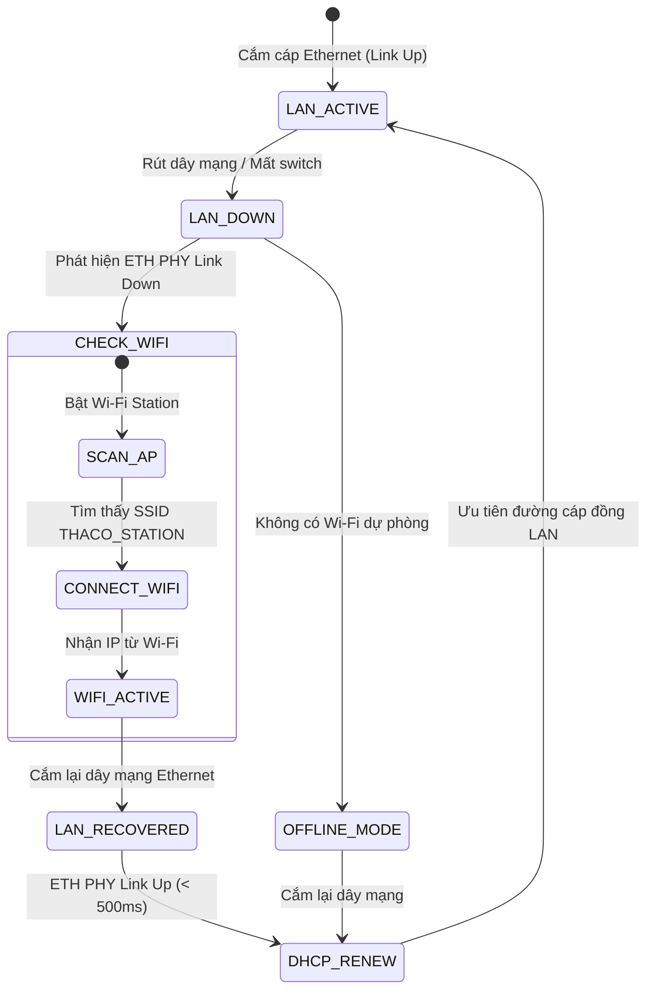

# CẨM NANG GIAO THỨC TRUYỀN THÔNG & BẢN ĐỒ THANH GHI TƯƠNG TÁC GIỮA 3 VI ĐIỀU KHIỂN VÀ MÀN HÌNH HMI
## (COMPREHENSIVE INTER-MCU COMMUNICATION, PROTOCOL FRAMING & REGISTER MAP SPECIFICATION)

> **Phạm vi kỹ thuật:** Đặc tả chi tiết nguyên lý hoạt động, vai trò phân tầng, cấu trúc gói tin, mã lệnh và bản đồ thanh ghi tương tác giữa **ESP32-C6**, **STM32F429**, **STM32H743** và **Màn hình cảm ứng Android HMI**.  
> **Dành cho:** Kỹ sư Lập trình Nhúng (Embedded Firmware), Kỹ sư Thiết kế Phần cứng (Hardware) và Kỹ sư Tích hợp Hệ thống (System Integrator).  
> **Phiên bản chuẩn:** Hệ thống trạm sạc nhanh DC THACO EVSE `v1.0.1` (Tháng 9/2026).

---

## 1. TỔNG QUAN KIẾN TRÚC PHÂN TẦNG VÀ PHÂN VAI (ROLES & RESPONSIBILITIES)

Hệ sinh thái phần cứng trạm sạc THACO EVSE hoạt động theo nguyên tắc **Phân tán trách nhiệm (Separation of Concerns)** và **Cô lập an toàn phần cứng (Hardware Safety Isolation)**. Không một vi điều khiển đơn lẻ nào phải gánh toàn bộ tác vụ, mà được chia thành 3 tầng vi xử lý chuyên trách kết hợp màn hình HMI hiện trường:



### Bảng phân tích chi tiết vai trò từng khối:

| Thiết bị | Vi xử lý | Vai trò kiến trúc | Tại sao cần thiết kế này? (Nguyên lý kỹ thuật) |
| :--- | :--- | :--- | :--- |
| **Tier 1: ESP32-C6** | ESP32-C6-WROOM-1<br>(160MHz RISC-V, 16MB Flash) | **Gateway Không dây / Ethernet & Modem OTA** | Cách ly khối mạng IP không ổn định ra khỏi vi điều khiển thời gian thực. Nếu Wi-Fi rớt hoặc bị tấn công DoS, hai chip STM32 vẫn hoạt động bình thường, không bao giờ bị đơ CPU hay trễ nhịp bảo vệ nguồn. |
| **Tier 2: STM32F429** | STM32F429ZIT6<br>(180MHz Cortex-M4, 2MB Flash, 256KB RAM) | **Bộ điều khiển Giao thức Mạng Trung tâm (OCPP Master)** | Xử lý toàn bộ logic nghiệp vụ đám mây phức tạp: giao thức OCPP 1.6J JSON, mã hóa, bộ đệm thông điệp ngoại tuyến (Offline Queueing), quản lý danh sách thẻ RFID thẻ trắng/thẻ đen. Đóng vai trò **Modbus Master** điều phối lệnh xuống H7. |
| **Tier 3: STM32H743** | STM32H743XIT6<br>(480MHz Cortex-M7, 2MB Dual-Bank, 1MB RAM) | **Bộ điều khiển Công suất Cao thế & Trọng tài An toàn (CCU Safety Arbiter)** | Chịu trách nhiệm tối cao về an toàn điện: chạy thuật toán điều khiển PID/FSM chu trình sạc CCS2, giao tiếp FDCAN thời gian thực siêu tốc với bộ nguồn và bộ bắt tay xe SECC, điều khiển contactor ngắt cực nhanh ($< 20\text{ ms}$). Toàn bộ dữ liệu của H7 được công bố qua không gian thanh ghi Modbus RTU. |
| **Giao diện HMI** | Màn hình Android Công nghiệp (Flutter Kiosk App) | **Giao diện Người dùng Hiện trường (Face of Charger)** | Cung cấp trải nghiệm cảm ứng trực quan cho tài xế và kỹ thuật viên bảo trì. HMI độc lập đọc dữ liệu từ H743 qua Modbus và gửi lệnh qua cơ chế Hộp thư Mailbox nguyên tử. |

---

## 2. GIAO THỨC SPI FULL-DUPLEX DMA: STM32F429 (MASTER) ↔ ESP32-C6 (SLAVE)

### 2.1. Cấu hình phần cứng và thông số Bus
- **Chuẩn vật lý:** SPI 4 dây chuẩn Mode 0 (`CPOL=0`, `CPHA=0`), Full-Duplex.
- **Tốc độ xung nhịp (Clock):** **10 MHz** (có thể nâng lên 20 MHz khi tối ưu phần cứng).
- **Cơ chế truyền nhận:** **DMA (Direct Memory Access)** trên cả hai đầu:
  - F429 sử dụng `SPI2` kết hợp DMA1 Stream 3 (RX) và Stream 4 (TX).
  - ESP32-C6 sử dụng bộ điều khiển phần cứng `spi_slave` với bộ đệm căn chỉnh Word (`WORD_ALIGNED_ATTR`).
- **Sơ đồ chân kết nối:**

| Chân tín hiệu | STM32F429ZIT6 | ESP32-C6 | Hướng truyền | Chức năng |
| :--- | :---: | :---: | :---: | :--- |
| **SCK (Clock)** | `PB10` | `GPIO6` | F429 $\longrightarrow$ ESP32 | Xung nhịp đồng bộ truyền dữ liệu 10 MHz do F4 phát |
| **MOSI (Master Out Slave In)** | `PC3` | `GPIO8` | F429 $\longrightarrow$ ESP32 | Kênh dữ liệu F4 gửi lệnh (Command/Data) xuống ESP32 |
| **MISO (Master In Slave Out)** | `PC2` | `GPIO7` | ESP32 $\longrightarrow$ F429 | Kênh dữ liệu ESP32 phản hồi (Response/Event) lên F4 |
| **NSS / CS (Chip Select)** | `PB15` | `GPIO9` | F429 $\longrightarrow$ ESP32 | Tín hiệu chọn chip tích cực mức thấp (Active-Low) |
| **SYNC / HANDSHAKE (Tùy chọn)**| `PD11` | `GPIO10`| ESP32 $\longrightarrow$ F429 | Báo ngắt khi ESP32 có dữ liệu socket CSMS chờ F4 đọc |

> **LƯU Ý QUAN TRỌNG:** Kết nối giữa STM32F429 và ESP32-C6 là **chuẩn SPI DMA tốc độ cao 10 MHz**, **TUYỆT ĐỐI KHÔNG PHẢI UART**. Thiết kế này cho phép truyền tải thông điệp OCPP lớn và các gói firmware OTA mà không bị nghẽn cổ chai.

---

### 2.2. Cấu trúc Khung nhị phân (SPI Binary Frame Layout)
Mọi gói tin truyền qua bus SPI đều tuân thủ cấu trúc khung nhị phân chuẩn định nghĩa trong file `esp32_spi_protocol.h`:

```text
+---------------+--------------+--------------+---------------+--------------+---------------+----------------+----------------+
|  MAGIC (2B)   | VERSION (1B) | MSG_TYPE(1B) | CMD/EVT_ID(1B)|  FLAGS (1B)  | SEQUENCE (2B) | PAYLOAD_LEN(2B)| HEADER_CRC(2B) |
|    0xAE53     |     0x01     | 0x01/0x02... |  0x01..0xFF   | 0x00..0x07   |  0x0000..FFFF |  0..1024 Bytes |     CRC-16     |
+---------------+--------------+--------------+---------------+--------------+---------------+----------------+----------------+
|<─────────────────────────────── HEADER: 12 BYTES CỐ ĐỊNH ───────────────────────────────────>|
|
|───> [ DATA PAYLOAD: 0 đến 1024 BYTES ] ───> [ PAYLOAD CRC32: 4 BYTES (khi có Payload) ]
```

#### Chi tiết các trường dữ liệu Header (12 Bytes):
1. `magic` (`0xAE53`): Mã đồng bộ bắt đầu khung. Nếu nhận sai magic, vi xử lý lập tức loại bỏ frame và căn chỉnh lại bộ đệm.
2. `version` (`0x01`): Phiên bản giao thức nhị phân.
3. `msg_type`:
   - `0x00` (`ESP_MSG_NOOP`): Khung đệm rỗng dùng để kích xung Clock kéo dữ liệu về.
   - `0x01` (`ESP_MSG_CMD`): Lệnh từ F4 Master gửi xuống ESP32 Slave.
   - `0x02` (`ESP_MSG_RSP`): Phản hồi từ ESP32 Slave trả về cho F4 Master.
   - `0x03` (`ESP_MSG_EVT`): Sự kiện bất đồng bộ do ESP32 chủ động đẩy lên (Event).
4. `cmd_or_evt_id`: Định danh mã lệnh hoặc mã sự kiện (Tra cứu bảng bên dưới).
5. `flags`:
   - Bit 0 (`0x01`): `ESP_FLAG_HAS_PAYLOAD` (Khung có đính kèm Payload phía sau).
   - Bit 1 (`0x02`): `ESP_FLAG_EVT_PENDING` (ESP32 đang còn sự kiện trong hàng đợi, yêu cầu F4 tiếp tục đọc).
   - Bit 2 (`0x04`): `ESP_FLAG_ERROR` (Có lỗi xử lý ở tầng dưới).
6. `sequence` (16-bit): Số thứ tự gói tin tăng dần phục vụ phát hiện mất gói hoặc trùng gói.
7. `payload_length` (16-bit): Chiều dài dữ liệu thực tế ($0 \le N \le 1024$).
8. `header_crc` (16-bit): Mã kiểm tra CRC-16 bảo vệ 10 bytes đầu tiên của Header.

---

### 2.3. Bảng Mã Lệnh (Commands) & Sự Kiện (Events) SPI

#### A. Nhóm Quản lý Hệ thống & Wi-Fi:
| Mã (Hex) | Tên hằng số Enum | Chiều truyền | Mô tả chức năng |
| :---: | :--- | :---: | :--- |
| `0x01` | `ESP_CMD_PING` | F4 $
ightarrow$ ESP | Kiểm tra nhịp tim và kết nối SPI liveness |
| `0x02` | `ESP_CMD_GET_STATUS` | F4 $
ightarrow$ ESP | Lấy trạng thái mạng, RSSI, chế độ trạm |
| `0x10` | `ESP_CMD_WIFI_SCAN` | F4 $
ightarrow$ ESP | Yêu cầu quét các mạng Wi-Fi lân cận |
| `0x11` | `ESP_CMD_WIFI_CONNECT`| F4 $
ightarrow$ ESP | Kết nối vào mạng Wi-Fi với SSID & Password trong payload |
| `0x12` | `ESP_CMD_WIFI_DISCONNECT`| F4 $
ightarrow$ ESP | Ngắt kết nối Wi-Fi hiện tại |
| `0x14` | `ESP_CMD_WIFI_GET_IP` | F4 $
ightarrow$ ESP | Đọc địa chỉ IP đã được cấp phát từ DHCP |
| `0x15` | `ESP_CMD_WIFI_SET_CONFIG`| F4 $
ightarrow$ ESP | Cấu hình IP tĩnh hoặc DHCP |

#### B. Nhóm Truyền tải Ổ cắm Mạng (Socket Tunneling - Phục vụ OCPP 1.6J):
| Mã (Hex) | Tên hằng số Enum | Chiều truyền | Mô tả chức năng |
| :---: | :--- | :---: | :--- |
| `0x30` | `ESP_CMD_SOCKET_OPEN` | F4 $
ightarrow$ ESP | Yêu cầu mở kết nối TCP/TLS WSS tới máy chủ CSMS Cloud |
| `0x31` | `ESP_CMD_SOCKET_CLOSE`| F4 $
ightarrow$ ESP | Đóng kết nối socket hiện tại |
| `0x32` | `ESP_CMD_SOCKET_SEND` | F4 $
ightarrow$ ESP | F4 gửi bản tin JSON OCPP (Call/CallResult) qua socket ra Internet |
| `0x33` | `ESP_CMD_SOCKET_RECV` | F4 $
ightarrow$ ESP | F4 kéo dữ liệu JSON OCPP mà máy chủ Cloud vừa gửi xuống |
| `0x34` | `ESP_CMD_SOCKET_STATUS`| F4 $
ightarrow$ ESP | Truy vấn trạng thái kết nối socket (Connected / Connecting / Closed) |

#### C. Nhóm Telemetry & Nâng cấp OTA (Sub-chunking $\le 512$ Bytes):
| Mã (Hex) | Tên hằng số Enum | Chiều truyền | Mô tả chức năng |
| :---: | :--- | :---: | :--- |
| `0x40` | `ESP_CMD_REPORT_TELEMETRY` | F4 $
ightarrow$ ESP | F4 gửi thông số V, I, kWh, SoC lên ESP32 để hiển thị Web Dashboard `10.14.80.19` |
| `0x50` | `ESP_CMD_OTA_GET_CHUNK` | F4 $
ightarrow$ ESP | F4 yêu cầu ESP32 trả về 1 phân đoạn dữ liệu firmware mới ($\le 512\text{B}$) |
| `0x51` | `ESP_CMD_OTA_REPORT_RESULT`| F4 $
ightarrow$ ESP | F4 báo kết quả nạp firmware (Hoàn tất / Thất bại / Lỗi CRC32) |
| `0xFF` | `ESP_CMD_REBOOT` | F4 $
ightarrow$ ESP | Yêu cầu khởi động lại ESP32 |

#### D. Các Sự kiện Bất đồng bộ từ ESP32 (Asynchronous Events):
- `0x10` (`ESP_EVT_WIFI_CONNECTED`): Đã kết nối vào Access Point.
- `0x14` (`ESP_EVT_IP_ACQUIRED`): Đã nhận được địa chỉ IP hợp lệ.
- `0x30` (`ESP_EVT_SOCKET_CONNECTED`): WebSocket kết nối thành công tới CSMS.
- `0x31` (`ESP_EVT_SOCKET_DATA_READY`): Có bản tin OCPP từ CSMS gửi về, sẵn sàng cho F4 đọc.
- `0x32` (`ESP_EVT_SOCKET_CLOSED`): Mất kết nối tới CSMS.
- `0x50` (`ESP_EVT_OTA_CHUNK_READY`): ESP32 đã tải xong phân đoạn firmware từ Cloud, sẵn sàng chuyển tiếp.

---

## 3. GIAO THỨC MODBUS RTU: F429 (MASTER) & HMI (MASTER) ↔ STM32H743 (SLAVE)

### 3.1. Mô hình Bus và Cơ chế Đa Master (Dual-Master Architecture)
- **Chuẩn vật lý:** RS485 vi sai công nghiệp 2 dây (A / B) chống nhiễu mạnh.
- **Tốc độ baud:** **115,200 bps**, Khung `8N1` (8 data bits, No parity, 1 stop bit).
- **Nguyên lý kết nối:**
  - Vi điều khiển **STM32H743** là trung tâm dữ liệu, đóng vai trò là **Modbus RTU Slave** với địa chỉ `Slave ID = 0x01`.
  - **F429 Master** giao tiếp với H743 qua cổng `UART7` của H743.
  - **Màn hình Android HMI Master** giao tiếp với H743 qua cổng `USART6` của H743.
  - Cả hai Master độc lập đọc/ghi dữ liệu vào không gian thanh ghi của H743 theo chuẩn phân vùng bộ nhớ `Map Version 0x0221`.

---

### 3.2. Bản đồ Không gian Thanh ghi Chi tiết của STM32H743 (Memory Map)

Không gian thanh ghi của STM32H743 được tổ chức thành các vùng chức năng (Planes) 16-bit rõ ràng:

```text
0x0000 ┌─────────────────────────────────────────────────────────┐
       │ VÙNG 1: THÔNG TIN HỆ THỐNG & ĐIỀU PHỐI (SYSTEM PLANE)    │ (0x0000 - 0x0017: 24 Thanh ghi)
0x0100 ├─────────────────────────────────────────────────────────┤
       │ VÙNG 2: DỮ LIỆU TELEMETRY SÚNG 1 (CONNECTOR A PLANE)    │ (0x0100 - 0x0123: 36 Thanh ghi)
0x0200 ├─────────────────────────────────────────────────────────┤
       │ VÙNG 3: DỮ LIỆU TELEMETRY SÚNG 2 (CONNECTOR B PLANE)    │ (0x0200 - 0x0223: 36 Thanh ghi)
0x0500 ├─────────────────────────────────────────────────────────┤
       │ VÙNG 4: GIÁ ĐIỆN & CHI PHÍ TỨC THỜI (BUSINESS MIRROR)   │ (0x0500 - 0x0515: 22 Thanh ghi)
0x0700 ├─────────────────────────────────────────────────────────┤
       │ VÙNG 5: HỘP THƯ LỆNH TỪ HMI (HMI COMMAND MAILBOX)       │ (0x0700 - 0x0708: Ghi lệnh FC16)
0x0720 ├─────────────────────────────────────────────────────────┤
       │ VÙNG 6: PHẢN HỒI LỆNH HMI (HMI COMMAND ACK & RESULT)    │ (0x0720 - 0x0725: 6 Thanh ghi)
0x0740 ├─────────────────────────────────────────────────────────┤
       │ VÙNG 7: BÀN ĐIỀU KHIỂN TỪ F429 (F429/OCPP COMMAND PLANE)│ (0x0740 - 0x074B: Ghi lệnh FC16)
0x0800 ├─────────────────────────────────────────────────────────┤
       │ VÙNG 8: MÃ TOKEN & VIETQR ĐỘNG (QR TOKEN MIRROR)        │ (0x0800 - 0x0814: 21 Thanh ghi)
       └─────────────────────────────────────────────────────────┘
```

---

### 3.3. Bảng Chi tiết Từng Vùng Thanh ghi Modbus

#### VÙNG 1: THÔNG TIN HỆ THỐNG & NHỊP TIM (Offset `0x0000` - Đọc bằng FC 0x03 / 0x04)
| Offset | Tên thanh ghi | Kiểu dữ liệu | Đơn vị / Hệ số | Ý nghĩa & Mô tả |
| :---: | :--- | :---: | :---: | :--- |
| `0x0000` | `MAP_VERSION` | `uint16` | Hằng số | Phiên bản bản đồ thanh ghi (Hiện tại: `0x0221`) |
| `0x0001` | `DEVICE_TYPE` | `uint16` | Enum | Loại thiết bị (`1`: DC Fast Charger, `2`: AC Charger) |
| `0x0002` | `FW_VER_MAJOR_MINOR`| `uint16` | Raw | Byte cao: Major version, Byte thấp: Minor version |
| `0x0003` | `FW_VER_PATCH` | `uint16` | Raw | Patch version của firmware H7 |
| `0x0004` | `CAPABILITIES_1` | `uint16` | Bitmask | Cờ tính năng phần cứng (Dual Gun, RFID, DCM Meter) |
| `0x0006` | `ALIVE_COUNTER` | `uint16` | Bộ đếm | Nhịp tim H7 tăng liên tục mỗi 100ms. F4/HMI kiểm tra liveness |
| `0x0007..08`| `H7_BOOT_ID` | `uint32` | Word ghép | Định danh ngẫu nhiên mỗi lần khởi động lại H7 |
| `0x0009` | `RESET_REASON` | `uint16` | Enum | Nguyên nhân reset (Power-on, Watchdog, Software, Fault) |
| `0x000A..0B`| `UPTIME_SEC` | `uint32` | Giây (s) | Thời gian hoạt động liên tục của chip H7 từ lần boot cuối |
| `0x000C` | `SUPERVISOR_STATUS` | `uint16` | Bitmask | Trạng thái bảo vệ: Bit 0: E-Stop, Bit 1: IMD Fault, Bit 2: Door Open |
| `0x000E..0F`| `UTC_EPOCH_SEC` | `uint32` | Giây Epoch | Thời gian thực đồng bộ từ CSMS qua F4 xuống H7 |
| `0x0010` | `TOTAL_STATION_KW` | `uint16` | kW | Tổng công suất định mức phần cứng của trạm |
| `0x0011` | `POWER_ALLOC_MODE` | `uint16` | Enum | Chế độ phân bổ công suất (`1`: Fixed 50/50, `2`: Dynamic) |
| `0x0012` | `GUN_A_REQ_POWER_KW`| `uint16` | kW | Công suất xe tại Súng A đang yêu cầu |
| `0x0013` | `GUN_A_ALLOC_POWER` | `uint16` | kW | Công suất cấp phát thực tế cho Súng A |
| `0x0014` | `GUN_A_ACT_POWER` | `uint16` | kW | Công suất sạc đo thực tế tại Súng A |

---

#### VÙNG 2 & 3: DỮ LIỆU TELEMETRY SÚNG SẠC (Connector A: `0x0100`, Connector B: `0x0200`)
*(Đọc bằng FC 0x03 hoặc FC 0x04, độ dài: 36 thanh ghi)*

| Offset Gun A | Offset Gun B | Tên trường dữ liệu | Kiểu | Đơn vị / Hệ số | Ý nghĩa & Mô tả |
| :---: | :---: | :--- | :---: | :---: | :--- |
| `0x0100` | `0x0200` | `SNAPSHOT_SEQ_BEGIN` | `uint16` | Bộ đếm | Mã sequence đầu snapshot (dùng chống rách dữ liệu) |
| `0x0101` | `0x0201` | `EVSE_STATE` | `uint16` | Enum | Trạng thái phiên: `0`: Unavail, `1`: Idle, `2`: Plugged, `4`: Authorized, `5`: Preparing, `6`: Charging, `7`: Stopping, `8`: Completed, `9`: Faulted, `10`: E-Stop |
| `0x0102` | `0x0202` | `EVSE_SUBSTATE` | `uint16` | Enum | Chi tiết bước: `1`: Locking, `2`: IMD Test, `3`: Precharge, `5`: Contactor Close, `6`: Ramp-up, `10`: Ramp-down |
| `0x0103` | `0x0203` | `PLUG_STATE` | `uint16` | 0 / 1 | Trạng thái cắm súng (`0`: Rút ra, `1`: Đã cắm ngập chốt) |
| `0x0104` | `0x0204` | `LOCK_STATE` | `uint16` | 0 / 1 | Trạng thái khóa ngàm súng (`0`: Mở, `1`: Đã khóa cơ học) |
| `0x0105` | `0x0205` | `CONTACTOR_CMD` | `uint16` | 0 / 1 | Lệnh xuất ra cuộn hút Contactor DC (`0`: Ngắt, `1`: Đóng) |
| `0x0106` | `0x0206` | `CONTACTOR_FEEDBACK` | `uint16` | 0 / 1 | Tiếp điểm phụ phản hồi trạng thái thực của Contactor |
| `0x010A` | `0x020A` | `SOC_PERCENT` | `uint16` | % (0 - 100) | **Dung lượng Pin xe hiện tại** (nhận diện qua SECC CAN) |
| `0x010B` | `0x020B` | `START_SOC_PERCENT` | `uint16` | % (0 - 100) | Dung lượng Pin xe tại thời điểm bắt đầu phiên sạc |
| `0x010C..0D`| `0x020C..0D`| `OUTPUT_VOLTAGE` | `uint32` | **0.1 V** | **Điện áp sạc thực tế** đo tại đầu súng (Giá trị / 10 = Volt) |
| `0x010E..0F`| `0x020E..0F`| `OUTPUT_CURRENT` | `int32` | **0.1 A** | **Dòng điện sạc thực tế** đang cấp vào xe (Giá trị / 10 = Ampe) |
| `0x0110..11`| `0x0210..11`| `OUTPUT_POWER` | `uint32` | **1 W** | Công suất tức thời (Giá trị / 1000 = kW) |
| `0x0112..13`| `0x0212..13`| `SESSION_ENERGY` | `uint32` | **1 Wh** | **Điện năng phiên sạc tích lũy** (Giá trị / 1000 = kWh) |
| `0x0114..15`| `0x0214..15`| `ELAPSED_SECONDS` | `uint32` | Giây (s) | Thời gian đã sạc tính từ lúc đóng contactor |
| `0x0116` | `0x0216` | `REMAINING_MINUTES` | `uint16` | Phút | Thời gian ước tính sạc đầy do BMS xe tính toán |
| `0x0117` | `0x0217` | `GUN_TEMPERATURE` | `uint16` | **0.1 °C** | Nhiệt độ cảm biến đầu súng (Bảo vệ quá nhiệt) |
| `0x0118..19`| `0x0218..19`| `LOCAL_SESSION_ID` | `uint32` | Word ghép | Mã phiên sạc nội bộ trạm tạo ra |
| `0x011A` | `0x021A` | `BMS_REQ_VOLTAGE` | `uint16` | 0.1 V | Điện áp do BMS xe yêu cầu cấp |
| `0x011B` | `0x021B` | `BMS_REQ_CURRENT` | `uint16` | 0.1 A | Dòng điện do BMS xe yêu cầu cấp |
| `0x011F` | `0x021F` | `STOP_CAUSE` | `uint16` | Enum | Lý do kết thúc phiên (`1`: Local, `2`: Remote, `3`: Emergency) |
| `0x0120` | `0x0220` | `PRIMARY_FAULT_CODE`| `uint16` | Mã lỗi Hex | Mã sự cố chính khi trạm dừng bất thường |
| `0x0123` | `0x0223` | `SNAPSHOT_SEQ_END` | `uint16` | Bộ đếm | Mã sequence cuối snapshot. Nếu `BEGIN == END` $
ightarrow$ Dữ liệu hợp lệ |

---

#### VÙNG 4: GIÁ ĐIỆN & CHI PHÍ TỨC THỜI (Offset `0x0500`)
| Offset | Tên trường | Kiểu | Đơn vị | Ý nghĩa & Mô tả |
| :---: | :--- | :---: | :---: | :--- |
| `0x0500` | `BUSINESS_DATA_SEQ` | `uint16` | Bộ đếm | Số sequence cập nhật dữ liệu tài chính |
| `0x0501` | `IS_VALID` | `uint16` | 0 / 1 | `1`: Dữ liệu giá hợp lệ, `0`: Chưa nhận được giá từ CSMS |
| `0x0503..04`| `TARIFF_RATE_VND` | `uint32` | VNĐ / kWh | Đơn giá sạc hiện tại (ví dụ: `3850` VNĐ/kWh) |
| `0x0505..06`| `SERVICE_FEE_VND` | `uint32` | VNĐ | Phí dịch vụ cố định mỗi phiên |
| `0x0507..08`| `RUNNING_COST_A` | `uint32` | VNĐ | Tiền sạc tức thời của Súng A (tính tự động = kWh × Đơn giá) |
| `0x0509..0A`| `RUNNING_COST_B` | `uint32` | VNĐ | Tiền sạc tức thời của Súng B |
| `0x050B` | `CSMS_CONN_STATUS` | `uint16` | Enum | `0`: Offline, `1`: Connected, `2`: Authorized |

---

#### VÙNG 5 & 6: HỘP THƯ LỆNH TỪ MÀN HÌNH HMI (HMI COMMAND MAILBOX & ACK)
Cơ chế điều khiển từ HMI xuống H7 được thiết kế theo nguyên tắc **Hộp thư nguyên tử (Atomic Mailbox with Magic Commit)**. HMI ghi một chuỗi gồm 9 thanh ghi qua Function Code `0x10` (Write Multiple Registers) vào vùng `0x0700`:

| Offset | Tên thanh ghi | Giá trị ghi vào | Ý nghĩa & Quy tắc bắt buộc |
| :---: | :--- | :---: | :--- |
| `0x0700` | `REQ_SEQ_HI` | Word cao | Số sequence yêu cầu (32-bit tăng dần mỗi lần bấm nút) |
| `0x0701` | `REQ_SEQ_LO` | Word thấp | Số sequence yêu cầu |
| `0x0702` | `BOOT_ID_HI` | Word cao | Mã Boot ID của H7 (đọc từ `0x0007` để tránh gửi lệnh sai phiên boot) |
| `0x0703` | `BOOT_ID_LO` | Word thấp | Mã Boot ID của H7 |
| `0x0704` | `CMD_ID` | Mã lệnh | `1`: Start Charging, `2`: Stop Charging, `3`: Reset Fault, `4`: E-Stop, `7`: Request QR, `8`: Cancel QR |
| `0x0705` | `TARGET_CONNECTOR` | `1` hoặc `2` | `1`: Súng sạc A (Connector 1), `2`: Súng sạc B (Connector 2) |
| `0x0706` | `PARAM_1` | Tham số 1 | Ví dụ: Loại xác thực hoặc Giới hạn SoC dừng sạc |
| `0x0707` | `PARAM_2` | Tham số 2 | Tham số phụ mở rộng |
| `0x0708` | `COMMIT_MAGIC` | **`0xA55A`** | **CHÌA KHÓA THỰC THI:** H743 chỉ thi hành lệnh khi thanh ghi này mang giá trị `0xA55A`. Nếu ghi thiếu hoặc sai số, lệnh sẽ bị hủy! |

Ngay sau khi ghi lệnh, HMI đọc vùng **ACK (`0x0720 - 0x0725`)** để xác nhận phản hồi từ H743:
- `0x0720 - 0x0721`: `ACK_SEQ` (Số sequence H7 vừa xử lý).
- `0x0722`: `RESP_CMD_ID` (Mã lệnh được phản hồi).
- `0x0723`: `STATUS` (`0`: None, `1`: Accepted, `2`: Rejected, `3`: Executing, `4`: Completed, `5`: Failed).
- `0x0724`: `REJECT_REASON` (`1`: InvalidParam, `2`: Busy, `3`: EstopActive, `4`: NotPlugged, `5`: AuthFailed).
- `0x0725`: `RESULT_REASON` (`0`: Success, `1`: Timeout, `2`: HardwareFault).

---

#### VÙNG 7: BÀN ĐIỀU KHIỂN TỪ F429 / CSMS (F429 COMMAND PLANE - Offset `0x0740`)
Khi máy chủ CSMS Cloud gửi lệnh điều khiển sạc từ xa (`RemoteStartTransaction`, `RemoteStopTransaction`, `UnlockConnector`, `Reset`), F429 sẽ ghi lệnh xuống H743 qua Function Code `0x10`:

| Offset | Tên thanh ghi | Kiểu | Ý nghĩa chức năng |
| :---: | :--- | :---: | :--- |
| `0x0740` | `F4_CMD_SEQ` | `uint16` | Số thứ tự lệnh từ F429 |
| `0x0741` | `F4_CMD_ID` | `uint16` | `1`: RemoteStart, `2`: RemoteStop, `3`: Reset, `4`: UnlockGun |
| `0x0742` | `TARGET_CONNECTOR`| `uint16` | `1`: Súng A, `2`: Súng B |
| `0x0743` | `TARGET_VOLTAGE` | `uint16` | Điện áp cài đặt mong muốn (0.1 V) |
| `0x0744` | `TARGET_CURRENT` | `uint16` | Dòng điện giới hạn tối đa cho phép sạc (0.1 A) |
| `0x0745` | `MAX_POWER_LIMIT` | `uint16` | Giới hạn công suất Smart Charging (kW) |
| `0x074A` | `STOP_REASON` | `uint16` | Lý do dừng từ Cloud (Remote, EVDisconnected, OverCurrent) |
| `0x074B` | `COMMIT_MAGIC` | **`0xA55A`** | **CHÌA KHÓA THỰC THI TỪ F4:** H743 kiểm tra đúng `0xA55A` mới ra lệnh đóng mở contactor và module nguồn |

---

## 4. QUY TRÌNH TƯƠNG TÁC ĐỒNG BỘ TOÀN HỆ THỐNG (END-TO-END SEQUENCE FLOW)

Dưới đây là chu trình tương tác thực tế giữa 4 thực thể phần cứng trong một phiên sạc hoàn chỉnh:



---

## 5. CƠ CHẾ BẢO VỆ FAIL-SAFE & XỬ LÝ SỰ CỐ TRUYỀN THÔNG LIÊN MCU

1. **Mất nhịp tim liveness giữa F429 và H743:**
   - H743 liên tục tăng thanh ghi `ALIVE_COUNTER` (`0x0006`). F429 đọc thanh ghi này chu kỳ 100ms.
   - Nếu trong vòng **$> 3\text{ giây}$**, F429 không đọc được Modbus hoặc giá trị `ALIVE_COUNTER` không thay đổi:
     - F429 đánh dấu trạm `Unavailable` và báo lỗi lên CSMS Cloud.
     - Đồng thời, watchdog bên trong H743 phát hiện không có lệnh polling từ F429 sẽ tự động kích hoạt chu trình dừng sạc khẩn cấp: ngắt contactor DC chính và kéo nguồn module về OFF.
2. **Mất liên kết SPI giữa F429 và ESP32-C6:**
   - F429 gửi lệnh `ESP_CMD_PING` (`0x01`) mỗi giây. Nếu ESP32 không phản hồi qua SPI trong 3 chu kỳ liên tiếp:
     - F429 kích hoạt chân reset phần cứng kéo chân `EN` của ESP32 xuống mức thấp để khởi động lại modem.
     - Toàn bộ dữ liệu phiên sạc vẫn được lưu an toàn trong RAM của F429 và H743, không làm gián đoạn dòng điện đang sạc xe.
3. **Nút Dừng Khẩn Cấp (E-Stop) hoặc Rò điện IMD:**
   - Tín hiệu nút E-Stop và tiếp điểm cảnh báo rò điện cách ly IMD được đấu nối cứng trực tiếp vào các chân ngắt ngoài EXTI của vi điều khiển **STM32H743**.
   - Khi có sự cố, mạch ngắt phần cứng của H743 lập tức ngắt cuộn hút contactor trong thời gian **$< 20\text{ ms}$** và phát lệnh tắt nguồn khẩn cấp qua FDCAN1 mà không cần chờ bất kỳ sự cho phép nào từ F429 hay màn hình HMI.

---

## 6. CƠ CHẾ KHỞI ĐỘNG (BOOT SEQUENCE), XỬ LÝ SỰ CỐ RESET & KHÔI PHỤC MẠNG ETHERNET/OFFLINE

Trong thực tế vận hành ngoài hiện trường trạm sạc, các sự cố như mất điện lưới chập chờn, sụt áp nguồn nuôi 24V/3.3V, xung nhiễu điện từ công suất cao, hoặc đứt cáp mạng Ethernet hoàn toàn có thể xảy ra. Hệ thống 3 vi điều khiển THACO EVSE được thiết kế với cơ chế tự phục hồi (Self-Healing) và khả năng chịu lỗi ngoại tuyến (Offline Resilience) tối đa:



---

### 6.1. Trình tự Khởi động Bất đồng bộ: Trường hợp ESP32 khởi động chậm hơn F429 & H743

#### Thực tế phần cứng:
- Hai vi điều khiển **STM32H743** (Cortex-M7) và **STM32F429** (Cortex-M4) thực thi code trực tiếp từ bộ nhớ Flash nhúng nội chip với tốc độ xung nhịp cực cao (480MHz / 180MHz), hoàn tất quá trình Boot, cấu hình Clock, Peripheral và nạp FreeRTOS chỉ trong **$< 150\text{ ms}$**.
- **ESP32-C6** (RISC-V) sử dụng chip Flash ngoài giao tiếp SPI, phải trải qua giai đoạn ROM bootloader, kiểm tra Second-stage bootloader, khởi tạo khối RF Wi-Fi/Bluetooth và tải FreeRTOS của Espressif, thời gian khởi động kéo dài từ **$800\text{ ms}$ đến $1200\text{ ms}$**.

#### Cơ chế xử lý của STM32F429 (Chống treo CPU):
1. **Khởi tạo Non-blocking:** STM32F429 khởi tạo cổng `SPI2` ở chế độ Master DMA nhưng **tuyệt đối không dùng vòng lặp `while()` chặn chờ ESP32**.
2. **Polling Liveness mềm:** F429 kích hoạt một phần mềm định thời (Software Timer trong task `StartOcppTask`) định kỳ mỗi `200ms` kéo chân CS (`PB15`) xuống mức thấp và phát khung lệnh `ESP_CMD_PING` (`0x01`).
3. **Phản hồi Boot Ready:** Khi ESP32-C6 vừa hoàn tất hàm `app_main()` và gọi `spi_slave_init()`, nó lập tức đưa sự kiện `ESP_EVT_BOOT_READY` (`0x01`) vào hàng đợi phản hồi DMA.
4. **Bắt tay đồng bộ (Handshake):** F429 nhận được mã phản hồi hợp lệ có chứa Magic `0xAE53`, đánh dấu liên kết SPI sẵn sàng (`s_spi_link_ready = true`), chuyển sang gửi lệnh kết nối mạng hoặc gọi `wifi_mgr_resume()`.
5. **Trạng thái Trụ sạc trong lúc chờ ESP32:** Trong 1 giây đầu tiên này, STM32H743 và F429 đã giao tiếp Modbus thông suốt với nhau. Màn hình HMI đã hiển thị giao diện trạm sạc bình thường. Nếu tài xế cắm súng ngay lập tức, H743 vẫn phát hiện súng sạc (`Plugged`) và chuẩn bị sẵn sàng, hoàn toàn không bị trễ hay lỗi hệ thống.

---

### 6.2. Kịch bản Xử lý Sự cố khi Một Vi Điều Khiển Bị Reset Bất Thường

Hệ thống phân lập 3 kịch bản lỗi và áp dụng cơ chế tự phục hồi (Self-Healing) tương ứng:

```text
+----------------------------------------------------------------------------------------------------+
|                       MA TRẬN XỬ LÝ KHI CÓ 1 VI ĐIỀU KHIỂN BỊ RESET BẤT THƯỜNG                     |
+-------------------+--------------------------------+-----------------------------------------------+
| Vi điều khiển lỗi | Trạng thái Dòng Sạc Cao Thế    | Hành vi Phục hồi & Tự chữa lành (Self-Healing)|
+-------------------+--------------------------------+-----------------------------------------------+
| ESP32-C6 Reset    | KHÔNG BỊ GIÁN ĐOẠN             | F429 đệm tin vào RAM/Flash. ESP32 boot lại    |
| (Watchdog/Sụt áp) | Xe tiếp tục sạc an toàn        | tự resume Wi-Fi/Ethernet, đồng bộ lại CSMS.   |
+-------------------+--------------------------------+-----------------------------------------------+
| STM32F429 Reset   | KHÔNG BỊ GIÁN ĐOẠN             | H743 giữ dòng sạc (Timeout 8s). F429 boot lại |
| (Swap Bank/Fault) | (Nếu F4 boot lại < 8 giây)     | trong 150ms, đọc H7 state, khôi phục session. |
+-------------------+--------------------------------+-----------------------------------------------+
| STM32H743 Reset   | NGẮT AN TOÀN TỨC THÌ (< 20ms)  | Contactor DC nhả lò xo tự do. Boot lại sinh   |
| (Sự cố điện/HW)   | Kéo toàn bộ nguồn về OFF       | H7_BOOT_ID mới -> HMI/F4 hủy lệnh, reset trụ. |
+-------------------+--------------------------------+-----------------------------------------------+
```

#### Kịch bản A: ESP32-C6 bị Reset (Do Watchdog, sụt áp, hoặc Soft Reboot sau khi nạp OTA)
- **Ảnh hưởng đến phiên sạc:** **Hoàn toàn KHÔNG ảnh hưởng**. Dòng điện cao thế sạc vào pin xe ô tô được duy trì liên tục và an toàn bởi STM32H743 và STM32F429.
- **Hành vi của F429:**
  - Khi không nhận được phản hồi PING qua SPI trong 3 giây liên tiếp, F429 chuyển trạng thái mạng nội bộ sang `WS_OFFLINE`.
  - Toàn bộ các gói tin đo đếm `MeterValues` phát sinh trong lúc mất ESP32 được F429 ghi tạm vào bộ đệm hàng đợi ngoại tuyến (Offline Circular Buffer trong Flash/RAM).
- **Quá trình phục hồi:**
  - ESP32 khởi động lại, kích hoạt hàm `wifi_mgr_resume()`, tự động kết nối lại mạng Wi-Fi hoặc Ethernet từ thông số lưu trong bộ nhớ NVS.
  - Sau khi kết nối mạng có IP, ESP32 mở lại kết nối WebSocket WSS:9000 tới CSMS Cloud.
  - F429 phát hiện kết nối WSS đã khôi phục (`MINIOCPP_EVENT_CONNECTED`), tiến hành kéo tuần tự toàn bộ các bản tin `MeterValues` trong hàng đợi đọng đẩy lên Cloud, bảo toàn nguyên vẹn dữ liệu đo đếm phục vụ tính tiền.

#### Kịch bản B: STM32F429 bị Reset (Do cờ hoán đổi Live Dual-Bank Flash hoặc lỗi tác vụ)
- **Thời gian khởi động lại:** F429 khởi động lại chỉ mất khoảng **`150ms`**.
- **Cơ chế dung sai nhịp tim trên H743 (`H7_COMM_OFFLINE_TIMEOUT_MS = 8000ms`):**
  - STM32H743 có bộ đếm thời gian kiểm tra giao tiếp Modbus với F429. H743 thiết lập ngưỡng thời gian chờ lên tới **8 giây** trước khi ra quyết định dừng khẩn cấp.
  - Do F429 boot lại chỉ mất 150ms (nhỏ hơn rất nhiều so với 8000ms), dòng điện nạp vào xe **không hề bị gián đoạn**.
- **Quá trình phục hồi:**
  - F429 sau khi boot xong, lập tức gửi lệnh Modbus Function Code `0x03` đọc vùng thanh ghi `0x0000` và `0x0100` của H743.
  - F429 đọc thấy `EVSE_STATE == 6` (Charging) và kiểm tra thấy `H7_BOOT_ID` không đổi $\rightarrow$ F429 nhận diện phiên sạc vẫn đang tiếp diễn hợp lệ.
  - F429 tải lại `TransactionId` đang lưu trong EEPROM/Flash, tiếp tục đọc Wh từ H743 và duy trì gửi bản tin về CSMS như chưa từng xảy ra sự cố.
  - *Trường hợp xấu nhất (F429 chết hẳn quá 8 giây):* Bộ đếm H743 hết hạn ($> 8\text{s}$), H743 tự động kích hoạt máy trạng thái dừng an toàn `SafeStop`: hạ dòng về 0A và ngắt contactor DC chính.

#### Kịch bản C: STM32H743 bị Reset (Sự cố phần cứng nghiêm trọng hoặc sụt nguồn cao áp)
- **Cơ chế bảo vệ vật lý tuyệt đối (Hardware Fail-Safe Interlock):**
  - Chân GPIO điều khiển cuộn hút Contactor DC chính của trạm sạc được thiết kế kéo tích cực mức cao từ H743.
  - Khi H743 bị reset, toàn bộ các chân I/O lập tức rơi về trạng thái thả nổi (Floating/High-Z) hoặc bị kéo xuống đất bởi điện trở trở kéo ngoài `R_PULLDOWN = 10k\Omega`.
  - $\rightarrow$ **Cuộn hút Contactor DC mất điện tức thì:** Tiếp điểm lực tự động mở bung nhờ lực đẩy của lò xo cơ học trong thời gian **$< 20\text{ ms}$**, lập tức cách ly hoàn toàn nguồn điện 1000V DC ra khỏi xe ô tô, triệt tiêu mọi nguy cơ cháy nổ.
- **Cơ chế nhận diện qua `H7_BOOT_ID`:**
  - Khi H743 khởi động lại, hàm khởi tạo sinh ra một giá trị ngẫu nhiên `H7_BOOT_ID` mới (32-bit Random UUID ghi tại thanh ghi `0x0007 - 0x0008`).
  - Màn hình Android HMI và STM32F429 đọc Modbus phát hiện `H7_BOOT_ID` bị thay đổi so với phiên trước đó.
  - HMI và F429 lập tức hủy toàn bộ lệnh điều khiển cũ trong Command Mailbox (`0x0700` và `0x0740`), kết thúc phiên sạc cũ với mã lý do `StopReason: HardwareReset`, gửi cảnh báo `StatusNotification(Faulted)` lên CSMS và chuyển trạng thái về `Idle` chờ người dùng cắm sạc lại từ đầu.

---

### 6.3. Cơ chế Tự Khôi Phục Đường Truyền Mạng Ethernet & Wi-Fi (Network Failover)

Khối truyền thông mạng do vi điều khiển ESP32-C6 trực tiếp quản lý với cơ chế giám sát lớp vật lý (PHY Monitor):



#### 1. Phát hiện mất liên kết Ethernet (Link Down):
- ESP32-C6 giao tiếp với IC Ethernet PHY (chuẩn RMII như LAN8720 hoặc W5500 SPI) liên tục giám sát thanh ghi trạng thái đường truyền (Basic Mode Status Register - BMSR).
- Khi cáp mạng bị đứt, tuột đầu bấm RJ45 hoặc Switch mạng tại trạm mất điện: Trong vòng **$< 100\text{ ms}$**, chip PHY phát ngắt Link Down.
- ESP32 chuyển cờ `lan_online = false` và gửi sự kiện `ESP_EVT_SOCKET_CLOSED` qua bus SPI thông báo cho STM32F429.

#### 2. Cơ chế khôi phục tự động khi cắm lại cáp mạng (Auto-Reconnection Flow):
1. **Phát hiện Link Up:** Ngay khi cáp mạng được cắm lại, chip PHY đàm phán tốc độ tự động (Auto-Negotiation 100Mbps Full-Duplex) trong vòng **$< 500\text{ ms}$**.
2. **Cấp phát lại IP qua DHCP:** ESP32 kích hoạt tiến trình DHCP Client, gửi gói `DHCP Discover` để xin cấp lại địa chỉ IP, Subnet Mask và Gateway.
3. **Phục hồi Socket WSS tới Cloud:**
   - Sau khi nhận được sự kiện `IP_EVENT_ETH_GOT_IP`, ESP32 giải quyết địa chỉ DNS tên miền máy chủ CSMS (`csms.thaco.vn`).
   - Mở lại luồng WebSocket TLS/WSS qua cổng `9000`.
4. **Bắt tay đồng bộ lại giao thức OCPP:**
   - F429 phát hiện Socket đã kết nối trở lại, gửi bản tin kiểm tra nhịp tim `Heartbeat.req`.
   - Nếu phiên sạc bị mất kết nối trong thời gian dài, F429 gửi lại bản tin `StatusNotification` để đồng bộ lại trạng thái thực tế của súng sạc trên Dashboard Cloud của trung tâm điều hành.

---

### 6.4. Trạng Thái Hoạt Động của Trạm Sạc khi Mất Mạng Hoàn Toàn (Offline Resilience)

Một trong những tiêu chí khắt khe nhất của hệ thống trạm sạc xe điện thương mại là: **Mất kết nối mạng Internet tuyệt đối không được làm ảnh hưởng đến trải nghiệm sạc an toàn của khách hàng**.

#### A. Đối với phiên sạc ĐANG DIỄN RA khi mạng bị rớt:
1. **Tiếp tục nạp điện bình thường:**
   - Trụ sạc **TUYỆT ĐỐI KHÔNG NGẮT SẠC** khi mất mạng.
   - Xe điện tiếp tục nhận dòng điện DC liên tục vì chu trình trao đổi công suất diễn ra cục bộ qua đường dây truyền thông PLC giữa xe và bộ điều khiển SECC/H743.
2. **Đo đếm điện năng và tính tiền chính xác:**
   - Công tơ DC Eastron DCM230 vẫn tiếp tục đo đếm từng Wh điện tích lũy qua cổng UART8 của H743.
   - Màn hình Android HMI vẫn hiển thị trực quan đồ họa Arc Gauge % pin (SoC), công suất nạp (kW) và số tiền phát sinh theo biểu giá đã được lưu trong bộ nhớ Flash (`0x0500`).
3. **Lưu trữ ngoại tuyến an toàn (Offline Storage):**
   - STM32F429 ghi nhận các mẫu đo đếm `MeterValues` và bản tin kết thúc `StopTransaction` vào bộ nhớ Flash nội (dung lượng cho phép lưu trữ tối thiểu **hơn 200 phiên sạc hoàn chỉnh**).
   - Khi mạng Internet có trở lại, trạm sạc tự động gửi bù toàn bộ các phiên sạc này lên CSMS Cloud theo thứ tự thời gian (FIFO) để hệ thống quyết toán và trừ tiền ví tài xế chính xác đến từng đồng.

#### B. Đối với việc BẮT ĐẦU PHIÊN SẠC MỚI khi trạm đang mất mạng:
| Phương thức sạc | Khả năng hoạt động khi Mất Mạng | Cách thức vận hành |
| :--- | :---: | :--- |
| **Thẻ sạc RFID vật lý** | **HOẠT ĐỘNG BÌNH THƯỜNG (100%)** | F429 kích hoạt cơ chế `LocalAuthorizeOffline = true`. Đối chiếu mã thẻ với **Danh sách Thẻ trắng Cục bộ (Local Authorization Whitelist Cache)** được lưu sẵn trong Flash. Nếu thẻ hợp lệ, trạm lập tức đóng contactor và cấp điện sạc bình thường. |
| **Ứng dụng Mobile App / Quét mã QR** | Tạm ngưng kích hoạt mới | Ứng dụng THACO Charge trên điện thoại kiểm tra thấy trạm báo trạng thái `Offline` trên bản đồ, thông báo cho tài xế chuyển sang quẹt thẻ RFID hoặc sử dụng trạm sạc lân cận. |
| **Nút Dừng Khẩn Cấp (E-Stop) & Dừng tại chỗ** | **HOẠT ĐỘNG BÌNH THƯỜNG (100%)** | Nút dừng sạc trên màn hình HMI hoặc Nút nhấn dừng khẩn cấp cơ học (E-Stop) hoạt động hoàn toàn bằng ngắt phần cứng, dừng ngắt nguồn ngay lập tức mà không cần bất kỳ tín hiệu mạng nào. |
