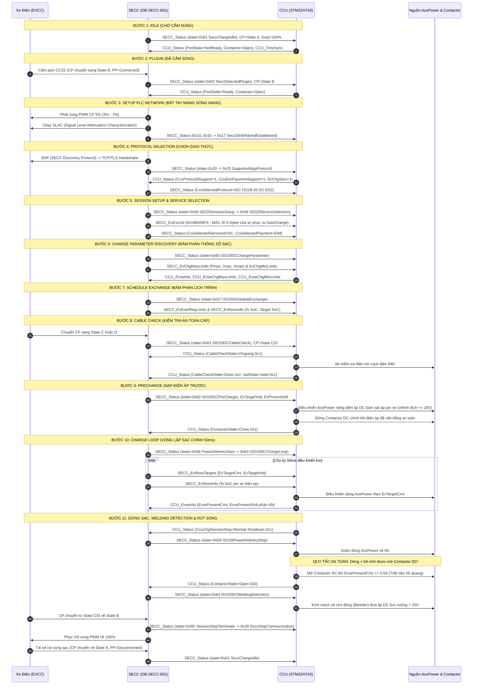

# ĐẶC TẢ QUY TRÌNH SẠC DC ISO 15118-20 (EIM) & MA TRẬN TRUYỀN THÔNG CCU ↔ SECC (DB-SECC-601)

> **Tiêu chuẩn áp dụng:** ISO 15118-20:2022 (ED2) DC Charging, DIN SPEC 70121, IEC 61851-23  
> **Phương thức xác thực:** External Identification Means (EIM) / AutoCharge (EVCC ID MAC 6-byte)  
> **Phần cứng kết nối:** STM32H743XIT6 (CCU) $\longleftrightarrow$ Drop-Beats DB-SECC-601 (SECC) qua bus **FDCAN2** (PB12 RX / PB13 TX) tốc độ **250 kbps** (29-bit Extended CAN).  
> **Căn cứ xác thực:** Tài liệu gốc hãng Drop-Beats `DB-SECC-601 Communication Matrix Charging Flow V1.0.0` & `Communication Matrix v1.1.0`.

---

## 1. TỔNG QUAN HỆ THỐNG VÀ VAI TRÒ GIAO TIẾP

Trong hệ thống trạm sạc nhanh DC THACO EVSE:
- **CCU (Charge Control Unit - STM32H743):** Đóng vai trò bộ não điều khiển trung tâm (Host Master), chịu trách nhiệm cao nhất về an toàn điện lực, điều khiển module nguồn công suất AcePower qua FDCAN1, đóng/ngắt các cuộn hút rơ-le Contactor DC chính, giám sát công tơ đo đếm điện năng DCM230, và duy trì máy trạng thái phiên sạc `ChargerSession`.
- **SECC (Supply Equipment Communication Controller - Drop-Beats DB-SECC-601):** Đóng vai trò bộ chuyển đổi giao thức truyền thông mức cao (High-Level Communication - HLC) qua đường dây tín hiệu Pilot CP bằng sóng mang PLC (HomePlug GreenPHY). SECC bắt tay trực tiếp với ECU xe (EVCC), giải mã các bản tin V2G ISO 15118-20 và chuyển đổi thành các khung truyền CAN 29-bit Extended định kỳ gửi lên CCU STM32H743.

```
  +-----------------------------------------------------------------------------------+
  |                               TRẠM SẠC NHANH THACO EVSE                           |
  |                                                                                   |
  |   +--------------------+     FDCAN2 (250 kbps)      +-------------------------+   |
  |   |    STM32H743XI     | <========================> |   DB-SECC-601 (SECC)    |   |
  |   |    (CCU Master)    |   PB12 RX / PB13 TX        |      (HLC Gateway)      |   |
  |   +--------------------+                            +-------------------------+   |
  |             |                                                    |                |
  |    FDCAN1   | Contactor DC                                       | Dây Pilot CP   |
  |     125k    | (+ / - 250A)                                       | (PWM / PLC)    |
  |             v                                                    v                |
  |      [AcePower Modules]                                  [Cổng Súng Sạc CCS2]     |
  +-------------|----------------------------------------------------|----------------+
                |                                                    |
                +=================== DÂY SẠC CCS2 ===================+
                                     |
                                     v
                           [XE ĐIỆN VINFAST / CCS2]
```

---

## 2. BẢNG CĂN CỨ ĐỐI SOÁT TRIPLE CHECK (3 NGUỒN ĐỘC LẬP)

Để bảo đảm độ tin cậy tuyệt đối và loại bỏ hoàn toàn các giả định sai lệch, quy trình sạc được đối soát chéo qua 3 nguồn:

1. **Lớp 1 (Ground Truth - Đặc tả chính thức của Hãng Drop-Beats):**
   - File tài liệu lưu trữ: `SECC_drop-beats/DB-SECC-601 Communication Matrix Charging Flow V1.0.0 - ISO15118-20_EIM_DC_Charging_2025050723_unlocked.pdf`.
   - File ma trận CAN: `SECC_drop-beats/DB-SECC-601 Communication Matrix_v1.1.0_20250711 - Matrix.pdf`.
2. **Lớp 2 (Reference Implementation - Mã nguồn mẫu chính hãng Drop-Beats):**
   - Mã nguồn C FSM: `test_\DB601_CCU_RaspV1.0.5_DEMO\ccu_simulator\sim\ccu_sim\db_ccu_comm_fsm.c` và `db_ccu_comm_fsm.h`.
3. **Lớp 3 (Production Firmware & Architecture - Mã nguồn STM32H743):**
   - File driver FDCAN2: [Core/secc/ccu_secc_can.c](file:///d:/DuAn/10.ViDieuKhien/STM32/CodeSTM32/evse_h743/Core/secc/ccu_secc_can.c) và [Core/secc/ccu_secc_can.h](file:///d:/DuAn/10.ViDieuKhien/STM32/CodeSTM32/evse_h743/Core/secc/ccu_secc_can.h).
   - Máy trạng thái phiên: [Core/app/charger_session.c](file:///d:/DuAn/10.ViDieuKhien/STM32/CodeSTM32/evse_h743/Core/app/charger_session.c).
   - Task RTOS chu kỳ 10ms: [Core/Src/main.c](file:///d:/DuAn/10.ViDieuKhien/STM32/CodeSTM32/evse_h743/Core/Src/main.c).

---

## 3. BIỂU ĐỒ TUẦN TỰ 11 BƯỚC SẠC ISO 15118-20 EIM DC



---

## 4. CHI TIẾT 11 GIAI ĐOẠN SẠC VÀ BẢNG THAM SỐ ĐỐI CHIẾU

### Bảng đối chiếu FSM 11 bước giữa Chuẩn Hãng và Firmware STM32H743:

| Bước | Tên Bước Chuẩn | Mã `state_raw` SECC | Trạng thái Chân CP | Tần số & Duty CP | Lệnh Điều Khiển từ CCU (STM32H743) | Phản Hồi Từ SECC (DB-SECC-601) | Điều Kiện Chuyển Bước Tiếp Theo |
| :---: | :--- | :---: | :---: | :---: | :--- | :--- | :--- |
| **1** | **Idle** | `0x01` (`SeccChargeIdle`) | State A | $1\text{ kHz}$, $100\%$ | `PortState = 0` (Not Ready)<br/>`Contactor = 0` (Open) | `SeccPpState = Disconnected` | Cắm súng sạc vào xe, điện áp chân CP sụt từ 12V về 9V (State B). |
| **2** | **Plugin** | `0x02` (`SeccDetectedPlugin`) | State B | $1\text{ kHz}$, $100\%$ | `PortState = 1` (Ready)<br/>`Contactor = 0` (Open) | `SeccPpState = Connected` | CP duy trì ở State B $\ge 1.0\text{ s}$. CCU reset toàn bộ watchdog timer. |
| **3** | **PLC Setup** | `0x03` $\rightarrow$ `0x10..0x15` $\rightarrow$ `0x17` (`DlinkEstablished`) | State B | $1\text{ kHz}$, **$5\%$** ($3\%\sim 7\%$) | Giữ `PortState = Ready`<br/>Chờ liên kết mạng PLC | Báo suy hao tín hiệu SLAC (`SeccSlacQuality`), Link mạng HomePlug GreenPHY nối thành công. | SECC chuyển sang trạng thái khám phá giao thức `0x20`. |
| **4** | **Protocol Selection** | `0x20` $\rightarrow$ `0x25` (`SupportedAppProtocol`) | State B | $1\text{ kHz}$, $5\%$ | CCU gửi cờ hỗ trợ qua `CCU_Status`: `ISO20Support=1`, `EimSupport=1`, `DcChgServ=1`, `SchCtrl=1`, `DynCtrl=1`. | SECC chọn giao thức: `CcsSelectedProtocol = 0x3` (ISO 15118-20 DC ED2). | Nhận diện xong giao thức truyền thông mức cao. |
| **5** | **Session Setup & Service Selection** | `0x50` (`ISO20SessionSetup`) $\rightarrow$ `0x56` (`ServiceSelection`) | State B | $1\text{ kHz}$, $5\%$ | CCU duy trì trạng thái phiên, ghi nhận định danh xe. | SECC phát bản tin `SECC_EvEvccId` (`0x18B356F4`) mang **6-byte MAC xe**; `CcsSelectedServiceId = DC(2)`. | Hoàn tất đàm phán dịch vụ sạc một chiều (DC). |
| **6** | **Charge Parameter Discovery** | `0x60` (`ISO20DCChargeParameter`) | State B | $1\text{ kHz}$, $5\%$ | CCU lập tức phát các bản tin giới hạn trạm: `CCU_EvseInfo`, `EvseChgMaxLimits`, `EvseChgMinLimits`. | SECC gửi giới hạn pin xe: `SECC_EvChgMaxLimits` ($P_{\max}, I_{\max}, V_{\max}$) và `SECC_EvChgMinLimits`. | Trao đổi xong toàn bộ năng lực nguồn trạm và thông số giới hạn của pin xe. |
| **7** | **Schedule Exchange** | `0x57` (`ISO20ScheduleExchange`) | State B | $1\text{ kHz}$, $5\%$ | Duy trì `CCU_Status`, sẵn sàng chuyển bước Cable Check. | SECC gửi dữ liệu `SECC_EvEnerReqLimits` và `SECC_EvRessInfo` (% SoC, Target SoC). | Xe và trạm thống nhất biểu đồ công suất nạp. |
| **8** | **Cable Check** | `0x61` (`ISO20DCCableCheck`) | **State C hoặc D** | $1\text{ kHz}$, $5\%$ | 1. Báo `CableCheckState = Ongoing(1)`.<br/>2. Đo điện trở cách điện IMD.<br/>3. Báo `CableCheckState = Done(2)` và `IsolState = Valid(1)`. | CP chuyển từ B sang C/D (Xe kích hoạt đóng rơ-le trong xe chuẩn bị sạc). | Điện trở cách điện đạt chuẩn an toàn ($> 500\,\Omega/\text{V}$), hoàn tất kiểm tra cáp. |
| **9** | **Precharge** | `0x62` (`ISO20DCPreCharge`) | State C hoặc D | $1\text{ kHz}$, $5\%$ | 1. Điều khiển AcePower nâng điện áp DC bám sát áp pin xe `EvPresentVolt`.<br/>2. Đóng Contactor DC khi chênh lệch áp $|\Delta V| \le 20\text{V}$.<br/>3. Báo `ContactorState = Close(1)`. | SECC gửi liên tục `EvTargetVolt` và `EvPresentVolt` để CCU bám đuổi điện áp. | Điện áp module nguồn cân bằng với điện áp pin xe ($\Delta V \le 20\text{V}$) và contactor đã đóng an toàn. |
| **10**| **Charge Loop** | `0x58` (`PowerDeliveryStart`) $\rightarrow$ `0x63` (`ISO20DCChargeLoop`) | State C hoặc D | $1\text{ kHz}$, $5\%$ | **Chu kỳ 50ms**: Điều khiển dòng AcePower theo `EvTargetCrnt`; gửi phản hồi `EvsePresentVolt` và `EvsePresentCrnt`. | **Chu kỳ 50ms**: SECC gửi `SECC_EvRessTargets` và **chu kỳ 250ms** gửi `SECC_EvRessInfo` (% SoC). | Phiên sạc chạy ổn định cho tới khi nhận lệnh dừng từ User (HMI/App/RFID) hoặc từ Xe (Pin đầy/Lỗi). |
| **11**| **Stop & Welding Detection** | `0x59` $\rightarrow$ `0x64` $\rightarrow$ `0x5D` $\rightarrow$ `0x29` | State C $\rightarrow$ B $\rightarrow$ A | $5\% \rightarrow 100\%$ | 1. Giảm dòng AcePower về $0\text{A}$.<br/>2. Khi dòng đo được $\le 5.0\text{A}$, mở Contactor DC (`Contactor = Open`).<br/>3. Xả điện áp DC bus xuống $< 20\text{V}$. | SECC báo `0x64` (Welding Detection), chuyển CP về State B. SECC ngắt truyền thông (`0x29`). | Rút súng sạc, hệ thống trở về Bước 1 (Idle). |

---

## 5. ĐẶC TẢ ĐÓNG GÓI BIT 14 BẢN TIN CAN (CAN SPECIFICATION)

Tất cả các bản tin giao tiếp FDCAN2 đều sử dụng định dạng **29-bit Extended Frame (CAN 2.0B)** theo chuẩn byte order Little-Endian (Intel).

### 5.1. Nhóm Bản Tin CCU $\longrightarrow$ SECC (STM32H743 Phát Đi)

#### 1. `CCU_Status` (`0x18C0F456` | DLC = 8 | Chu kỳ: 50 ms)
Bản tin quan trọng nhất điều khiển máy trạng thái SECC và công bố các tính năng hỗ trợ của trạm:

| Tín hiệu (Signal Name) | Start Bit | Độ dài | Kiểu dữ liệu | Scale / Offset | Đơn vị | Giá trị quy ước & Ý nghĩa kỹ thuật |
| :--- | :---: | :---: | :---: | :---: | :---: | :--- |
| `CcuChgPortStandard` | 0 | 2 bit | Unsigned | 1 / 0 | Enum | `0x0`: CCS1, **`0x1`**: **CCS2**, `0x2`: NACS. |
| `CcuChgPortState` | 2 | 1 bit | Unsigned | 1 / 0 | Enum | `0x0`: Not Ready, **`0x1`**: **Port Ready**. |
| `CcuChgPortIsolMonitoring` | 3 | 1 bit | Unsigned | 1 / 0 | Enum | `0x0`: Not Active, **`0x1`**: **Active** (Đang giám sát cách điện). |
| `CcuChgPortIsolState` | 4 | 2 bit | Unsigned | 1 / 0 | Enum | `0x0`: Invalid, **`0x1`**: **Valid**, `0x2`: Warning, `0x3`: Fault. |
| `CcuChgCableCheckState` | 6 | 2 bit | Unsigned | 1 / 0 | Enum | `0x0`: Not Run, `0x1`: Ongoing, **`0x2`**: **Done successfully**, `0x3`: Failed. |
| `CcuChgSessionAuth` | 8 | 2 bit | Unsigned | 1 / 0 | Enum | `0x0`: Unauthorized, `0x1`: Free, **`0x2`**: **Authorized by EIM**, `0x3`: PnC. |
| `CcuChgSessionStop` | 10 | 2 bit | Unsigned | 1 / 0 | Enum | `0x0`: No Stop, `0x1`: Normal Shutdown, `0x2`: Emergency Shutdown, `0x3`: Other Error. |
| `CcuChgSessionState` | 12 | 5 bit | Unsigned | 1 / 0 | Enum | Trạng thái phiên của CCU: `0x0`=Idle, `0x1`=Plugged, `0x8`=CableCheck, `0x9`=PreCharge, `0xB`=Charging, `0xC`=Stopping, `0xD`=Welding. |
| `CcuChgPortContactorState` | 17 | 1 bit | Unsigned | 1 / 0 | Enum | **`0x0`**: **Open (Mở)**, **`0x1`**: **Close (Đóng rơ-le)**. |
| `CcuEimPaymentSupport` | 18 | 1 bit | Bool | 1 / 0 | Flag | `1`: Trạm hỗ trợ thanh toán EIM (App/RFID/QR). |
| `CcuPncPaymentSupport` | 19 | 1 bit | Bool | 1 / 0 | Flag | `0`: Tạm thời tắt Plug & Charge chứng chỉ số ISO 15118-2. |
| `CcuProDinSupport` | 20 | 1 bit | Bool | 1 / 0 | Flag | `1`: Hỗ trợ giao thức DIN 70121. |
| `CcuProIso2Support` | 21 | 1 bit | Bool | 1 / 0 | Flag | `1`: Hỗ trợ giao thức ISO 15118-2 (ED1). |
| `CcuProIso20Support` | 22 | 1 bit | Bool | 1 / 0 | Flag | `1`: Hỗ trợ giao thức ISO 15118-20 (ED2). |
| `CcuDcChgServSupport` | 23 | 1 bit | Bool | 1 / 0 | Flag | `1`: Hỗ trợ dịch vụ sạc một chiều DC Charging. |
| `CcuDcBptServSupport` | 24 | 1 bit | Bool | 1 / 0 | Flag | `0`: Chưa bật tính năng phát điện ngược V2G/BPT. |
| `CcuSchCtrllModeSupport` | 25 | 1 bit | Bool | 1 / 0 | Flag | `1`: Hỗ trợ điều khiển theo Schedule Mode. |
| `CcuDynCtrllModeSupport` | 26 | 1 bit | Bool | 1 / 0 | Flag | `1`: Hỗ trợ điều khiển theo Dynamic Mode. |
| `CcuPreferredMobiNdsMode`| 27 | 2 bit | Unsigned | 1 / 0 | Enum | `0x1`: Thông tin nhu cầu di chuyển do EVCC cung cấp. |
| `Reserved` | 29 | 27 bit | Unsigned | - | - | Dự phòng (set 0). |
| `CcuTroubleCode` | 56 | 8 bit | Unsigned | 1 / 0 | Enum | Mã lỗi chi tiết CCU gửi SECC (Xem Bảng Mã Lỗi ở Mục 6). |

#### 2. `CCU_EvseInfo` (`0x18C1F456` | DLC = 8 | Chu kỳ: 100 ms)
Phản hồi đo đạc điện áp và dòng điện thực tế tại đầu ra súng sạc do CCU đo được từ AcePower/DCM230:
- `EvsePresentCrnt` (Bit 0..15, 16-bit Signed): Hệ số scale $0.1\text{ A}$ (Dải: $-3276.8\text{ A} \sim +3276.7\text{ A}$). Dấu âm biểu thị xả pin.
- `EvsePresentVolt` (Bit 16..31, 16-bit Unsigned): Hệ số scale $0.1\text{ V}$ (Dải: $0 \sim 6553.5\text{ V}$).

#### 3. `CCU_EvseChgMaxLimits` (`0x18C2F456` | DLC = 8 | Chu kỳ: 100 ms)
Công bố năng lực giới hạn phát tối đa của trạm sạc:
- `EvseMaxChgPwr` (Bit 0..15, 16-bit Unsigned): Scale $0.1\text{ kW}$ (Ví dụ: $600 = 60.0\text{ kW}$, $1200 = 120.0\text{ kW}$).
- `EvseMaxChgCrnt` (Bit 16..31, 16-bit Unsigned): Scale $0.1\text{ A}$ (Ví dụ: $2500 = 250.0\text{ A}$).
- `EvseMaxVolt` (Bit 32..47, 16-bit Unsigned): Scale $0.1\text{ V}$ (Ví dụ: $10000 = 1000.0\text{ V}$).
- `EvsePeakCurrentRipple` (Bit 48..55, 8-bit Unsigned): Độ nhấp nhô đỉnh-đỉnh của dòng điện ($1\text{ A/LSB}$).

#### 4. `CCU_EvseChgMinLimits` (`0x18C3F456` | DLC = 8 | Chu kỳ: 100 ms)
Giới hạn tối thiểu trạm có thể đáp ứng với độ chính xác bảo đảm:
- `EvseMinChgPwr` (Bit 0..15): Scale $0.1\text{ kW}$.
- `EvseMinChgCrnt` (Bit 16..31): Scale $0.1\text{ A}$ (Ví dụ: $20 = 2.0\text{ A}$).
- `EvseMinVolt` (Bit 32..47): Scale $0.1\text{ V}$ (Ví dụ: $2000 = 200.0\text{ V}$).
- `EvsePowerRampLim` (Bit 48..55): Giới hạn tốc độ biến thiên công suất ($\%/\text{phút}$).

#### 5. `CCU_TimeSync` (`0x18C9F456` | DLC = 6 | Chu kỳ: 1000 ms)
Đồng bộ thời gian thực từ CCU sang SECC:
- `TsYear` (Bit 0..7): Năm tính từ mốc 2000 (Ví dụ: $26 = 2026$).
- `TsMonth` (Bit 8..15): Tháng ($1 \sim 12$).
- `TsDay` (Bit 16..23): Ngày ($1 \sim 31$).
- `TsHour` (Bit 24..31): Giờ UTC ($0 \sim 23$).
- `TsMinute` (Bit 32..39): Phút ($0 \sim 59$).
- `TsSecond` (Bit 40..47): Giây ($0 \sim 59$).

---

### 5.2. Nhóm Bản Tin SECC $\longrightarrow$ CCU (STM32H743 Nhận & Giám Sát)

#### 1. `SECC_Status` (`0x18B056F4` | DLC = 8 | Chu kỳ: 50 ms)
Bản tin phản ánh tiến trình đàm phán HLC từ xe:
- `SeccChgSessionState` (Bit 0..6, 7-bit): Mã trạng thái phiên hiện tại (`0x01`=Idle, `0x02`=Plugin, `0x17`=DlinkReady, `0x25`=AppProtocol, `0x50`=SessionSetup, `0x60`=ParamDiscovery, `0x61`=CableCheck, `0x62`=PreCharge, `0x63`=ChargeLoop, `0x64`=WeldingDetection, `0x29`=StopComm).
- `SeccChgSessionDirection` (Bit 7, 1-bit): `0`=SECC nhận, `1`=SECC gửi.
- `SeccChgStopReason` (Bit 8..14, 7-bit): Nguyên nhân dừng phiên (`0x01`=EV Normal, `0x10`=Charger Normal, `0x13`=CCU Status Timeout, `0x22`=CP Abnormal, v.v.).
- `SeccChgStopStage` (Bit 15..19, 5-bit): Giai đoạn phát sinh dừng sạc.
- `CcsSelectedProtocol` (Bit 20..23, 4-bit): `0x1`=DIN70121, `0x2`=ISO15118-2, **`0x3`=ISO 15118-20 DC**.
- `CcsSelectedServiceId` (Bit 24..29, 6-bit): **`0x2`=DC Charging**.
- `CcsSelectedPayment` (Bit 30..31, 2-bit): **`0x2`=EIM**.
- `CcsSelectedControlMode` (Bit 32..33, 2-bit): `0x1`=Schedule, `0x2`=Dynamic.
- `SeccChgSessionStop` (Bit 40..41, 2-bit): `0x1`=Normal Stop, `0x2`=Emergency Stop.
- `SeccTroubleType` (Bit 50..55, 6-bit) & `SeccTroubleCode` (Bit 56..63, 8-bit).

#### 2. `SECC_PlcModeBasicInfo` (`0x18B156F4` | DLC = 8 | Chu kỳ: 100 ms)
Thông số vật lý đường truyền Pilot CP và Proximity PP:
- `SeccSwVer` (Bit 0..15): Phiên bản phần mềm SECC (`Major*10000 + Minor*100 + Build`).
- `SeccCpState` (Bit 16..19): Trạng thái chân CP (**`0x1`=A**, **`0x2`=B**, **`0x3`=C**, **`0x4`=D**, `0x5`=E, `0x6`=F).
- `SeccPpState` (Bit 20..23): Trạng thái ngàm súng PP (**`0x1`=Connected**, `0x2`=Disconnected).
- `SeccCpVoltage` (Bit 24..31, Signed): Điện áp chân CP (Scale: $0.1\text{ V}$, Dải: $-12.8\text{ V} \sim +12.7\text{ V}$).
- `SeccCpDuty` (Bit 32..39): Chu kỳ nhiệm vụ xung PWM CP (Scale: $1\%$, Dải: $0 \sim 100\%$).
- `SeccPpVoltage` (Bit 40..47): Điện áp ngàm súng PP (Scale: $0.1\text{ V}$).
- `SeccSlacQuality` (Bit 48..49): Chất lượng suy hao tín hiệu PLC (`0`=Xuất sắc, `1`=Tốt, `2`=Bình thường, `3`=Kém).
- `PlcLinkStatus` (Bit 56..57): `1`=Linked (Mạng PLC đã thông).

#### 3. `SECC_EvEvccId` (`0x18B356F4` | DLC = 8 | Chu kỳ: 1000 ms)
Định danh duy nhất của modem xe điện:
- `EvccIdLen` (Bit 0..3): Độ dài mã MAC (thường là $6\text{ bytes}$).
- `EvccId` (Bit 8..55, 48-bit): **Địa chỉ MAC 6-byte của xe** (Ví dụ: `38:2C:4A:A1:B2:C3`). Dữ liệu này được H743 gửi về CSMS để thực hiện nhận diện xe tự động **AutoCharge**.

#### 4. `SECC_EvChgMaxLimits` (`0x18B456F4` | DLC = 8 | Chu kỳ: 100 ms)
Giới hạn tối đa mà bộ quản lý pin BMS của xe cho phép nhận:
- `EvMaxChgPwr` (Bit 8..23): Công suất sạc tối đa (Scale $0.1\text{ kW}$).
- `EvMaxChgCrnt` (Bit 24..39): Dòng điện sạc tối đa pin xe chịu được (Scale $0.1\text{ A}$).
- `EvMaxVolt` (Bit 40..55): Điện áp ngưỡng ngắt bảo vệ pin xe (Scale $0.1\text{ V}$).

#### 5. `SECC_EvRessTargets` (`0x18B656F4` | DLC = 8 | Chu kỳ: 50 ms)
Mục tiêu dòng và áp xe liên tục yêu cầu module nguồn phát trong vòng sạc kín:
- `EvTargetCrnt` (Bit 8..23, 16-bit Signed): Dòng điện yêu cầu tức thời (Scale $0.1\text{ A}$).
- `EvTargetVolt` (Bit 24..39, 16-bit Unsigned): Điện áp sạc yêu cầu tức thời (Scale $0.1\text{ V}$).
- `EvTargetSoc` (Bit 40..47): Phần trăm pin xe mong muốn đạt được (Scale $1\%$).
- `EvPresentVolt` (Bit 48..63): Điện áp thực tế đo tại chân cắm pin xe (Scale $0.1\text{ V}$).

#### 6. `SECC_EvRessInfo` (`0x18B856F4` | DLC = 8 | Chu kỳ: 250 ms)
Thông tin trạng thái dung lượng pin xe:
- `EvPresentSoc` (Bit 8..15): **Phần trăm pin xe hiện tại (% SoC)** ($0 \sim 100\%$).
- `DepartureTime` (Bit 16..31): Thời gian dự kiến xe rời trạm ($10\text{ s/LSB}$).
- `EvRessEnerCapa` (Bit 32..47): Tổng dung lượng danh định gói pin xe (Scale $0.1\text{ kWh}$).
- `EvMinSoc` (Bit 48..55) & `EvMaxSoc` (Bit 56..63): Giới hạn SoC dưới và trên của xe.

---

## 6. CÁC QUY TẮC AN TOÀN BẮT BUỘC & NGƯỠNG BẢO VỆ ĐIỆN TỬ

Để bảo đảm tuổi thọ thiết bị và chống cháy nổ, hệ thống thực thi 3 quy tắc an toàn bất khả xâm phạm:

### 6.1. Quy tắc Ngắt Contactor Chống Hồ Quang ($I_{\text{OUT}} \le 5.0\text{ A}$)
- **Cơ sở tiêu chuẩn (PDF Spec Line 549 & IEC 61851-23):**
  > *"EVSE contactor should be opened if DC output current less than 5A."*
- **Thực thi trong firmware H743 (`ccu_secc_can.c` Line 740):**
  Khi kết thúc phiên sạc bình thường, CCU tuyệt đối **KHÔNG** được nhả cuộn hút contactor ngay lập tức khi dòng điện còn lớn. Module AcePower phải được lệnh giảm dòng về $0\text{A}$. Chỉ khi dòng điện đo được hạ xuống $\le 5.0\text{A}$ (`evse_present_current_dA <= 50`), CCU mới xuất tín hiệu mở rơ-le Contactor DC:
  ```c
  if (c->tx_status.session_stop == CCU_STOP_NORMAL &&
      (int)c->tx_info.evse_present_current_dA <= 50 /* 5A = 50 dA */) {
      c->tx_status.contactor_state = CCU_CONTACTOR_OPEN;
  }
  ```
  Điều này triệt tiêu hoàn toàn hiện tượng sinh hồ quang điện ion hóa plasma, bảo vệ tiếp điểm bạc của rơ-le Contactor 1000V/250A không bị dính chặt (contact welding).

### 6.2. Cơ Chế Precharge An Toàn 2 Tầng ($|\Delta V| \le 20\text{V}$)
- Trong giai đoạn Precharge (`0x62`), trước khi dòng điện lớn được kích hoạt, điện áp đầu ra của module nguồn phải được nâng dần để bám sát điện áp hiện tại của pin xe `EvPresentVolt`.
- Chỉ khi sai số chênh lệch điện áp:
  $$|\Delta V| = |V_{\text{AcePower}} - V_{\text{Battery}}| \le 20\text{ V}$$
  mạch logic trong [charger_session.c](file:///d:/DuAn/10.ViDieuKhien/STM32/CodeSTM32/evse_h743/Core/app/charger_session.c) mới cho phép đóng rơ-le kết nối vật lý, ngăn chặn dòng điện nạp ngược đột biến (inrush current) làm đứt cầu chì cao thế.

### 6.3. Xả Áp Chủ Động Buồng Hàn Welding Detection ($V_{\text{DC}} < 20\text{V}$)
- Sau khi mở contactor ở bước dừng sạc, tụ điện cao thế trong module nguồn và trên đường bus DC vẫn còn tích điện tích nguy hiểm ($400\text{V} \sim 800\text{V}$).
- Tại bước `0x64` (`ISO20DCWeldingDetection`), CCU kích hoạt điện trở xả chủ động (Bleeder Resistor) để xả điện áp bus xuống ngưỡng an toàn $< 20\text{V}$ (hoặc $< 60\text{V}$ theo tiêu chuẩn chạm tay người SELV) trước khi cho phép mở khóa súng sạc.

### 6.4. Cơ Chế Latch Trouble Code & Watchdog Từng Bản Tin CAN
- Mỗi khung tin CAN từ SECC đều có một bộ đếm Watchdog độc lập (Timeout $5000\text{ ms}$). Nếu SECC bị treo hoặc đứt cáp CAN trong lúc đang sạc:
  1. CCU lập tức chốt mã lỗi đầu tiên (Latch Trouble Code) vào thanh ghi `CcuTroubleCode`.
  2. Ngắt nguồn AcePower ngay lập tức.
  3. Mở contactor DC và chuyển trạng thái sạc sang `CHARGER_STATE_FAULTED`.
  4. Mã lỗi này được giữ nguyên cho đến khi tài xế rút súng sạc hoặc người vận hành xóa lỗi thủ công qua lệnh Modbus HMI.

---

## 7. BẢNG TRA CỨU 17 MÃ LỖI CCU TROUBLE CODES (CHUẨN DROP-BEATS)

Khi có sự cố, byte thứ 7 của bản tin `CCU_Status` (`CcuTroubleCode`, bit 56..63) sẽ phản ánh chính xác nguyên nhân:

| Mã Lỗi (Hex) | Tên Định Danh Hằng Số | Mức Độ | Nguyên Nhân Phát Sinh | Hành Động Xử Lý Của Firmware |
| :---: | :--- | :---: | :--- | :--- |
| `0x00` | `CCU_TROUBLE_NONE` | - | Hệ thống vận hành bình thường. | Duy trì phiên sạc. |
| `0x01` | `CCU_TROUBLE_HW_ERROR` | CRITICAL | Lỗi phần cứng CCU (Nút E-Stop ấn, lỗi rơ-le). | Ngắt AcePower $< 20\text{ ms}$, mở Contactor. |
| `0x02` | `CCU_TROUBLE_SW_ERROR` | HIGH | Lỗi logic phần mềm, tràn bộ đệm. | Reset phiên sạc, log cảnh báo. |
| `0x03` | `CCU_TROUBLE_CAN_BUSOFF`| CRITICAL | Bus FDCAN2 bị nghẽn (Bus-Off / Lỗi chân PB12/13).| Khởi động lại ngoại vi FDCAN2. |
| `0x04` | `CCU_TROUBLE_CHARGER_FAULT`| HIGH | Module nguồn AcePower báo lỗi quá áp/quá nhiệt. | Dừng sạc, cô lập module lỗi. |
| `0x10` | `CCU_TROUBLE_SECC_STATUS_TIMEOUT` | HIGH | Mất bản tin `SECC_Status` (`0x18B056F4`) quá 5s. | Dừng khẩn cấp phiên sạc. |
| `0x11` | `CCU_TROUBLE_SECC_PLC_BASIC_TIMEOUT` | HIGH | Mất bản tin `SECC_PlcModeBasicInfo` (`0x18B156F4`) quá 5s.| Dừng khẩn cấp phiên sạc. |
| `0x12` | `CCU_TROUBLE_SECC_MCS_BASIC_TIMEOUT` | MEDIUM | Mất bản tin MCS BasicInfo (chỉ dùng cho sạc MCS). | Ghi log cảnh báo. |
| `0x13` | `CCU_TROUBLE_SECC_EVCC_ID_TIMEOUT` | MEDIUM | Mất bản tin EVCC ID MAC (`0x18B356F4`) quá 15s. | Bỏ qua AutoCharge, chuyển sang RFID/App. |
| `0x14` | `CCU_TROUBLE_SECC_EV_CHG_MAX_TIMEOUT`| HIGH | Mất bản tin giới hạn cực đại sạc pin xe quá 5s. | Dừng phiên sạc an toàn. |
| `0x15` | `CCU_TROUBLE_SECC_EV_CHG_MIN_TIMEOUT`| HIGH | Mất bản tin giới hạn cực tiểu sạc pin xe quá 5s. | Dừng phiên sạc an toàn. |
| `0x16` | `CCU_TROUBLE_SECC_RESS_TARGETS_TIMEOUT`| CRITICAL | Mất bản tin mục tiêu dòng/áp sạc trong Charge Loop quá 5s. | **Cực kỳ nguy hiểm**: Ngắt ngay dòng nguồn phát. |
| `0x17` | `CCU_TROUBLE_SECC_RESS_INFO_TIMEOUT` | HIGH | Mất bản tin dung lượng % SoC pin xe quá 5s. | Dừng phiên sạc an toàn. |
| `0x18` | `CCU_TROUBLE_SECC_REMAIN_TIME1_TIMEOUT`| LOW | Mất bản tin dự toán thời gian sạc Bulk 80%. | Tiếp tục sạc, hiển thị '--:--' trên HMI. |
| `0x19` | `CCU_TROUBLE_SECC_REMAIN_TIME2_TIMEOUT`| LOW | Mất bản tin dự toán thời gian sạc Full 100%. | Tiếp tục sạc, hiển thị '--:--' trên HMI. |
| `0x1A` | `CCU_TROUBLE_SECC_ENER_REQ_TIMEOUT` | MEDIUM | Mất bản tin yêu cầu năng lượng kWh của xe quá 5s. | Tiếp tục sạc theo dòng áp mục tiêu. |
| `0x1B` | `CCU_TROUBLE_SECC_DCHG_LIMITS_TIMEOUT`| MEDIUM | Mất bản tin giới hạn xả pin V2G (chỉ dùng khi BPT bật).| Hủy bỏ chế độ xả điện. |
