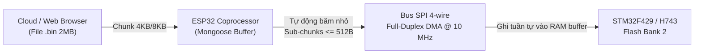

# ĐẶC TẢ KỸ THUẬT NÂNG CẤP FIRMWARE TỪ XA (OTA SPECIFICATION)
## (WEB OTA & MQTT FLEET OTA ARCHITECTURE FOR ESP32, STM32F429, STM32H743)

Tài liệu này chuẩn hóa toàn bộ kiến trúc cập nhật phần mềm từ xa (OTA) cho cả 3 vi điều khiển trong hệ thống trạm sạc THACO EVSE phiên bản **v1.0.1**.

---

## 1. CƠ CHẾ NẠP KÉP (DUAL OTA CHANNELS)

Hệ thống hỗ trợ 2 kênh nạp độc lập:
1. **Web OTA (Kỹ thuật viên tại chỗ):**
   - Kết nối Wi-Fi trạm hoặc mạng LAN nội bộ, mở trình duyệt truy cập `http://10.14.80.19`.
   - Chọn đối tượng cần nạp (`ESP32`, `EVSE_F429`, `EVSE_H743`) và tải tệp `.bin` trực tiếp.
2. **MQTT Fleet OTA (Quản lý hạm đội từ xa qua Cloud):**
   - Quản trị viên sử dụng công cụ `tools/network_tools/ota_mqtt.py` kết nối tới broker MQTT EMQX trung tâm.
   - Phát lệnh nạp hàng loạt cho hàng nghìn trạm sạc cùng lúc theo topic: `evse/ota/upload`.

---

## 2. CƠ CHẾ CẦU NỐI SPI BRIDGE VỚI PHÂN ĐOẠN SUB-CHUNKING $\le 512\text{B}$

> [!IMPORTANT]
> **Giải pháp kỹ thuật cốt lõi:** Khi nạp firmware cho STM32F429 và STM32H743 từ xa, file binary được gửi tới ESP32 dưới dạng chunk lớn (4KB/8KB). ESP32 tự động băm nhỏ chunk này thành các **sub-chunk $\le 512\text{ Byte}$** trước khi đẩy qua bus SPI sang STM32.  
> Cơ chế này loại bỏ 100% nguy cơ tràn bộ đệm RAM trên STM32 và giải quyết triệt để lỗi sai lệch mã kiểm tra `Bridge error 3 CRC Mismatch`.

---

## 3. CƠ CHẾ FLASH DUAL-BANK & LIVE SWAP AN TOÀN

Cả 2 vi điều khiển STM32F429 và STM32H743 đều sử dụng kiến trúc bộ nhớ Flash Dual-Bank:
- **Bank 1 (`0x08000000`):** Chứa firmware phiên bản hiện tại đang vận hành trạm sạc.
- **Bank 2 (`0x08100000`):** Nhận firmware phiên bản mới được ghi trực tiếp trong thời gian thực.
- **Xác thực toàn vẹn bằng phần cứng CRC32:**
  - Sau khi truyền hết byte cuối cùng, bộ đồng xử lý phần cứng CRC32 tích hợp trong chip STM32 sẽ quét toàn bộ dữ liệu trên Bank 2.
  - Nếu mã CRC32 tính được khớp chính xác 100% với CRC trong Header file binary $\longrightarrow$ Cho phép kích hoạt hoán đổi Bank.
- **Hoán đổi Bank tức thì (Instant Bank Swap):**
  - Kích hoạt bit `SWAP_BANK` trong thanh ghi Option Bytes của STM32.
  - Thực hiện Soft Reset hệ thống trong thời gian $< 500\text{ ms}$. Trạm sạc tái khởi động ngay lập tức trên firmware mới.
  - Nếu bản mới bị lỗi treo, mạch giám sát Watchdog sẽ tự động kích hoạt Rollback quay lại Bank cũ, chống "brick" chip 100%.
