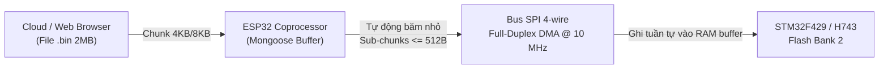
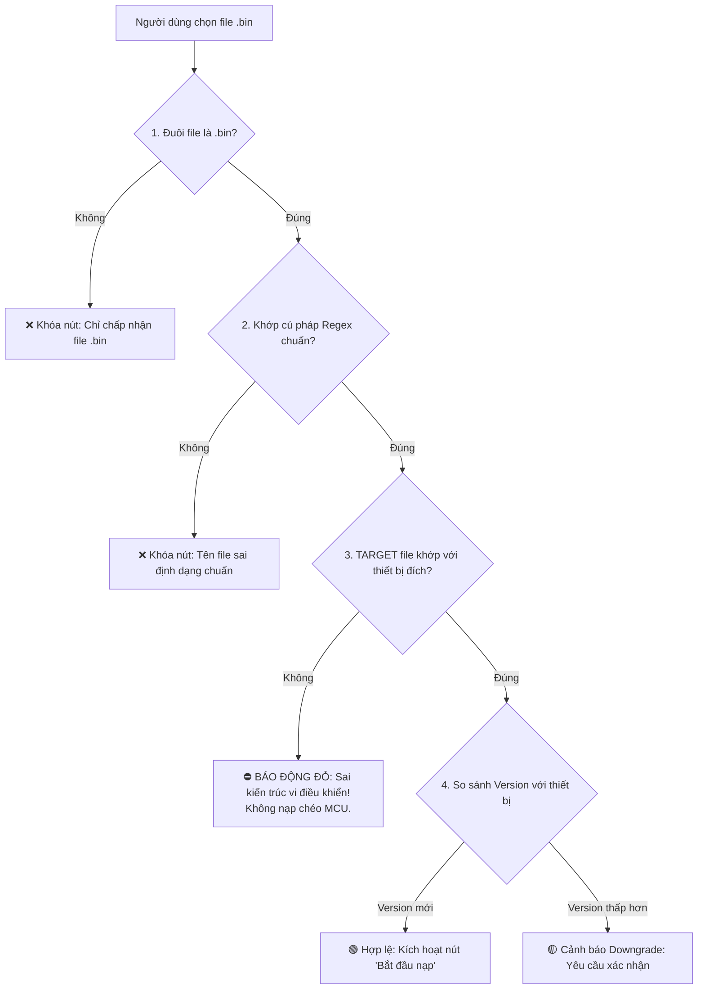

# ĐẶC TẢ KỸ THUẬT NÂNG CẤP FIRMWARE TỪ XA (OTA SPECIFICATION)
## (WEB OTA & MQTT FLEET OTA ARCHITECTURE FOR ESP32, STM32F429, STM32H743)

Tài liệu này chuẩn hóa toàn bộ kiến trúc cập nhật phần mềm từ xa (OTA) cho cả 3 vi điều khiển trong hệ thống trạm sạc THACO EVSE phiên bản **v1.0.1**.

---

## 1. CƠ CHẾ NẠP KÉP (DUAL OTA CHANNELS)

Hệ thống hỗ trợ 2 kênh nạp độc lập:
1. **Web OTA (Kỹ thuật viên tại chỗ):**
   - Kết nối Wi-Fi trạm hoặc mạng LAN nội bộ, mở trình duyệt truy cập `http://10.14.80.19`.
   - Chọn đối tượng cần nạp (`ESP32`, `EVSE_F429`, `EVSE_H743`) và tải tệp `.bin` trực tiếp.
2. **MQTT Fleet OTA (Quản lý hạm đội từ xa qua Cloud):**
   - Quản trị viên sử dụng công cụ `tools/network_tools/ota_mqtt.py` kết nối tới broker MQTT EMQX trung tâm.
   - Phát lệnh nạp hàng loạt cho hàng nghìn trạm sạc cùng lúc theo topic: `evse/ota/upload`.

---

## 2. CƠ CHẾ CẦU NỐI SPI BRIDGE VỚI PHÂN ĐOẠN SUB-CHUNKING $\le 512\text{B}$

> [!IMPORTANT]
> **Giải pháp kỹ thuật cốt lõi:** Khi nạp firmware cho STM32F429 và STM32H743 từ xa, file binary được gửi tới ESP32 dưới dạng chunk lớn (4KB/8KB). ESP32 tự động băm nhỏ chunk này thành các **sub-chunk $\le 512\text{ Byte}$** trước khi đẩy qua bus SPI sang STM32.  
> Cơ chế này loại bỏ 100% nguy cơ tràn bộ đệm RAM trên STM32 và giải quyết triệt để lỗi sai lệch mã kiểm tra `Bridge error 3 CRC Mismatch`.



---

## 3. CƠ CHẾ FLASH DUAL-BANK & LIVE SWAP AN TOÀN

Cả 2 vi điều khiển STM32F429 và STM32H743 đều sử dụng kiến trúc bộ nhớ Flash Dual-Bank:
- **Bank 1 (`0x08000000`):** Chứa firmware phiên bản hiện tại đang vận hành trạm sạc.
- **Bank 2 (`0x08100000`):** Nhận firmware phiên bản mới được ghi trực tiếp trong thời gian thực.
- **Xác thực toàn vẹn bằng phần cứng CRC32:**
  - Sau khi truyền hết byte cuối cùng, bộ đồng xử lý phần cứng CRC32 tích hợp trong chip STM32 sẽ quét toàn bộ dữ liệu trên Bank 2.
  - Nếu mã CRC32 tính được khớp chính xác 100% với CRC trong Header file binary $\longrightarrow$ Cho phép kích hoạt hoán đổi Bank.
- Hoán đổi Bank tức thì (Instant Bank Swap):
  - Kích hoạt bit `SWAP_BANK` trong thanh ghi Option Bytes của STM32.
  - Thực hiện Soft Reset hệ thống trong thời gian $< 500\text{ ms}$. Trạm sạc tái khởi động ngay lập tức trên firmware mới.
  - Nếu bản mới bị lỗi treo, mạch giám sát Watchdog sẽ tự động kích hoạt Rollback quay lại Bank cũ, chống "brick" chip 100%.

---

## 4. QUY CHUẨN ĐẶT TÊN THIẾT BỊ (DEVICE ID) CHO SẢN XUẤT HÀNG LOẠT

Mỗi trạm sạc thực tế trong mạng lưới thương mại (Charge Point / Station) được định danh bằng một mã duy nhất `STATION_ID`. Trong trạm sạc gồm 3 vi điều khiển phối hợp, do đó `Device ID` trên hệ thống MQTT / Cloud bắt buộc tuân theo cấu trúc:

```text
[STATION_ID]_[TARGET_MCU]
```

### 4.1. Bảng quy ước định danh MCU (`TARGET_MCU`)
| Mã TARGET | Vi điều khiển | Vai trò trong trạm sạc | MQTT Sub-topic |
| :--- | :--- | :--- | :--- |
| **`ESP32`** | ESP32-C6 | Gateway Wi-Fi/Ethernet, Web Dashboard, Cầu nối OTA | `.../[Device_ID]/rx`, `tx`, `status` |
| **`F429`** | STM32F429ZIT6 | Bộ điều khiển trung tâm giao thức OCPP 1.6J, Master Modbus | `.../[Device_ID]/rx`, `tx`, `status` |
| **`H743`** | STM32H743VIT6 | Bộ điều khiển công suất cao thế, FSM chu trình sạc CCS2/GBT | `.../[Device_ID]/rx`, `tx`, `status` |

### 4.2. Cấu trúc Station ID & Device ID thực tế
- **Môi trường Phòng Lab / Mặc định (Stand-alone default):**
  - `STATION_ID` = `EVSE`
  - Các Device ID tương ứng:
    - ESP32 Gateway: `EVSE_ESP32`
    - STM32F429 Master: `EVSE_F429`
    - STM32H743 Trụ chính: `EVSE_H743`
- **Môi trường Sản xuất thương mại (Production Fleet):**
  - `STATION_ID` đặt theo mã trạm/trụ (Ví dụ: `TC01`, `TC_BD01_P01` - Trạm Bình Dương trụ 1):
    - ESP32 Gateway: `TC01_ESP32`
    - STM32F429 Master: `TC01_F429`
    - STM32H743 Trụ chính: `TC01_H743`

### 4.3. Cấu hình trong mã nguồn C (`project_config.h` của ESP32):
```c
// Mã định danh tiền tố của trạm (Station ID)
// Lab mặc định: "EVSE" -> sinh ra "EVSE_ESP32", "EVSE_F429", "EVSE_H743"
// Sản xuất (Production): Có thể cấu hình tĩnh qua define hoặc cấu hình động lưu trong NVS Flash.
#define STATION_ID_DEFAULT      "EVSE"
#define DEVICE_NAME_PREFIX      STATION_ID_DEFAULT
```

---

## 5. QUY CHUẨN ĐẶT TÊN FILE FIRMWARE (BINARY NAMING CONVENTION)

Để phục vụ quản lý tập trung và tự động hóa kiểm tra tính hợp lệ trên Dashboard, mọi file firmware khi build và xuất bản (Release) **bắt buộc** phải tuân theo cấu trúc chuẩn:

```text
[DỰ_ÁN]_[TARGET]_[VAI_TRÒ]_v[MAJOR].[MINOR].[PATCH]_[BUILD_DATE].[bin]
```

### 5.1. Bảng thành phần trong tên file
| Thành phần | Định dạng | Quy ước giá trị | Mô tả |
| :--- | :--- | :--- | :--- |
| `DỰ_ÁN` | Chuỗi in hoa | `EVSE` hoặc `THACO` | Tên hệ sinh thái dự án |
| `TARGET` | **Bắt buộc** | `ESP32` \| `F429` \| `H743` | Định danh vi điều khiển phần cứng đích |
| `VAI_TRÒ` | Tùy chọn | `GW` (ESP32) \| `OCPP` (F429) \| `MAIN` (H743) | Mô tả phân hệ chức năng |
| `VERSION` | **Bắt buộc** | `v[MAJOR].[MINOR].[PATCH]` | Chuẩn Semantic Versioning 2.0 (VD: `v1.0.1`, `v2.0.0`) |
| `BUILD_DATE`| **Bắt buộc** | `YYYYMMDD` (8 số) | Ngày xuất bản bản build (VD: `20260919`) |
| Đuôi mở rộng| Cố định | `.bin` | File binary mã máy nguyên bản cho bộ nhớ Flash |

### 5.2. Mẫu tên file chuẩn khi xuất xưởng:
- **Firmware cho ESP32-C6 (Gateway):**  
  📁 `EVSE_ESP32_GW_v1.0.1_20260919.bin`
- **Firmware cho STM32F429 (OCPP Controller):**  
  📁 `EVSE_F429_OCPP_v1.0.1_20260919.bin`
- **Firmware cho STM32H743 (Trụ sạc chính & Power CCU):**  
  📁 `EVSE_H743_MAIN_v1.0.1_20260919.bin`

---

## 6. BỘ 5 NGUYÊN TẮC BẢO VỆ & KIỂM TRA TỰ ĐỘNG (VALIDATION RULES)

Mọi công cụ nạp (Web Dashboard, CLI Tool, CSMS Backend) bắt buộc phải tích hợp bộ kiểm tra 5 lớp trước khi bắt đầu truyền byte dữ liệu đầu tiên:



### 1. Luật 1 - Khóa kiến trúc vi điều khiển (Target Architecture Lock):
- **Tuyệt đối nghiêm cấm nạp chéo vi điều khiển.** File mang nhãn `H743` không được nạp cho `ESP32` hoặc `F429`, và ngược lại.
- Nếu người dùng đang chọn nạp cho thiết bị `EVSE_ESP32` mà chọn file `EVSE_H743_*.bin`:  
  ➔ Giao diện phải **khóa nút nạp ngay lập tức** và hiện thông báo đỏ cảnh báo nguy cơ brick chip.

### 2. Luật 2 - Kiểm tra cú pháp phiên bản (Semantic Versioning Integrity):
- Tên file bắt buộc chứa chuỗi `_vX.Y.Z_`.
- Parser tự động trích xuất các số `MAJOR`, `MINOR`, `PATCH` để quản lý chu kỳ release.

### 3. Luật 3 - Cảnh báo hạ cấp (Downgrade Warning):
- Khi nạp phiên bản có số version thấp hơn phiên bản đang chạy trong thiết bị:  
  ➔ Giao diện phải hiện hộp thoại cảnh báo: *"Bạn đang nạp phiên bản cũ hơn (Downgrade). Hành động này có thể gây mất tương thích cấu hình. Bạn có chắc chắn muốn tiếp tục?"*

### 4. Luật 4 - Định tuyến tự động khi Nạp đồng loạt (Fleet Mass OTA Routing):
- Khi người dùng chọn chế độ nạp **"Tất cả thiết bị"**:
  - Hệ thống căn cứ vào `TARGET` trong tên file:
    - File `..._ESP32_...bin` ➔ **Chỉ gửi lệnh nạp tới tất cả các node kết thúc bằng `_ESP32`**.
    - File `..._F429_...bin` ➔ **Chỉ gửi lệnh nạp tới tất cả các node kết thúc bằng `_F429`**.
    - File `..._H743_...bin` ➔ **Chỉ gửi lệnh nạp tới tất cả các node kết thúc bằng `_H743`**.
  - Các thiết bị khác kiến trúc sẽ tự động bị bỏ qua, không bị ảnh hưởng.

### 5. Luật 5 - Kiểm tra kích thước phân vùng (Partition Boundary Check):
- File binary không được vượt quá kích thước phân vùng Flash dành cho OTA:
  - ESP32-C6 OTA Partition: Tối đa $1.75\text{ MB}$ (`0x1C0000` bytes).
  - STM32F429 Flash Bank 2: Tối đa $1.0\text{ MB}$ (`1024 KB`).
  - STM32H743 Flash Bank 2: Tối đa $1.0\text{ MB}$ (`1024 KB`).
- Nếu kích thước file vượt quá giới hạn trên, hệ thống từ chối nạp ngay từ bước chọn file.

---

## 7. HƯỚNG DẪN THỰC HIỆN CHO CÁC ĐỘI NGŨ PHÁT TRIỂN (DEVELOPER GUIDE)

1. **Đội Firmware ESP32 (`esp32_ocpp_v2`):**
   - Giữ `#define FIRMWARE_VERSION "X.Y.Z"` khớp với phiên bản xuất bản trong `project_config.h`.
   - Script xuất binary `tools/export_bin.py` được cấu hình để tự động copy và đổi tên file ra `output/` theo đúng định dạng `EVSE_ESP32_GW_vX.Y.Z_YYYYMMDD.bin`.
2. **Đội Firmware STM32F429 (`F429_OCPP1.6J`) & STM32H743 (`evse_h743`):**
   - Đặt version trong `app_version.h` / `project_config.h`.
   - Khi build Release, xuất file `.bin` theo tiền tố `EVSE_F429_OCPP_...` và `EVSE_H743_MAIN_...`.
3. **Đội Frontend Dashboard (`mqtt_dashboard`):**
   - Áp dụng Regex parser trong component `FirmwareUpdate` (`DeviceDashboard.tsx`).
   - Tự động bóc tách tên file, hiển thị thông tin và thực thi Bộ 5 luật validation an toàn trước khi kích hoạt nút "Bắt đầu nạp".
