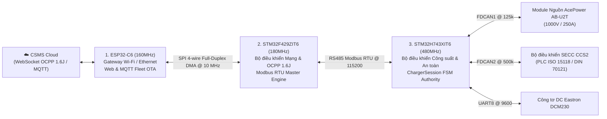

# PHÂN HỆ PHẦN CỨNG & VI ĐIỀU KHIỂN NHÚNG (EMBEDDED HARDWARE & FIRMWARE)
## (3-TIER EMBEDDED ARCHITECTURE: ESP32-C6 | STM32F429 | STM32H743)

> **Phiên bản hệ thống:** `v1.0.1`  
> **Cập nhật:** `18/09/2026`  
> **Phạm vi:** Toàn bộ 3 vi điều khiển nhúng điều khiển trạm sạc nhanh DC công suất cao.

---

## 1. TỔNG QUAN KIẾN TRÚC 3 TẦNG VI ĐIỀU KHIỂN

Hệ sinh thái phần cứng trạm sạc THACO EVSE phân chia nhiệm vụ cho 3 vi điều khiển độc lập nhằm đảm bảo **an toàn tuyệt đối**, **tốc độ phản ứng thời gian thực** và **khả năng kết nối đám mây bền bỉ**:

---

## 2. BẢNG DANH MỤC DỰ ÁN & GIT REPOSITORIES CỦA 3 VI ĐIỀU KHIỂN

| Vi điều khiển | Thư mục Project cục bộ | Git Repository URL | Phần cứng sử dụng | Vai trò chức năng chính |
| :--- | :--- | :--- | :--- | :--- |
| **Tier 1: ESP32-C6** | `d:\DuAn\10.ViDieuKhien\esp32_ocpp_v2` | [`ngoctoan150699/esp32_ocpp`](https://github.com/ngoctoan150699/esp32_ocpp.git) | ESP32-C6-WROOM-1 (16MB Flash, RISC-V 160MHz) | Quản lý kết nối Wi-Fi/Ethernet, mở Web Dashboard nội bộ (`10.14.80.19`), điều phối nạp Web OTA & MQTT Fleet OTA cho cả 3 vi điều khiển. |
| **Tier 2: STM32F429** | `d:\DuAn\10.ViDieuKhien\STM32\CodeSTM32\F429_OCPP1.6J` | [`ngoctoan150699/F429_OCPP1.6J`](https://github.com/ngoctoan150699/F429_OCPP1.6J.git) | STM32F429ZIT6 (ARM Cortex-M4 180MHz, 2MB Flash, 256KB RAM) | Chạy thư viện MiniOCPP 1.6J Client thuần C không malloc, đóng vai trò Modbus Master gửi lệnh xuống H743, hỗ trợ Live Dual-Bank Flash OTA. |
| **Tier 3: STM32H743** | `d:\DuAn\10.ViDieuKhien\STM32\CodeSTM32\evse_h743` | [`ngoctoan150699/EVSE_H743`](https://github.com/ngoctoan150699/EVSE_H743.git) | STM32H743XIT6 (ARM Cortex-M7 480MHz, 2MB Flash, 1MB RAM) | Nhà chức trách an toàn tối cao (Safety Authority), FSM sạc CCS2 8 bước, điều khiển nguồn AcePower (FDCAN1), SECC (FDCAN2), công tơ DCM230, ngắt khẩn E-Stop < 20ms, Live Dual-Bank OTA. |

---

## 3. DANH MỤC TÀI LIỆU KỸ THUẬT CHI TIẾT TRONG PHÂN HỆ

1. [HARDWARE_PINOUT_AND_BUSES.md](HARDWARE_PINOUT_AND_BUSES.md): Sơ đồ chân nối pinout chi tiết, thông số và ranh giới các bus SPI DMA, RS485, FDCAN.
2. [MODBUS_REGISTER_MAP.md](MODBUS_REGISTER_MAP.md): Bảng ánh xạ thanh ghi Modbus RTU chuẩn giữa HMI, F429 và H743.
3. [OTA_UPDATE_SPECIFICATION.md](OTA_UPDATE_SPECIFICATION.md): Đặc tả nạp firmware OTA qua Web & MQTT, cơ chế phân đoạn sub-chunking 512B và Live Dual-Bank Flash Swap.
4. [BUILD_AND_FLASH_GUIDE.md](BUILD_AND_FLASH_GUIDE.md): Cẩm nang biên dịch (PlatformIO, CubeIDE headless) và nạp flash ST-Link CLI cho cả 3 chip.
