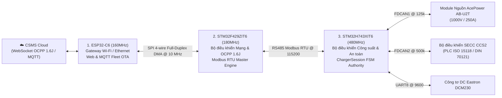

# PHÂN HỆ PHẦN CỨNG & VI ĐIỀU KHIỂN NHÚNG (EMBEDDED HARDWARE & FIRMWARE)
## (3-TIER EMBEDDED ARCHITECTURE: ESP32-C6 | STM32F429 | STM32H743)

> **Phiên bản hệ thống:** `v1.0.1`  
> **Cập nhật:** `18/09/2026`  
> **Phạm vi:** Toàn bộ 3 vi điều khiển nhúng điều khiển trạm sạc nhanh DC công suất cao.

---

## 1. TỔNG QUAN KIẾN TRÚC 3 TẦNG VI ĐIỀU KHIỂN

Hệ sinh thái phần cứng trạm sạc THACO EVSE phân chia nhiệm vụ cho 3 vi điều khiển độc lập nhằm đảm bảo **an toàn tuyệt đối**, **tốc độ phản ứng thời gian thực** và **khả năng kết nối đám mây bền bỉ**:

---

## 2. BẢNG DANH MỤC DỰ ÁN & GIT REPOSITORIES CỦA 3 VI ĐIỀU KHIỂN

| Vi điều khiển | Thư mục Project cục bộ | Git Repository URL | Phần cứng sử dụng | Vai trò chức năng chính |
| :--- | :--- | :--- | :--- | :--- |
| **Tier 1: ESP32-C6** | `d:\DuAn\10.ViDieuKhien\esp32_ocpp_v2` | [`ngoctoan150699/esp32_ocpp`](https://github.com/ngoctoan150699/esp32_ocpp.git) | ESP32-C6-WROOM-1 (16MB Flash, RISC-V 160MHz) | Quản lý kết nối Wi-Fi/Ethernet, mở Web Dashboard nội bộ (`10.14.80.19`), điều phối nạp Web OTA & MQTT Fleet OTA cho cả 3 vi điều khiển. |
| **Tier 2: STM32F429** | `d:\DuAn\10.ViDieuKhien\STM32\CodeSTM32\F429_OCPP1.6J` | [`ngoctoan150699/F429_OCPP1.6J`](https://github.com/ngoctoan150699/F429_OCPP1.6J.git) | STM32F429ZIT6 (ARM Cortex-M4 180MHz, 2MB Flash, 256KB RAM) | Chạy thư viện MiniOCPP 1.6J Client thuần C không malloc, đóng vai trò Modbus Master gửi lệnh xuống H743, hỗ trợ Live Dual-Bank Flash OTA. |
| **Tier 3: STM32H743** | `d:\DuAn\10.ViDieuKhien\STM32\CodeSTM32\evse_h743` | [`ngoctoan150699/EVSE_H743`](https://github.com/ngoctoan150699/EVSE_H743.git) | STM32H743XIT6 (ARM Cortex-M7 480MHz, 2MB Flash, 1MB RAM) | Nhà chức trách an toàn tối cao (Safety Authority), FSM sạc CCS2 8 bước, điều khiển nguồn AcePower (FDCAN1), SECC (FDCAN2), công tơ DCM230, ngắt khẩn E-Stop < 20ms, Live Dual-Bank OTA. |

---

---

## 3. NGUYÊN LÝ HOẠT ĐỘNG & TƯƠNG TÁC GIỮA 3 VI ĐIỀU KHIỂN VÀ MÀN HÌNH HMI

Hệ thống trạm sạc vận hành trơn tru nhờ sự phối hợp nhịp nhàng giữa 3 vi điều khiển và màn hình cảm ứng HMI:

### 3.1. Tương tác F429 (Master) ↔ ESP32-C6 (Slave) qua SPI 4-wire Full-Duplex DMA (10 MHz):
- **Bản chất kỹ thuật:** F429 là SPI Master, phát xung SCK (10 MHz) trên chân `PB10`, điều khiển chân `PB15` (CS Active-Low), trao đổi dữ liệu với ESP32 (`GPIO6-9`) qua DMA.
- **Vai trò:**
  - **Socket Tunneling (OCPP 1.6J):** F429 gửi các bản tin JSON OCPP (`BootNotification`, `Authorize`, `StartTransaction`, `MeterValues`, `StopTransaction`) qua các lệnh `ESP_CMD_SOCKET_SEND` (0x32), ESP32 chuyển tiếp lên máy chủ CSMS Cloud qua WebSocket WSS.
  - **Telemetry Sync:** F429 đẩy dữ liệu điện áp, dòng điện, SoC % lên ESP32 (`ESP_CMD_REPORT_TELEMETRY` 0x40) để phục vụ trang Web Dashboard tại địa chỉ `http://10.14.80.19`.
  - **OTA Sub-chunking:** Khi có lệnh nâng cấp firmware qua Web hoặc MQTT, ESP32 chia file bin thành các phân đoạn nhỏ $\le 512$ bytes (`ESP_CMD_OTA_GET_CHUNK` 0x50), F429 kéo về qua SPI DMA và ghi vào Bank Flash thứ hai.

### 3.2. Tương tác F429 (Master) ↔ STM32H743 (Slave ID 0x01) qua RS485 Modbus RTU (115,200 bps):
- **Bản chất kỹ thuật:** F429 dùng cổng `USART6` kết nối tới cổng `UART7` của H743 qua IC transceiver RS485 vi sai (SP3485).
- **Chu kỳ đọc dữ liệu (Telemetry Polling):** Mỗi 100ms, F429 gửi lệnh Function Code `0x03`/`0x04` đọc:
  - Vùng System `0x0000 - 0x0017`: Kiểm tra nhịp tim `ALIVE_COUNTER` (0x0006) và `UPTIME_SEC` (0x000A).
  - Vùng Súng sạc A (`0x0100 - 0x0123`) và Súng B (`0x0200 - 0x0223`): Đọc trạng thái sạc `EVSE_STATE` (0x0101), cắm súng (0x0103), pin `SOC_PERCENT` (0x010A), điện áp (0x010C, 0.1V), dòng điện (0x010E, 0.1A), công suất (0x0110, W), và điện năng tích lũy (0x0112, Wh).
- **Điều khiển sạc từ Cloud (F429 Command Plane 0x0740 - 0x074B):**
  - Khi CSMS phát lệnh `RemoteStartTransaction` hoặc `RemoteStopTransaction`, F429 ghi một chuỗi thanh ghi xuống H743: `F4_CMD_ID` (0x0741), `TARGET_CONNECTOR` (0x0742), `TARGET_VOLTAGE` (0x0743), `TARGET_CURRENT` (0x0744).
  - **Chìa khóa thực thi (Magic Commit):** F429 ghi giá trị **`0xA55A`** vào thanh ghi `0x074B`. H743 xác thực đúng magic mới kích hoạt rơ-le và điều khiển module nguồn.

### 3.3. Tương tác Android HMI (Master) ↔ STM32H743 (Slave ID 0x01) qua RS485 Modbus RTU (115,200 bps):
- **Bản chất kỹ thuật:** Ứng dụng Flutter trên màn hình cảm ứng kết nối qua cổng serial `/dev/ttyS7` tới cổng `USART6` của H743.
- **Chu kỳ đọc dữ liệu:** Mỗi 150ms - 250ms, HMI đọc các vùng:
  - `0x0100`: Dữ liệu súng sạc để hiển thị đồng hồ đo Arc Gauge % pin, V, I, kW, thời gian sạc còn lại.
  - `0x0500`: Bảng giá điện (`TARIFF_RATE_VND` 0x0503) và chi phí sạc tức thời (`RUNNING_COST_A` 0x0507).
  - `0x0800`: Chuỗi mã VietQR thanh toán động (`QR_TOKEN_STRING` 0x0805..14).
- **Hộp thư lệnh HMI (HMI Command Mailbox 0x0700 - 0x0708):**
  - Khi người dùng bấm nút Bắt đầu sạc, Dừng sạc, hoặc Reset trên màn hình, HMI ghi 9 thanh ghi: `REQ_SEQ` (0x0700..01), `BOOT_ID` (0x0702..03), `CMD_ID` (0x0704: 1=Start, 2=Stop), `TARGET_CONNECTOR` (0x0705), và ghi **`COMMIT_MAGIC = 0xA55A`** vào thanh ghi `0x0708`.
  - HMI kiểm tra phản hồi từ vùng ACK (`0x0720 - 0x0725`) để đảm bảo lệnh đã được H743 chấp thuận (`STATUS = Accepted`).

---

## 4. DANH MỤC TÀI LIỆU KỸ THUẬT CHI TIẾT TRONG PHÂN HỆ

1. [INTER_MCU_COMMUNICATION_AND_REGISTERS.md](INTER_MCU_COMMUNICATION_AND_REGISTERS.md): **Cẩm nang toàn diện về giao thức truyền thông SPI DMA, RS485 Modbus RTU và bản đồ thanh ghi chi tiết giữa 3 vi điều khiển và màn hình HMI.**
2. [HARDWARE_PINOUT_AND_BUSES.md](HARDWARE_PINOUT_AND_BUSES.md): Sơ đồ chân nối pinout chi tiết, thông số và ranh giới các bus SPI DMA, RS485, FDCAN.
3. [MODBUS_REGISTER_MAP.md](MODBUS_REGISTER_MAP.md): Bảng ánh xạ thanh ghi Modbus RTU chuẩn giữa HMI, F429 và H743.
4. [OTA_UPDATE_SPECIFICATION.md](OTA_UPDATE_SPECIFICATION.md): Đặc tả nạp firmware OTA qua Web & MQTT, cơ chế phân đoạn sub-chunking 512B và Live Dual-Bank Flash Swap.
5. [BUILD_AND_FLASH_GUIDE.md](BUILD_AND_FLASH_GUIDE.md): Cẩm nang biên dịch (PlatformIO, CubeIDE headless) và nạp flash ST-Link CLI cho cả 3 chip.
