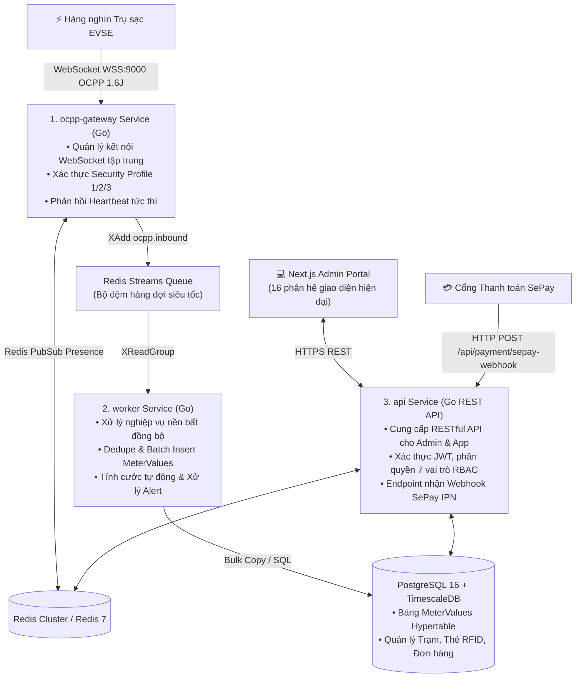

# PHÂN HỆ MÁY CHỦ QUẢN TRỊ TRẠM SẠC ĐÁM MÂY (CSMS CLOUD PLATFORM)
## (CENTRAL CHARGING STATION MANAGEMENT SYSTEM: GO BACKEND & NEXT.JS UI)

> **Repository Git:** [`https://github.com/ngoctoan150699/Csms_evse.git`](https://github.com/ngoctoan150699/Csms_evse.git)  
> **Thư mục cục bộ:** `d:\DuAn\1.EVSE\csms_evse`  
> **Phiên bản:** `v1.0.1` (Production Ready)  
> **Công nghệ:** Go 1.22 Microservices, Next.js 14 App Router, PostgreSQL 16, TimescaleDB, Redis 7, Docker Compose.

---

## 1. TỔNG QUAN KIẾN TRÚC MÁY CHỦ CSMS

Hệ thống CSMS của THACO được thiết kế theo mô hình Microservices phân tán hướng sự kiện (Event-Driven Architecture), đảm bảo khả năng chịu tải hàng nghìn trụ sạc kết nối đồng thời:

---

## 2. 16 PHÂN HỆ CHỨC NĂNG TRÊN GIAO DIỆN QUẢN TRỊ NEXT.JS

Giao diện quản trị trung tâm hỗ trợ song ngữ (**Tiếng Việt / English**), tương thích đa thiết bị (Desktop & Mobile Drawer) với 16 phân hệ hoàn chỉnh:

1. **Executive Dashboard (`Home`):** Realtime KPIs (Tổng điện năng kWh, Doanh thu VND, Đơn hàng, Giảm phát thải CO₂), Biểu đồ diện tích chu kỳ sạc, Biểu đồ tròn trạng thái súng sạc, Bản đồ trạm sạc OpenStreetMap.
2. **Operation Monitoring:** Giám sát trực tiếp súng sạc thời gian thực (Điện áp, Dòng điện, Công suất, Trạng thái), Điều khiển từ xa (RemoteStart, RemoteStop, Unlock, Reset).
3. **Live OCPP Console:** Màn hình soi trực tiếp luồng WebSocket OCPP theo thời gian thực (JSON Payload, Latency ms, lọc từ khóa, xuất file JSON log).
4. **Charging Station Management:** Thêm mới, chỉnh sửa thông tin trạm sạc, tọa độ GPS, đơn vị vận hành, giới hạn công suất trạm.
5. **Charge Point Management:** Quản lý danh sách trụ sạc, vendor, model, phiên bản firmware, trạng thái kết nối Online/Offline.
6. **Connector Management:** Quản lý từng cổng súng sạc (CCS2, Type 2), trạng thái trực tuyến, công suất tối đa.
7. **Station Load Balance (Smart Charging):** Quản lý chính sách chia sẻ công suất cho cụm trụ sạc (Site Limit kW), tự động cân bằng tải chống quá tải aptomat tổng trạm.
8. **Charging Card (Quản lý Thẻ RFID):** Danh sách thẻ sạc, chủ thẻ, số dư tiền (VND), trạng thái Active/Lost/Expired, phân quyền thẻ.
9. **Tariffs (Bảng giá điện linh hoạt):** Cấu hình biểu giá sạc theo khung giờ (Giờ cao điểm, Bình thường, Thấp điểm) và phí phạt chiếm chỗ sau khi sạc đầy (Idle Fee).
10. **Transaction Orders:** Quản lý lịch sử toàn bộ các phiên sạc, số kWh tiêu thụ, thời lượng sạc, chi phí, mã giao dịch.
11. **Recharge Orders (Nạp tiền):** Quản lý đơn nạp tiền vào tài khoản/thẻ sạc qua ngân hàng VietQR SePay.
12. **Alarm Management:** Cảnh báo thời gian thực về sự cố phần cứng, lỗi chạm đất, dừng khẩn cấp.
13. **Diagnostics & Firmware OTA:** Giao diện điều phối nâng cấp phần mềm từ xa cho trụ sạc và yêu cầu trụ tải log chẩn đoán về server.
14. **User Management (RBAC):** Phân quyền 7 vai trò người dùng (Super Admin, C-Level, Operator, Finance, Site Manager, Technician, Customer Support).
15. **System Settings:** Cấu hình tham số hệ thống, MQTT Broker URL, thông số kết nối ngân hàng SePay.
16. **Audit Logs:** Nhật ký kiểm toán bảo mật, ghi vết mọi hành vi tác động vào hệ thống.

---

## 3. DANH MỤC TÀI LIỆU CHI TIẾT TRONG PHÂN HỆ

1. [OCPP_1_6J_SPECIFICATION.md](OCPP_1_6J_SPECIFICATION.md): Đặc tả giao thức OCPP 1.6J JSON-RPC, Core Profile và Smart Charging.
2. [DATABASE_AND_OPERATIONS.md](DATABASE_AND_OPERATIONS.md): Thiết kế CSDL PostgreSQL, TimescaleDB, sao lưu, phục hồi và nén dữ liệu.
3. [SEPAY_PAYMENT_INTEGRATION.md](SEPAY_PAYMENT_INTEGRATION.md) (hoặc [sepay-payment.md](sepay-payment.md)): **Toàn văn đặc tả kỹ thuật 21 chương tích hợp cổng thanh toán SePay**: Cơ chế Webhook IPN thời gian thực, xác thực bảo mật HMAC-SHA256 & IP Whitelist, kiến trúc sổ cái kép Ledger PostgreSQL, chống trùng lặp Idempotency, engine đối soát tự động và quy trình hoàn tiền.
4. [CSMS_REST_API_SPECIFICATION.md](CSMS_REST_API_SPECIFICATION.md): Đặc tả chi tiết toàn bộ danh mục RESTful API (Auth, Mobile Driver, CSMS Admin, OCPP Commands, SePay Webhook).
5. [OPERATOR_ADMIN_USER_MANUAL.md](OPERATOR_ADMIN_USER_MANUAL.md): Sổ tay hướng dẫn vận hành và xử trị sự cố dành cho Quản trị viên & Kỹ thuật viên CSMS Cloud.
