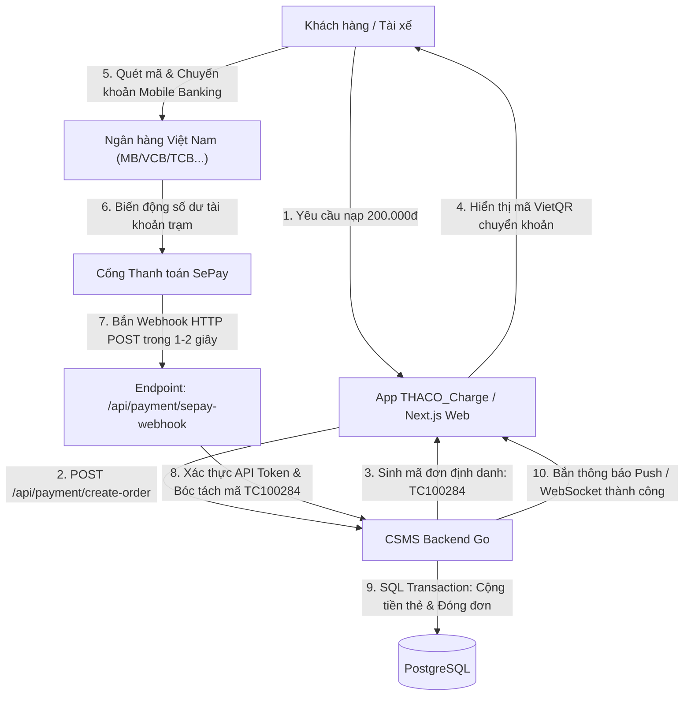

# TÍCH HỢP CỔNG THANH TOÁN TỰ ĐỘNG SEPAY VIETQR
## (SEPAY AUTOMATED PAYMENT GATEWAY & WEBHOOK IPN INTEGRATION)

Tài liệu này đặc tả chi tiết kiến trúc kết nối cổng thanh toán ngân hàng tự động SePay, cơ chế sinh mã VietQR định danh và xử lý Webhook IPN cộng tiền an toàn.

---

## 1. NGUYÊN LÝ HOẠT ĐỘNG THANH TOÁN VIETQR SEPAY



---

## 2. ĐẶC TẢ WEBHOOK IPN PAYLOAD (HTTP POST JSON)

Khi giao dịch chuyển khoản thành công, SePay chủ động gửi một request tới CSMS:
- **URL Endpoint:** `https://csms.thacoevse.vn/api/payment/sepay-webhook`
- **Method:** `POST`
- **Header xác thực:** `Authorization: Apikey <SEPAY_API_KEY>`

### Cấu trúc JSON Body mẫu:
```json
{
  "id": 847291,
  "gateway": "MBBank",
  "transactionDate": "2026-09-18 09:15:30",
  "accountNumber": "0987654321",
  "subAccount": null,
  "code": null,
  "content": "NAP TIEN TC100284 DANG KY SAC",
  "transferType": "in",
  "description": "Chuyen tien nhanh 247",
  "transferAmount": 200000,
  "referenceCode": "MBVCB.8291038291",
  "accumulated": 54200000
}
```

---

## 3. XỬ LÝ AN TOÀN TRÁNH TRÙNG LẶP & CỘNG TIỀN NGUYÊN TỬ (SQL TRANSACTION)

Để đảm bảo không bao giờ bị cộng tiền 2 lần (Idempotency) khi Webhook bị retry hoặc mạng chập chờn:
1. **Kiểm tra trùng mã giao dịch:** Truy vấn trường `sepay_transaction_id = 847291` trong bảng `recharge_orders`. Nếu đơn này đã ở trạng thái `SUCCESS` $\longrightarrow$ Trả về ngay `HTTP 200 OK` mà không cộng tiền thêm.
2. **Khóa dòng dữ liệu (Row-level Locking):**
```sql
BEGIN;
-- Khóa dòng đơn hàng để tránh race condition
SELECT id, card_id, amount, status FROM recharge_orders 
WHERE order_code = 'TC100284' FOR UPDATE;

-- Cộng tiền chính xác vào số dư thẻ RFID / ví người dùng
UPDATE cards 
SET balance = balance + 200000, updated_at = NOW() 
WHERE id = target_card_id;

-- Đánh dấu đơn hàng thành công
UPDATE recharge_orders 
SET status = 'SUCCESS', sepay_transaction_id = 847291, paid_at = NOW() 
WHERE order_code = 'TC100284';
COMMIT;
```
