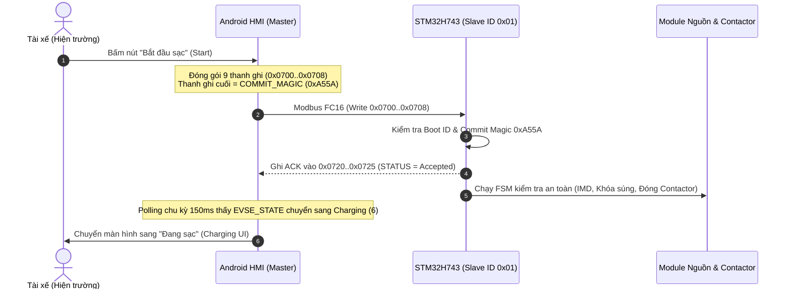

# ĐẶC TẢ TRUYỀN THÔNG MODBUS RTU GIỮA MÀN HÌNH HMI VÀ STM32H743
## (HMI MODBUS SERIAL TRANSPORT, POLLING ENGINE & ATOMIC COMMAND MAILBOX)

> **Mã nguồn triển khai thực tế:**
> - Firmware H743: [Core/lib/modbus_slave.c](file:///d:/DuAn/10.ViDieuKhien/STM32/CodeSTM32/evse_h743/Core/lib/modbus_slave.c) & [Core/protocol/evse_modbus_regs.h](file:///d:/DuAn/10.ViDieuKhien/STM32/CodeSTM32/evse_h743/Core/protocol/evse_modbus_regs.h).
> - Ứng dụng HMI Flutter: [lib/data/repositories/evse_repository.dart](file:///d:/DuAn/1.EVSE/hmi_evse/lib/data/repositories/evse_repository.dart) & [docs/HMI_MODBUS_ICD.md](file:///d:/DuAn/1.EVSE/hmi_evse/docs/HMI_MODBUS_ICD.md).
> - Phiên bản giao thức: **Modbus Map v2.2.1 (`0x0221`)**.

---

## 1. CẤU HÌNH VẬT LÝ & KÊNH TRUYỀN DẪN (PHYSICAL & TRANSPORT LAYER)

Màn hình cảm ứng công nghiệp HMI chạy hệ điều hành Android / Linux nhúng, giao tiếp trực tiếp với vi điều khiển công suất STM32H743 thông qua bus nối tiếp RS485 cách ly vi sai:

- **Cổng Serial vật lý:**
  - Phía HMI Panel: Cổng UART phần cứng `/dev/ttyS7` (hoặc `/dev/ttyS1` / bộ chuyển đổi USB-RS485 `/dev/ttyUSB0`).
  - Phía STM32H743: Ngoại vi **`USART6`** (`PC6` TX, `PC7` RX) nối qua IC thu phát RS485 tốc độ cao (MAX13487E / SP3485).
- **Thông số cấu hình UART:**
  - Tốc độ Baud: **`115,200 bps`**
  - Data bits: **`8`**
  - Parity: **`None`**
  - Stop bits: **`1`** (Cấu hình chuẩn `8N1`).
- **Phân định vai trò:**
  - **Màn hình HMI:** Đóng vai trò **Modbus RTU Master** (chủ động phát lệnh polling và ghi lệnh mailbox).
  - **STM32H743:** Đóng vai trò **Modbus RTU Slave** với địa chỉ duy nhất **`Slave ID = 0x01`**.
- **Thứ tự Byte (32-bit Word Order):** **Big-Endian / ABCD** (High Word ở offset địa chỉ thấp, Low Word ở offset địa chỉ cao).

---

## 2. CHU KỲ QUÉT DỮ LIỆU ĐỊNH KỲ CỦA HMI (POLLING ENGINE LOOP)

Để giao diện người dùng luôn mượt mà và phản ứng tức thời với hành vi cắm súng của tài xế, ứng dụng Flutter duy trì vòng lặp Polling liên tục mỗi **150 ms – 250 ms**:

```text
       ┌────────────────────────────────────────────────────────┐
       │               HMI POLLING SCHEDULER (150ms)            │
       └───────────────────────────┬────────────────────────────┘
                                   │
       ├───────────────────────────┼────────────────────────────┐
       ▼                           ▼                            ▼
[KÊNH 1: TELEMETRY]         [KÊNH 2: TARIFFS]           [KÊNH 3: VIETQR]
Đọc Súng A (0x0100..29)    Đọc Giá Điện (0x0500..1A)   Đọc Token QR (0x0800..14)
Đọc Súng B (0x0200..29)    Đọc Cước Chạy (Running VND) Đọc TTL Đếm Lùi (giây)
```

### 2.1. Đọc Telemetry Súng Sạc A (`0x0100`) và Súng B (`0x0200`)
- **Lệnh Modbus:** Function Code `0x04` (Read Input Registers), đọc khối 42 thanh ghi liên tiếp (`offset +0x00` đến `+0x29`).
- **Kiểm tra chống rách dữ liệu (Snapshot Integrity Check):**
  ```dart
  int seqBegin = rawRegs[0]; // Offset 0x0100 (SNAPSHOT_SEQ_BEGIN)
  int seqEnd   = rawRegs[35]; // Offset 0x0123 (SNAPSHOT_SEQ_END)
  if (seqBegin != seqEnd) {
    // Dữ liệu bị đọc dở dang đúng thời điểm MCU đang cập nhật -> Bỏ qua frame
    return;
  }
  ```
- **Dữ liệu phân tích hiển thị:**
  - `EVSE_STATE` (`+0x01`): Trạng thái sạc (Idle, Plugged, Preparing, Charging, Stopping, Faulted, E-Stop).
  - `SOC_PERCENT` (`+0x0A`): Phần trăm pin xe hiển thị trên đồng hồ Arc Gauge.
  - `OUTPUT_VOLTAGE` (`+0x0C..0D`): Điện áp sạc tức thời (Giá trị / 10 = Volt).
  - `OUTPUT_CURRENT` (`+0x0E..0F`): Dòng điện sạc tức thời (Giá trị / 10 = Ampe).
  - `OUTPUT_POWER` (`+0x10..11`): Công suất sạc tức thời (Giá trị / 1000 = kW).
  - `SESSION_ENERGY` (`+0x12..13`): Số điện đã nạp trong phiên (Giá trị / 1000 = kWh).
  - `ELAPSED_SEC` (`+0x14..15`): Thời gian phiên sạc đang chạy.
  - `REMAINING_MIN` (`+0x16`): Thời gian ước tính sạc đầy do BMS xe gửi về.
  - `EVCC_ID` (`+0x26..29`): Mã MAC xe điện 6 bytes phục vụ tính năng nhận diện xe **AutoCharge**.

### 2.2. Đọc Bảng Giá Điện & Trạng Thái Máy Chủ CSMS (`0x0500`)
- Đọc `0x0503..04`: Đơn giá sạc hiện tại (`TARIFF_RATE_VND` VNĐ/kWh) để hiển thị công khai trên màn hình Idle.
- Đọc `0x0507..08`: Tiền điện tức thời Súng A (`RUNNING_COST_A` VNĐ).
- Đọc `0x0509..0A`: Tiền điện tức thời Súng B (`RUNNING_COST_B` VNĐ).
- Đọc `0x050F` & `0x0513`: Trạng thái kết nối Wi-Fi và WebSocket CSMS Cloud để hiển thị biểu tượng icon mạng (Online / Offline).

### 2.3. Đọc Mã QR Thanh Toán Động (`0x0800 - 0x0814`)
- Đọc `0x0802`: Thời gian hiệu lực còn lại (`TTL_SEC` đếm lùi từng giây).
- Đọc `0x0805..14`: Chuỗi 32 ký tự mã QR token để widget Flutter tự động render ảnh mã VietQR chuẩn thanh toán cho tài xế quét bằng app ngân hàng hoặc app THACO_Charge.

---

## 3. CƠ CHẾ HỘP THƯ LỆNH NGUYÊN TỬ (ATOMIC COMMAND MAILBOX & COMMIT)

Khi tài xế thao tác trên màn hình cảm ứng (ví dụ: bấm nút **Bắt đầu sạc**, **Dừng sạc**, **Mở khóa súng**, hoặc **Reset lỗi**), ứng dụng HMI **tuyệt đối không tự ý thay đổi trạng thái UI** mà phải phát lệnh thông qua Hộp thư lệnh an toàn theo quy trình 3 bước:



### 3.1. Cấu trúc Khung tin Ghi Lệnh (Ghi qua Modbus Function Code `0x10`):
HMI ghi toàn bộ chuỗi **9 thanh ghi liên tiếp từ `0x0700` đến `0x0708`**:

```dart
// Code triển khai thực tế trong evse_repository.dart
Future<bool> sendHmiCommand({
  required int commandId,
  required int targetConnector,
  int param1 = 0,
  int param2 = 0,
}) async {
  final reqSeq = _nextCommandSeq();
  final bootId = _cachedBootId; // Đọc từ thanh ghi 0x0007..08

  final registers = [
    (reqSeq >> 16) & 0xFFFF, // 0x0700: REQ_SEQ_HI
    reqSeq & 0xFFFF,         // 0x0701: REQ_SEQ_LO
    (bootId >> 16) & 0xFFFF, // 0x0702: BOOT_ID_HI
    bootId & 0xFFFF,         // 0x0703: BOOT_ID_LO
    commandId,               // 0x0704: CMD_ID (1: Start, 2: Stop, 3: ClearFault...)
    targetConnector,         // 0x0705: TARGET (1: Gun A, 2: Gun B)
    param1,                  // 0x0706: PARAM_1 (Strategy mode)
    param2,                  // 0x0707: PARAM_2 (Target value)
    0xA55A,                  // 0x0708: COMMIT_MAGIC (Khóa thực thi bắt buộc)
  ];

  return await _modbusClient.writeMultipleRegisters(
    slaveId: 0x01,
    startAddress: 0x0700,
    values: registers,
  );
}
```

### 3.2. Đọc Phản Hồi Xác Nhận (ACK Verification tại `0x0720 - 0x0725`):
Ngay sau khi ghi lệnh, HMI đọc vùng ACK:
- Nếu `ACK_STATUS == 2` (**Accepted**): HMI hiển thị thông báo "Lệnh đã được gửi tới trụ sạc, vui lòng đợi hệ thống kiểm tra an toàn".
- Nếu `ACK_STATUS == 5` (**Rejected**): HMI tra cứu `ACK_REJECT_REASON` (`0x0724`) để hiển thị thông báo lỗi cụ thể cho tài xế (ví dụ: *"Vui lòng cắm súng sạc ngập chốt trước khi bấm sạc"*, hoặc *"Nút dừng khẩn cấp E-Stop đang bị nhấn"*).
- Nếu `ACK_STATUS == 6` (**Failed**): Hiển thị *"Lỗi phần cứng không thể kích hoạt sạc, vui lòng đổi cổng sạc hoặc liên hệ hotline"*.

---

## 4. NGUYÊN TẮC SUY DIỄN GIAO DIỆN KHÔNG GIẢ ĐỊNH (ZERO-MOCK STATE RULE)

1. **Giao diện phản ánh 100% phần cứng thực tế (Hardware-Driven UI):**
   - Màn hình HMI **không bao giờ tự suy diễn trạng thái** (No UI Guessing).
   - Khi tài xế bấm nút "Dừng sạc", giao diện hiển thị hiệu ứng "Đang xử lý dừng..." và chỉ chuyển sang trang **Completed** khi thanh ghi `EVSE_STATE` tại `0x0101` / `0x0201` thực sự mang giá trị `8` (`COMPLETED`) hoặc `1` (`IDLE`).
2. **Khóa an toàn điện áp cao thế ($V_{\text{OUTPUT}} < 20\text{V}$):**
   - HMI không bao giờ thông báo cho tài xế *"Rút súng sạc"* nếu điện áp đo được tại đầu súng `OUTPUT_VOLTAGE` (`+0x0C..0D`) chưa hạ xuống dưới mức an toàn $20\text{V}$, ngay cả khi phiên sạc đã bấm dừng.
3. **Chống lặp lệnh (Deduplication):**
   - Mỗi lệnh gửi đi có số `REQ_SEQ` 32-bit tăng dần. Nếu người dùng bấm liên tục nhiều lần vào nút cảm ứng, HMI sẽ bỏ qua các cú chạm tiếp theo cho đến khi lệnh trước đó được phản hồi dứt điểm.
