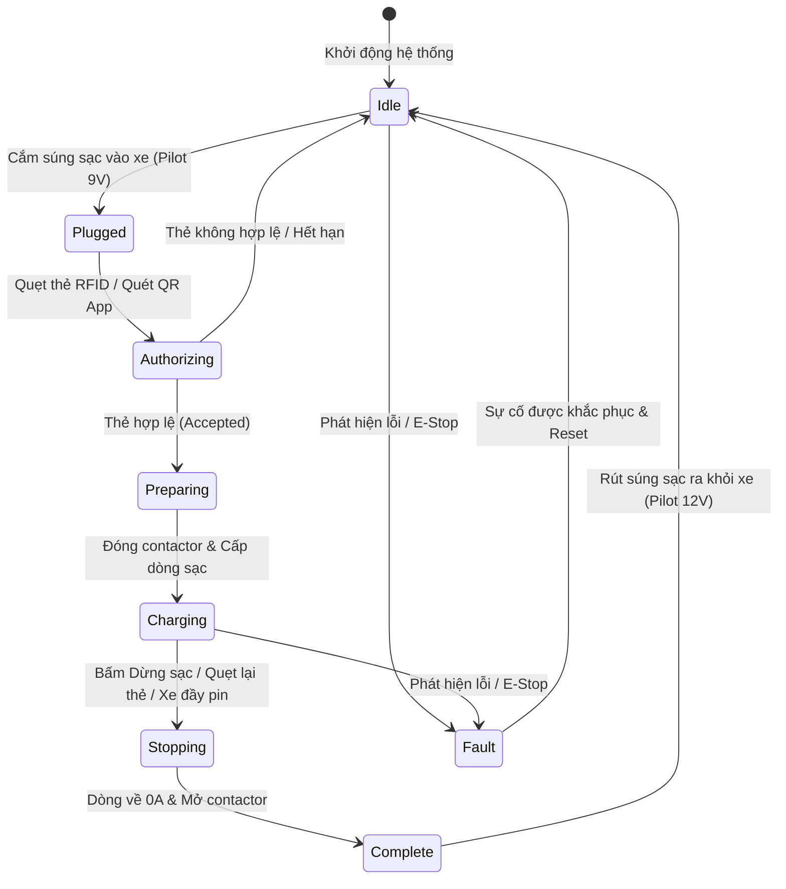

# MÁY TRẠNG THÁI GIAO DIỆN & 9 MÀN HÌNH CHỨC NĂNG HMI
## (HMI USER INTERFACE & STATE MACHINE SPECIFICATION)

Tài liệu này định nghĩa máy trạng thái giao diện và thiết kế chi tiết 9 màn hình hiển thị trên màn hình cảm ứng trụ sạc.

---

## 1. MÁY TRẠNG THÁI GIAO DIỆN NGƯỜI DÙNG (UI STATE MACHINE)

---

## 2. CHI TIẾT 9 MÀN HÌNH CHỨC NĂNG

1. **`IdleScreen` (Màn hình Chờ):** Hiển thị logo THACO EVSE, trạng thái súng sạc "SẴN SÀNG SẠC", công suất tối đa, hướng dẫn: "Vui lòng cắm súng sạc vào xe để bắt đầu".
2. **`PluggedScreen` (Đã cắm súng):** Nhận diện súng đã cắm chặt vào xe, phát âm thanh báo hiệu, hiển thị biểu tượng thẻ RFID và mã QR động hướng dẫn khách hàng quẹt thẻ hoặc dùng App quét mã.
3. **`AuthorizingScreen` (Đang xác thực):** Vòng tròn xoay loading, hiển thị: "Đang kiểm tra tài khoản thẻ... Vui lòng chờ trong giây lát".
4. **`PreparingScreen` (Đang chuẩn bị):** Hiển thị các bước an toàn: Khóa chốt súng cơ khí $
ightarrow$ Kiểm tra cách điện cao áp $
ightarrow$ Bắt tay truyền thông PLC với ô tô.
5. **`ChargingScreen` (Đang sạc - Màn hình chính):**
   - Đồng hồ đo hồ quang **SoC Arc Gauge** hiển thị số to rõ: % Pin hiện tại (ví dụ: `68%`).
   - Các thông số đo thời gian thực: Điện áp (`425.2 V`), Dòng điện (`118.5 A`), Công suất (`50.4 kW`), Số điện tích lũy (`18.42 kWh`).
   - Tổng tiền tạm tính: `73.680 đ` (cập nhật nhảy số liên tục theo giây).
   - Nút đỏ lớn: **[DỪNG SẠC]** (kèm mã xác nhận bảo vệ).
6. **`StoppingScreen` (Đang dừng sạc):** Hiển thị: "Đang giảm dòng điện an toàn... Vui lòng không rút súng sạc đột ngột".
7. **`CompleteScreen` (Hoàn tất sạc):** Bảng tổng kết hóa đơn phiên sạc: Thời lượng (`32 phút`), Điện năng tiêu thụ (`24.5 kWh`), Tổng chi phí (`98.000 đ`), Hướng dẫn rút súng sạc và gắn lại giá treo.
8. **`FaultScreen` (Báo lỗi / Dừng khẩn cấp):** Toàn màn hình chuyển viền đỏ cảnh báo, biểu tượng tam giác chấm than, hiển thị nguyên nhân lỗi (ví dụ: `E-STOP PRESSED` hoặc `INSULATION FAULT`) và hotline hỗ trợ kỹ thuật.
9. **`AdminPortal` (Cổng quản trị kỹ thuật):** Yêu cầu nhập mã PIN bảo mật, cho phép kỹ thuật viên xem bảng thanh ghi Modbus raw, bật tắt test relay, đổi IP mạng LAN.
