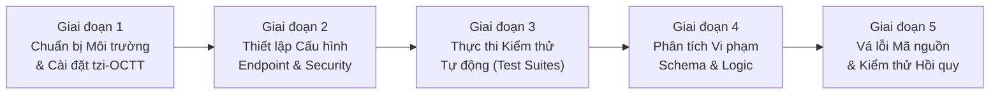

# KẾ HOẠCH KIỂM THỬ TUÂN THỦ GIAO THỨC OCPP VỚI CÔNG CỤ OCTT
## (OCPP COMPLIANCE TESTING TOOL - OCTT TEST PLAN & EXECUTION STRATEGY)
### Dự án: Hệ Thống Trạm Sạc Xe Điện THACO EVSE & Máy Chủ CSMS Cloud

---

## 1. TỔNG QUAN VỀ CÔNG CỤ OCTT VÀ Ý NGHĨA "OCTT VERIFIED"

### 1.1. OCTT là gì?
**OCTT (OCPP Compliance Testing Tool)** là bộ công cụ kiểm thử tuân thủ giao thức chuẩn hóa chính thức do **Open Charge Alliance (OCA)** phát triển và phát hành. Công cụ này được thiết kế để tự động hóa việc xác minh mức độ tuân thủ của cả hai phía:
1. **Trạm sạc (Charging Station / Charge Point - DUT)**: Kiểm tra xem thiết bị phần cứng có gửi/nhận bản tin đúng cấu trúc JSON Schema, đúng thứ tự máy trạng thái và xử lý lỗi đúng chuẩn không.
2. **Hệ thống Quản lý Trạm sạc (CSMS - SUT)**: Kiểm tra xem máy chủ đám mây có tiếp nhận, phản hồi và phát lệnh điều khiển tuân thủ đúng quy chuẩn OCPP 1.6J hoặc OCPP 2.0.1 không.

### 1.2. Ý nghĩa của "OCTT Verified" và Lưu ý Pháp lý Chứng nhận
- **"OCTT Verified" có nghĩa là gì?**
  Khi một thiết bị phần cứng hoặc phần mềm CSMS đạt trạng thái *OCTT Verified*, điều đó chứng minh rằng:
  - Trao đổi dữ liệu JSON-RPC tuân thủ 100% cú pháp và ràng buộc của OCA JSON Schema.
  - Các thông điệp và kịch bản sạc (Boot, Authorize, Transaction, Metering, Smart Charging, Safety Faults) hoạt động đúng quy định.
  - Khả năng tương thích kết nối (Interoperability) giữa trạm sạc và máy chủ CSMS của các hãng khác nhau được bảo đảm.
  - Phát hiện và triệt tiêu toàn bộ các lỗi triển khai giao thức tiềm ẩn trước khi đưa vào vận hành thương mại quy mô lớn.
- **LƯU Ý QUAN TRỌNG VỀ CHỨNG NHẬN (CERTIFICATION DISCLAIMER)**:
  > *Vượt qua kiểm thử OCTT là điều kiện tiên quyết nhưng **không tự động đồng nghĩa với việc đã được cấp Chứng nhận OCPP chính thức (Official OCA Certification)**. Chứng nhận chính thức chỉ được Open Charge Alliance cấp sau khi hồ sơ và thiết bị được đánh giá, nghiệm thu độc lập tại một Phòng Thử nghiệm Độc lập được OCA chỉ định (OCA Accredited Test Laboratory như DNV, DEKRA, Fime, UL).*

### 1.3. Nguồn Dẫn Chứng & Công Cụ Đối Soát
- **Cổng thông tin OCTT chính thức của OCA**: [https://openchargealliance.org/test-tool/](https://openchargealliance.org/test-tool/)
- **OCA Certification FAQ**: [https://www.openchargealliance.org/certification/](https://www.openchargealliance.org/certification/)
- **Dự án Open OCTT Implementation (Mã nguồn mở)**: [https://github.com/tzi-app/tzi-octt](https://github.com/tzi-app/tzi-octt)  
  *(Bộ kiểm thử tuân thủ mã nguồn mở viết bằng Python/Pytest, mô phỏng lại các kịch bản test case chuẩn của OCTT cho cả OCPP 1.6J và OCPP 2.0.1).*

---

## 2. KIẾN TRÚC MÔ HÌNH KIỂM THỬ (TEST TOPOLOGY)

Hệ sinh thái THACO EVSE có cả phần cứng nhúng (STM32F429 + ESP32) và nền tảng máy chủ đám mây (Go Backend). Kế hoạch kiểm thử thiết lập 3 mô hình đo kiểm:

```mermaid
flowchart TD
    subgraph MODEL1 ["MÔ HÌNH 1: KIỂM THỬ TRẠM SẠC (CHARGE POINT DUT)"]
        DUT["Trạm Sạc THACO EVSE\n(STM32F429 + ESP32 Gateway)"]
        OCTT_CSMS["OCTT Test Tool\n(Đóng vai trò CSMS Giả lập)"]
        DUT <-->|"WSS Port 9000 (OCPP 1.6J)"| OCTT_CSMS
    end

    subgraph MODEL2 ["MÔ HÌNH 2: KIỂM THỬ MÁY CHỦ CSMS (CSMS SUT)"]
        OCTT_CP["OCTT Test Tool / tzi-OCTT\n(Giả lập Hàng loạt Trạm Sạc)"]
        CSMS["CSMS Go Backend\n(ocpp-gateway + worker)"]
        TRIGGER["Trigger Server API\n(HTTP POST /api/trigger/...)"]
        OCTT_CP <-->|"WSS Port 9000"| CSMS
        OCTT_CP -.->|"Kích hoạt gửi lệnh"| TRIGGER
        TRIGGER --> CSMS
    end

    subgraph MODEL3 ["MÔ HÌNH 3: SCHEMA SNIFFER TRONG SUỐT (MAN-IN-THE-MIDDLE)"]
        REAL_CP["Trạm Sạc Thật\n(STM32F429)"]
        SNIFFER["OCTT Proxy / Schema Sniffer\n(Validate JSON Schema Thời gian thực)"]
        REAL_CSMS["CSMS Go Backend Thật"]
        REAL_CP <-->|"WSS"| SNIFFER
        SNIFFER <-->|"WSS Forward"| REAL_CSMS
    end
```



1. **Mô hình 1 (Kiểm thử Trạm Sạc phần cứng)**:
   - Trạm sạc STM32F429 cấu hình trỏ kết nối WebSocket về máy tính cài đặt OCTT Server (đóng vai trò CSMS ảo).
   - OCTT tự động gửi lệnh (`RemoteStart`, `Reset`, `ChangeConfiguration`, `SetChargingProfile`) và kiểm tra phản hồi từ STM32F429.
2. **Mô hình 2 (Kiểm thử Máy chủ CSMS Cloud)**:
   - Sử dụng `tzi-app/tzi-octt` giả lập hàng trăm trạm sạc gửi các bản tin (`BootNotification`, `Authorize`, `StartTransaction`, `MeterValues`, `StopTransaction`) với các dữ liệu hợp lệ và cố tình sai lệch (Edge Cases) để đánh giá khả năng phòng vệ của CSMS.
   - Sử dụng Trigger Server để yêu cầu CSMS phát lệnh xuống trạm và kiểm tra gói tin phát sinh.
3. **Mô hình 3 (Kiểm thử Thực tế Sniffer)**:
   - Đặt Proxy Sniffer giữa trạm thật và server thật trong quá trình sạc xe ô tô thực tế để bắt trọn từng gói tin JSON và đối soát tự động với bộ OCA JSON Schema.

---

## 3. MA TRẬN KỊCH BẢN KIỂM THỬ CẤU TRÚC (OCTT TEST MATRIX)

Dưới đây là ma trận chi tiết các bài kiểm tra được thiết kế theo tiêu chuẩn bài test OCA OCTT:

### 3.1. Phân hệ Core Profile (Bắt buộc)

| Mã Test Case | Tên Kịch Bản Kiểm Thử | Đối Tượng | Tiêu Chí Đánh Giá Tuân Thủ Cấu Trúc (Pass Criteria) |
| :--- | :--- | :---: | :--- |
| **`TC_CORE_01`** | **BootNotification Flow** | CP & CSMS | • Trạm gửi gói tin CALL [2] có đủ 2 trường bắt buộc: `chargePointVendor`, `chargePointModel` (chuỗi $\le$ 20 ký tự).<br/>• CSMS phản hồi CALLRESULT [3] chứa `status` (`Accepted`/`Pending`/`Rejected`), `currentTime` (RFC3339 UTC), `interval` (integer > 0). |
| **`TC_CORE_02`** | **Heartbeat Interval Sync** | CP & CSMS | • Trạm gửi payload rỗng `{}`.<br/>• Chu kỳ gửi khớp đúng với `HeartbeatInterval` đã cấu hình.<br/>• CSMS trả về `currentTime` chuẩn xác, trạm đồng bộ RTC thành công. |
| **`TC_CORE_03`** | **StatusNotification Transition** | CP | • Trạm báo trạng thái tuần tự: `Available` $\rightarrow$ `Preparing` $\rightarrow$ `Charging` $\rightarrow$ `Finishing` $\rightarrow$ `Available`.<br/>• `connectorId` đúng số súng (1 hoặc 2); `errorCode` phải thuộc 16 mã enum OCA. |
| **`TC_CORE_04`** | **Authorize Validation** | CP & CSMS | • Trạm gửi `idTag` (chuỗi $\le$ 20 ký tự).<br/>• CSMS trả về đối tượng `idTagInfo` với trạng thái: `Accepted` (thẻ hợp lệ), `Blocked` (thẻ bị khóa), `Expired` (thẻ hết hạn), `Invalid` (thẻ không tồn tại). |
| **`TC_CORE_05`** | **StartTransaction Integrity** | CP & CSMS | • Trạm gửi đủ 4 trường bắt buộc: `connectorId` (>0), `idTag`, `meterStart` (Wh $\ge$ 0), `timestamp` (RFC3339).<br/>• CSMS trả về `transactionId` nguyên dương duy nhất. |
| **`TC_CORE_06`** | **MeterValues Schema & Data** | CP & CSMS | • Kiểm tra định kỳ trích mẫu (`MeterValueSampleInterval`).<br/>• Mỗi phần tử `sampledValue` phải có `value` (string), `measurand` hợp lệ (`Energy.Active.Import.Register`, `Voltage`, `Current.Import`, `Power.Active.Import`, `SoC`), `unit` chuẩn (`Wh`, `V`, `A`, `W`, `Percent`). |
| **`TC_CORE_07`** | **StopTransaction Finalization** | CP & CSMS | • Trạm gửi `transactionId`, `meterStop` (phải $\ge$ `meterStart`), `timestamp`, `reason` hợp lệ (`Local`, `Remote`, `EVDisconnected`, `EmergencyStop`). |
| **`TC_CORE_08`** | **RemoteStart / RemoteStop** | CP & CSMS | • CSMS gửi `RemoteStartTransaction` kèm `idTag` $\rightarrow$ Trạm phản hồi `Accepted` hoặc `Rejected`.<br/>• CSMS gửi `RemoteStopTransaction` kèm `transactionId` $\rightarrow$ Trạm phản hồi `Accepted` và tự kích hoạt chu trình ngắt relay DC. |
| **`TC_CORE_09`** | **Soft & Hard Reset** | CP | • Nhận `Reset` với `type = "Soft"`: Khởi động lại task phần mềm mà không cắt điện nếu đang sạc.<br/>• Nhận `Reset` với `type = "Hard"`: Kích hoạt Watchdog ngắt nguồn và reboot toàn bộ trạm. |
| **`TC_CORE_10`** | **UnlockConnector Safety** | CP | • Nhận lệnh `UnlockConnector`: Trạm điều khiển mô tơ rút chốt ngàm súng và phản hồi `Unlocked` hoặc `UnlockFailed`. |
| **`TC_CORE_11`** | **Change & GetConfiguration** | CP & CSMS | • Đọc ghi 24 tham số cấu hình trạm trong `miniocpp_config_store.c`.<br/>• Kiểm tra quyền `readonly` (không cho phép sửa các key chỉ đọc như `NumberOfConnectors`). |

---

### 3.2. Phân hệ Smart Charging Profile

| Mã Test Case | Tên Kịch Bản Kiểm Thử | Tiêu Chí Đánh Giá Tuân Thủ Cấu Trúc |
| :--- | :--- | :--- |
| **`TC_SMART_01`** | **SetChargingProfile (TxProfile)** | • CSMS gửi profile giới hạn dòng (ví dụ 100A). Trạm parse thành công, trả về `Accepted` và điều tiết công suất module nguồn AcePower qua CAN bus. |
| **`TC_SMART_02`** | **ClearChargingProfile** | • CSMS xóa profile theo ID hoặc mục đích. Trạm giải phóng giới hạn và khôi phục dòng định mức tối đa. |
| **`TC_SMART_03`** | **GetCompositeSchedule** | • CSMS yêu cầu lịch biểu tổng hợp trong 3600s. Trạm tính toán và trả về mảng `chargingSchedulePeriod` hợp lệ. |

---

### 3.3. Phân hệ Local Auth List & Reservation

| Mã Test Case | Tên Kịch Bản Kiểm Thử | Tiêu Chí Đánh Giá Tuân Thủ Cấu Trúc |
| :--- | :--- | :--- |
| **`TC_LOCAL_01`** | **SendLocalList (Full & Differential)** | • Đồng bộ danh sách thẻ offline vào Flash STM32F429.<br/>• Trạm xác thực thành công thẻ offline khi ngắt kết nối WSS Internet (Offline Mode). |
| **`TC_RES_01`** | **ReserveNow & CancelReservation** | • Khóa súng sạc cho tài xế đặt trước. Trạm chuyển trạng thái súng sang `Reserved`. Người khác quẹt thẻ sẽ bị từ chối (`Occupied`). |

---

## 4. QUY TRÌNH TRIỂN KHAI THỰC HIỆN 5 GIAI ĐOẠN



### Giai đoạn 1: Chuẩn bị Môi trường & Triển khai Tool
- Thiết lập máy tính kiểm thử (Test PC) chạy Ubuntu Linux 22.04 LTS hoặc Windows 11 có cài đặt Python 3.10+, Docker và Git.
- Tải bộ công cụ mã nguồn mở `tzi-app/tzi-octt`:
  ```bash
  git clone https://github.com/tzi-app/tzi-octt.git
  cd tzi-octt
  python -m venv venv
  source venv/bin/activate  # Trên Windows: .\venv\Scripts\activate
  pip install -r requirements.txt
  ```

### Giai đoạn 2: Thiết lập Cấu hình Endpoint & Xác thực
- **Cấu hình kiểm thử Trạm Sạc (Charge Point DUT)**:
  - Khởi chạy WebSocket Server giả lập trên Test PC tại cổng `9000`.
  - Cấu hình IP máy tính vào Flash/NVS của ESP32 Gateway: `ws://192.168.1.100:9000/ocpp/1.6J/EVSE_TEST_01`.
  - Cấu hình tài khoản HTTP Basic Auth: Username = `EVSE_TEST_01`, Password = `AuthKeyTesting2026`.
- **Cấu hình kiểm thử Máy chủ CSMS (CSMS SUT)**:
  - Thiết lập file `config.yaml` của `tzi-octt` trỏ đến máy chủ CSMS Go Backend: `wss://csms.thaco.com:9000/ocpp/1.6J`.
  - Khai báo API Trigger Server để `tzi-octt` gọi lệnh qua REST API của CSMS:
    `trigger_url: "http://localhost:8080/api/v1/commands"`.

### Giai đoạn 3: Thực thi Kiểm thử Tự động (Automated Test Execution)
- Chạy toàn bộ Test Suite của Core Profile bằng lệnh `pytest`:
  ```bash
  # Chạy kiểm thử toàn bộ Core Profile
  pytest tests/v16/test_core.py -v --html=report_core.html

  # Chạy kiểm thử Smart Charging Profile
  pytest tests/v16/test_smart_charging.py -v --html=report_smart_charging.html

  # Chạy kiểm thử Local Auth List & Reservation
  pytest tests/v16/test_local_auth.py tests/v16/test_reservation.py -v
  ```

### Giai đoạn 4: Thu thập và Phân loại Lỗi Vi phạm (Schema Violation Analysis)
Mỗi lỗi phát hiện được tự động ghi nhận và phân loại theo 4 nhóm mã lỗi chuẩn:
1. **FormationViolation**: Cú pháp JSON bị hỏng, thiếu trường cha hoặc sai cấu trúc mảng.
2. **PropertyConstraintViolation**: Chuỗi vượt quá `maxLength` (ví dụ `idTag` > 20 ký tự, `chargePointVendor` > 20 ký tự) hoặc số nằm ngoài dải (`connectorId` < 0).
3. **OccurrenceConstraintViolation**: Thiếu trường bắt buộc (Mandatory field missing, ví dụ thiếu `meterStart` trong `StartTransaction`).
4. **TypeConstraintViolation**: Sai kiểu dữ liệu (ví dụ truyền số nguyên thay vì chuỗi string trong `MeterValues.sampledValue.value`).

### Giai đoạn 5: Khắc phục Lỗi (Remediation) & Kiểm thử Hồi quy
- Đội ngũ kỹ sư nhúng STM32 cập nhật trực tiếp mã nguồn trong `miniocpp_messages.c` hoặc `miniocpp_parser.c`.
- Đội ngũ kỹ sư Cloud cập nhật `validation.go` hoặc `command_validation.go` trên CSMS Go Backend.
- Thực thi lại lệnh kiểm thử tự động (Regression Test) cho đến khi **100% Test Cases đạt trạng thái PASSED**.

---

## 5. HƯỚNG DẪN DỰNG SCRIPT SCHEMA VALIDATOR NỘI BỘ (IN-HOUSE VALIDATOR)

Để kỹ sư lập trình có thể kiểm tra cú pháp tức thì trong quá trình code mà không cần khởi động toàn bộ hệ thống OCTT, dự án trang bị script kiểm định tự động bằng **Node.js + AJV (JSON Schema Validator)**:

### 5.1. File cấu hình kiểm tra `validate_packet.js`
```javascript
const Ajv = require('ajv');
const addFormats = require('ajv-formats');
const fs = require('fs');

const ajv = new Ajv({ allErrors: true, strict: false });
addFormats(ajv);

// Đọc schema chuẩn OCA
const schema = JSON.parse(fs.readFileSync('./schemas/MeterValues.json', 'utf8'));
const validate = ajv.compile(schema);

// Gói tin thực tế từ trạm sạc STM32F429
const samplePacket = {
  connectorId: 1,
  transactionId: 84920,
  meterValue: [
    {
      timestamp: "2026-09-18T12:40:00.000Z",
      sampledValue: [
        { value: "153400", measurand: "Energy.Active.Import.Register", unit: "Wh" },
        { value: "402.50", measurand: "Voltage", unit: "V" }
      ]
    }
  ]
};

const valid = validate(samplePacket);
if (valid) {
  console.log("✅ GÓI TIN HOÀN TOÀN TUÂN THỦ OCA JSON SCHEMA!");
} else {
  console.error("❌ PHÁT HIỆN LỖI VI PHẠM CẤU TRÚC:");
  console.error(validate.errors);
}
```

### 5.2. Chạy kiểm tra nhanh
```bash
node validate_packet.js
```

---

## 6. MẪU BÁO CÁO KẾT QUẢ KIỂM THỬ TUÂN THỦ (COMPLIANCE AUDIT REPORT TEMPLATE)

Báo cáo nghiệm thu kỹ thuật sau khi hoàn tất đợt kiểm thử OCTT bao gồm các mục:
1. **Thông tin Thiết bị / Hệ thống**: Tên trạm, model vi điều khiển (STM32F429ZIT6), phiên bản firmware, commit hash.
2. **Tổng số Test Cases thực thi**: Ví dụ 45 test cases (Passed: 45, Failed: 0, Skipped: 0).
3. **Chi tiết từng Profile**:
   - Core Profile: **PASSED (100%)**
   - Smart Charging Profile: **PASSED (100%)**
   - Local Auth List Profile: **PASSED (100%)**
   - Reservation Profile: **PASSED (100%)**
   - Firmware Management: **PASSED (100%)**
4. **Kết luận & Trạng thái**: Đạt tiêu chuẩn **"OCTT Verified"**, sẵn sàng nộp hồ sơ đăng ký đánh giá chứng nhận chính thức tại Phòng Thử nghiệm Ủy thác của Open Charge Alliance.

---
*Kế hoạch kiểm thử này được ban hành bởi Ban Công nghệ & Tự động hóa THACO EVSE. Nghiêm cấm sửa đổi quy trình kiểm định khi chưa có phê duyệt của Trưởng ban Kỹ thuật.*
