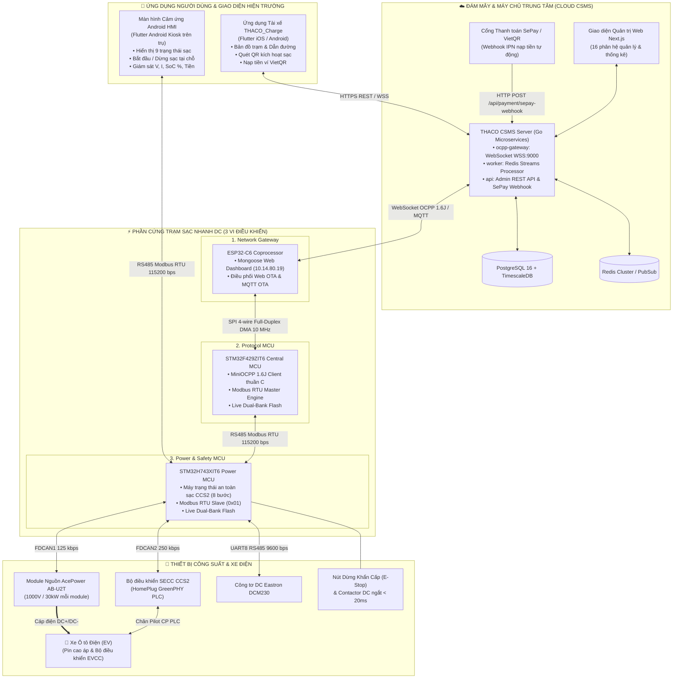

# CỔNG TRI THỨC & TÀI LIỆU KỸ THUẬT HỆ SINH THÁI THACO EVSE
## (MASTER DOCUMENTATION PORTAL & SYSTEM REPOSITORIES DIRECTORY)

> **Cập nhật mới nhất:** `18/09/2026`  
> **Phiên bản phát hành hệ thống:** `v1.0.1`  
> **Phạm vi:** Trạm sạc nhanh DC công suất cao (DC Fast Charger), Nền tảng máy chủ CSMS Cloud, Ứng dụng di động Tài xế, Màn hình cảm ứng HMI Android và Cổng thanh toán SePay.

Chào mừng bạn đến với **Cổng Tài liệu & Cơ sở Tri thức Trung tâm** của dự án trạm sạc xe điện THACO EVSE. Tài liệu này được thiết kế để bất kỳ ai — từ Lãnh đạo cấp cao, Trưởng dự án, Kỹ sư lập trình mới cho đến Kỹ thuật viên hiện trường — đều có thể hiểu tường tận bức tranh toàn cảnh và dễ dàng theo dõi từng phân hệ.

---

## 1. BẢNG DANH MỤC & ĐƯỜNG DẪN GIT CỦA 8 DỰ ÁN THÀNH PHẦN

Toàn bộ hệ thống trạm sạc được phân chia thành 8 dự án độc lập, được đồng bộ và liên kết chặt chẽ với nhau:

| STT | Phân hệ / Dự án | Nền tảng / Chip | Vai trò cốt lõi | Thư mục cục bộ | Git Repository |
|:---:|:---|:---|:---|:---|:---:|
| **1** | **EVSE_H743** `v1.0.1` | STM32H743XI *(ARM Cortex-M7)* | Điều khiển công suất cao thế, nguồn AcePower, SECC CCS2 & an toàn fail-safe < 20ms | `d:\DuAn\10.ViDieuKhien\` `STM32\CodeSTM32\evse_h743` | [GitHub ↗](https://github.com/ngoctoan150699/EVSE_H743.git) |
| **2** | **F429_OCPP1.6J** `v1.0.1` | STM32F429ZI *(ARM Cortex-M4)* | Chạy MiniOCPP 1.6J Client thuần C, Modbus Master sang H743, SPI Slave DMA | `d:\DuAn\10.ViDieuKhien\` `STM32\CodeSTM32\F429_OCPP1.6J` | [GitHub ↗](https://github.com/ngoctoan150699/F429_OCPP1.6J.git) |
| **3** | **esp32_ocpp_v2** `v1.0.1` | ESP32-C6 *(RISC-V 160MHz)* | Gateway Wi-Fi/Ethernet, Web Dashboard cục bộ, điều phối nạp OTA qua Web & MQTT | `d:\DuAn\10.ViDieuKhien\` `esp32_ocpp_v2` | [GitHub ↗](https://github.com/ngoctoan150699/esp32_ocpp.git) |
| **4** | **Csms_evse** `v1.0.1` | Go Microservices + Next.js 14 | Máy chủ CSMS Cloud: OCPP Gateway WSS, Admin Portal 16 phân hệ, ví VietQR SePay | `d:\DuAn\1.EVSE\` `csms_evse` | [GitHub ↗](https://github.com/ngoctoan150699/Csms_evse.git) |
| **5** | **hmi_evse** `v1.0.0` | Flutter / Android *(Kiosk Touch)* | Màn hình cảm ứng tại trụ, Modbus RTU RS485 với MCU, 9 trạng thái sạc trực quan | `d:\DuAn\1.EVSE\` `hmi_evse` | [GitHub ↗](https://github.com/ngoctoan150699/hmi_evse.git) |
| **6** | **THACO_Charge** `v1.0.0` | Flutter *(iOS & Android)* | App tài xế: Tìm trạm, quét QR sạc xe, nạp ví SePay, theo dõi realtime & AutoCharge | `d:\DuAn\1.EVSE\` `THACO_Charge` | [GitHub ↗](https://github.com/ngoctoan150699/THACO_Charge.git) |
| **7** | **sepay** `API v2` | Webhook IPN + VietQR | Cổng thanh toán VietQR: Nhận biến động số dư tự động nạp ví người dùng trong 1-2s | `d:\DuAn\1.EVSE\` `sepay` | *(Tài liệu tích hợp)* |
| **8** | **Docs_evse** `v1.0.1` | Markdown Docs *(Knowledge Portal)* | Cổng tri thức trung tâm: Kiến trúc tổng thể, sơ đồ luồng hệ thống, protocol matrix | `d:\DuAn\1.EVSE\` `Docs_evse` | [GitHub ↗](https://github.com/ngoctoan150699/Docs_evse.git) |

---

## 2. TỔNG QUAN KIẾN TRÚC HỆ SINH THÁI (ECOSYSTEM TOPOLOGY)

---

## 3. HƯỚNG DẪN ĐỌC TÀI LIỆU THEO VAI TRÒ (READING GUIDE BY ROLE)

### 3.1. Dành cho Ban Giám đốc / Lãnh đạo (Executive & Management):
- Đọc [01_EMBEDDED_FIRMWARE/EVCCID_AND_AUTOCHARGE_SPECIFICATION.md](01_EMBEDDED_FIRMWARE/EVCCID_AND_AUTOCHARGE_SPECIFICATION.md): **Tóm lược dành cho Ban Lãnh đạo về tính năng AutoCharge (Cắm là Sạc)**: Giải thích lý do bắt buộc dùng OCPP DataTransfer, so sánh trải nghiệm người dùng và lợi ích cạnh tranh thương mại.
- Đọc [GLOSSARY.md](GLOSSARY.md): Nắm bắt nhanh định nghĩa toàn bộ thuật ngữ chuyên ngành (OCPP, SECC, CCS2, SePay, v.v.).
- Đọc [ARCHITECTURE_OVERVIEW.md](ARCHITECTURE_OVERVIEW.md): Hiểu mô hình 5 tầng bảo mật và phân chia trách nhiệm hệ thống.
- Đọc [05_OPERATIONS_AND_MAINTENANCE/PRODUCTION_READINESS_AUDIT.md](05_OPERATIONS_AND_MAINTENANCE/PRODUCTION_READINESS_AUDIT.md): Đánh giá mức độ sẵn sàng thương mại hóa và lộ trình mở rộng quy mô.
- Đọc [05_OPERATIONS_AND_MAINTENANCE/CYBERSECURITY_AND_SECRETS_MANAGEMENT.md](05_OPERATIONS_AND_MAINTENANCE/CYBERSECURITY_AND_SECRETS_MANAGEMENT.md): Nắm vững chính sách tuân thủ an toàn thông tin và bảo vệ tài sản doanh nghiệp.

### 3.2. Dành cho Kỹ sư Lập trình Nhúng & Phần cứng (Embedded Engineers):
- Đọc [01_EMBEDDED_FIRMWARE/README.md](01_EMBEDDED_FIRMWARE/README.md): Kiến trúc phân tán 3 chip ESP32-C6, STM32F429, STM32H743.
- Đọc [01_EMBEDDED_FIRMWARE/EVCCID_AND_AUTOCHARGE_SPECIFICATION.md](01_EMBEDDED_FIRMWARE/EVCCID_AND_AUTOCHARGE_SPECIFICATION.md): **Đặc tả kỹ thuật toàn diện cơ chế trích xuất EVCCID từ xe qua PLC/CAN/Modbus/OCPP DataTransfer**, quy trình liên kết tài khoản Zero-Touch trên Mobile App, và chu trình sạc tự động AutoCharge.
- Đọc [01_EMBEDDED_FIRMWARE/ISO15118_20_SECC_CHARGING_FLOW_SPECIFICATION.md](01_EMBEDDED_FIRMWARE/ISO15118_20_SECC_CHARGING_FLOW_SPECIFICATION.md): **Đặc tả toàn diện quy trình sạc DC ISO 15118-20 (EIM) & Ma trận truyền thông CCU ↔ SECC (DB-SECC-601)**: Biểu đồ tuần tự 11 bước bắt tay sạc, đối soát 3 lớp (Spec Drop-Beats vs Code C vs Firmware STM32H743), ma trận đóng gói bit 14 frame CAN 250 kbps, 3 quy tắc an toàn bất biến ($I_{\text{OUT}} \le 5.0\text{A}$ ngắt contactor, Precharge $|\Delta V| \le 20\text{V}$, xả áp buồng hàn $< 20\text{V}$) và bảng tra cứu 17 mã lỗi Trouble Codes.
- Đọc [01_EMBEDDED_FIRMWARE/SECC_CAN_FRAME_GAP_ANALYSIS_AND_AUDIT.md](01_EMBEDDED_FIRMWARE/SECC_CAN_FRAME_GAP_ANALYSIS_AND_AUDIT.md): **Báo cáo đối soát chi tiết từng bit/byte giữa file Excel đặc tả Drop-Beats Matrix v1.1.0 và thư viện C firmware STM32H743** (Chỉ ra toàn bộ điểm khớp, thiếu trường dữ liệu phụ và điểm lệch comment mô tả).
- Đọc [01_EMBEDDED_FIRMWARE/INTER_MCU_COMMUNICATION_AND_REGISTERS.md](01_EMBEDDED_FIRMWARE/INTER_MCU_COMMUNICATION_AND_REGISTERS.md): **Cẩm nang tương tác giữa 3 vi điều khiển và màn hình HMI**: Giao thức SPI 4 dây DMA 10MHz (Magic 0xAE53), Modbus RTU RS485 (115200 bps), bảng thanh ghi chi tiết H743, cơ chế Boot bất đồng bộ (ESP32 boot chậm hơn F4 & H7), ma trận tự phục hồi khi có 1 MCU bị reset, quy trình khôi phục mạng Ethernet tự động và cơ chế vận hành sạc ngoại tuyến (Offline Resilience) khi mất mạng.
- Đọc [05_OPERATIONS_AND_MAINTENANCE/ELECTRICAL_SAFETY_AND_COMMISSIONING.md](05_OPERATIONS_AND_MAINTENANCE/ELECTRICAL_SAFETY_AND_COMMISSIONING.md): Tiêu chuẩn an toàn điện cao thế, nối đất PE và quy trình nghiệm thu trạm sạc.
- Đọc [05_OPERATIONS_AND_MAINTENANCE/TROUBLESHOOTING_AND_FAULT_CODES.md](05_OPERATIONS_AND_MAINTENANCE/TROUBLESHOOTING_AND_FAULT_CODES.md): Bảng tra cứu mã lỗi và phác đồ sửa chữa trạm sạc.

### 3.3. Dành cho Kỹ sư Máy chủ & Cloud (Backend & DevOps Engineers):
- Đọc [02_CSMS_CLOUD_PLATFORM/README.md](02_CSMS_CLOUD_PLATFORM/README.md): Kiến trúc microservices Go và Next.js Admin UI.
- Đọc [02_CSMS_CLOUD_PLATFORM/OCPP_1_6J_SPECIFICATION.md](02_CSMS_CLOUD_PLATFORM/OCPP_1_6J_SPECIFICATION.md): Đặc tả giao thức OCPP 1.6J và các bản tin Core Profile.
- Đọc [02_CSMS_CLOUD_PLATFORM/AUTOCHARGE_CONFIGURATION_API_SPECIFICATION.md](02_CSMS_CLOUD_PLATFORM/AUTOCHARGE_CONFIGURATION_API_SPECIFICATION.md): **Đặc tả chi tiết API & kiến trúc cấu hình AutoCharge (Cắm là Sạc qua EVCCID/MAC)**: Cơ chế bắt tay PLC DIN 70121/ISO 15118, luồng nhận diện Zero-Touch, danh mục API Mobile/Admin/Settings và Kill-switch toàn hệ thống.
- Đọc [02_CSMS_CLOUD_PLATFORM/DATABASE_AND_OPERATIONS.md](02_CSMS_CLOUD_PLATFORM/DATABASE_AND_OPERATIONS.md): Thiết kế CSDL PostgreSQL, TimescaleDB, sao lưu và dọn dẹp dữ liệu.
- Đọc [02_CSMS_CLOUD_PLATFORM/SEPAY_PAYMENT_INTEGRATION.md](02_CSMS_CLOUD_PLATFORM/SEPAY_PAYMENT_INTEGRATION.md) (hoặc [`sepay-payment.md`](02_CSMS_CLOUD_PLATFORM/sepay-payment.md)): **Toàn văn đặc tả 21 chương tích hợp thanh toán SePay VietQR**, xác thực chữ ký HMAC-SHA256, kiến trúc sổ cái kép chống gian lận tài chính và quy trình đối soát tự động.
- Đọc [02_CSMS_CLOUD_PLATFORM/OPERATOR_ADMIN_USER_MANUAL.md](02_CSMS_CLOUD_PLATFORM/OPERATOR_ADMIN_USER_MANUAL.md): Sổ tay hướng dẫn vận hành trạm và xử lý sự cố cho Quản trị viên CSMS.
- Đọc [05_OPERATIONS_AND_MAINTENANCE/DEPLOYMENT_GUIDE.md](05_OPERATIONS_AND_MAINTENANCE/DEPLOYMENT_GUIDE.md): Hướng dẫn triển khai Docker Compose, Nginx và Cloudflare SSL.
- Đọc [05_OPERATIONS_AND_MAINTENANCE/CYBERSECURITY_AND_SECRETS_MANAGEMENT.md](05_OPERATIONS_AND_MAINTENANCE/CYBERSECURITY_AND_SECRETS_MANAGEMENT.md): Quản lý khóa bí mật, mTLS và phòng chống tấn công mạng.

### 3.4. Dành cho Kỹ sư Mobile App & HMI (Frontend & App Engineers):
- Đọc [03_HMI_TOUCH_PANEL/README.md](03_HMI_TOUCH_PANEL/README.md): Kiến trúc ứng dụng màn hình Android HMI trên trụ sạc.
- Đọc [03_HMI_TOUCH_PANEL/HMI_STATE_MACHINE_AND_UI.md](03_HMI_TOUCH_PANEL/HMI_STATE_MACHINE_AND_UI.md): 9 màn hình trạng thái trực quan.
- Đọc [03_HMI_TOUCH_PANEL/DRIVER_CHARGING_USER_MANUAL.md](03_HMI_TOUCH_PANEL/DRIVER_CHARGING_USER_MANUAL.md): Cẩm nang hướng dẫn thao tác sạc xe thực tế dành cho tài xế.
- Đọc [04_DRIVER_MOBILE_APP/README.md](04_DRIVER_MOBILE_APP/README.md): Ứng dụng tài xế THACO_Charge (iOS/Android).
- Đọc [04_DRIVER_MOBILE_APP/API_CONTRACT_AND_AUTH.md](04_DRIVER_MOBILE_APP/API_CONTRACT_AND_AUTH.md): **Cẩm nang đặc tả chi tiết toàn bộ API Mobile Driver THACO_Charge** (Đầy đủ ví dụ cURL, JSON request/response và mã lỗi cho đăng nhập, xe điện, bản đồ trạm, sạc xe, ví VietQR SePay).

---

## 4. MỤC LỤC CHI TIẾT TÀI LIỆU TRUNG TÂM

1. **Từ điển Thuật ngữ & Từ viết tắt:** [GLOSSARY.md](GLOSSARY.md)
2. **Kiến trúc Toàn diện Đa phân hệ:** [ARCHITECTURE_OVERVIEW.md](ARCHITECTURE_OVERVIEW.md)
3. **Sơ đồ Chu trình Nghiệp vụ Thực tế:** [SYSTEM_WORKFLOWS_AND_FLOWCHARTS.md](SYSTEM_WORKFLOWS_AND_FLOWCHARTS.md)
4. **Phân hệ Phần cứng & Nhúng (Embedded Firmware):** [01_EMBEDDED_FIRMWARE/README.md](01_EMBEDDED_FIRMWARE/README.md)
   - [Đặc tả Quy trình Sạc DC ISO 15118-20 & Ma trận Truyền thông CCU ↔ SECC (DB-SECC-601)](01_EMBEDDED_FIRMWARE/ISO15118_20_SECC_CHARGING_FLOW_SPECIFICATION.md)
   - [Báo cáo Đối soát Chi tiết Khung truyền CAN: Drop-Beats Matrix v1.1.0 vs Thư viện C STM32H7](01_EMBEDDED_FIRMWARE/SECC_CAN_FRAME_GAP_ANALYSIS_AND_AUDIT.md)
   - [Giao thức Truyền thông Liên MCU & Bản đồ Thanh ghi HMI/F4/H7](01_EMBEDDED_FIRMWARE/INTER_MCU_COMMUNICATION_AND_REGISTERS.md)
   - [Sơ đồ chân & Các bus truyền thông](01_EMBEDDED_FIRMWARE/HARDWARE_PINOUT_AND_BUSES.md)
   - [Bảng ánh xạ thanh ghi Modbus RTU chuẩn](01_EMBEDDED_FIRMWARE/MODBUS_REGISTER_MAP.md)
   - [Đặc tả nâng cấp Firmware OTA](01_EMBEDDED_FIRMWARE/OTA_UPDATE_SPECIFICATION.md)
   - [Cẩm nang Biên dịch, Nạp Flash & Headless Test](01_EMBEDDED_FIRMWARE/BUILD_AND_FLASH_GUIDE.md)
5. **Phân hệ Máy chủ Đám mây (CSMS Cloud Platform):** [02_CSMS_CLOUD_PLATFORM/README.md](02_CSMS_CLOUD_PLATFORM/README.md)
   - [Đặc tả giao thức OCPP 1.6J](02_CSMS_CLOUD_PLATFORM/OCPP_1_6J_SPECIFICATION.md)
   - [Đặc tả Chi tiết API & Kiến trúc Cấu hình AutoCharge (Cắm là Sạc qua EVCCID/MAC)](02_CSMS_CLOUD_PLATFORM/AUTOCHARGE_CONFIGURATION_API_SPECIFICATION.md)
   - [Thiết kế CSDL & Vận hành Backup/Retention](02_CSMS_CLOUD_PLATFORM/DATABASE_AND_OPERATIONS.md)
   - [Tích hợp Cổng thanh toán SePay VietQR Toàn diện (21 chương)](02_CSMS_CLOUD_PLATFORM/SEPAY_PAYMENT_INTEGRATION.md) (hoặc [sepay-payment.md](02_CSMS_CLOUD_PLATFORM/sepay-payment.md))
   - [Đặc tả Toàn bộ RESTful API Máy chủ CSMS](02_CSMS_CLOUD_PLATFORM/CSMS_REST_API_SPECIFICATION.md)
   - [Bảng Đối soát Chuẩn OCA OCPP 1.6J vs Dự án THACO](02_CSMS_CLOUD_PLATFORM/OCPP_1_6J_SCHEMA_COMPLIANCE_AND_GAP_ANALYSIS.md)
6. **Phân hệ Màn hình Cảm ứng Trụ sạc (Android HMI):** [03_HMI_TOUCH_PANEL/README.md](03_HMI_TOUCH_PANEL/README.md)
   - [Máy trạng thái & Giao diện 9 màn hình](03_HMI_TOUCH_PANEL/HMI_STATE_MACHINE_AND_UI.md)
   - [Giao thức truyền thông Modbus RTU Serial](03_HMI_TOUCH_PANEL/HMI_MODBUS_COMMUNICATION.md)
   - [Cẩm nang Hướng dẫn Thao tác Sạc Xe Dành cho Tài xế](03_HMI_TOUCH_PANEL/DRIVER_CHARGING_USER_MANUAL.md)
7. **Phân hệ Ứng dụng Tài xế (THACO_Charge Mobile App):** [04_DRIVER_MOBILE_APP/README.md](04_DRIVER_MOBILE_APP/README.md)
   - [Tính năng Ứng dụng Tài xế](04_DRIVER_MOBILE_APP/DRIVER_APP_FEATURES.md)
   - [Hợp đồng API & Cẩm nang Đặc tả Chi tiết RESTful API Mobile Driver (Kèm Ví Dụ cURL/JSON)](04_DRIVER_MOBILE_APP/API_CONTRACT_AND_AUTH.md)
8. **Vận hành, Triển khai, An toàn & Xử lý Sự cố:** [05_OPERATIONS_AND_MAINTENANCE/README.md](05_OPERATIONS_AND_MAINTENANCE/README.md)
   - [Cẩm nang Xử lý Sự cố & Bảng Tra cứu Mã lỗi (Troubleshooting & Fault Codes)](05_OPERATIONS_AND_MAINTENANCE/TROUBLESHOOTING_AND_FAULT_CODES.md)
   - [Quy trình An toàn Điện & Nghiệm thu Trạm sạc (Safety & Commissioning)](05_OPERATIONS_AND_MAINTENANCE/ELECTRICAL_SAFETY_AND_COMMISSIONING.md)
   - [Chính sách An ninh Mạng & Quản lý Khóa Bí mật (Cybersecurity & Secrets)](05_OPERATIONS_AND_MAINTENANCE/CYBERSECURITY_AND_SECRETS_MANAGEMENT.md)
   - [Cẩm nang Triển khai Hạ tầng Máy chủ Docker Compose](05_OPERATIONS_AND_MAINTENANCE/DEPLOYMENT_GUIDE.md)
   - [Bộ công cụ Giả lập Test Harness (CAN Sim, SECC Sim, OCPP Sim)](05_OPERATIONS_AND_MAINTENANCE/TEST_SIMULATORS_GUIDE.md)
   - [Kế hoạch Kiểm thử Tuân thủ Chuẩn OCTT (Open Charge Alliance)](05_OPERATIONS_AND_MAINTENANCE/OCPP_OCTT_COMPLIANCE_TEST_PLAN.md)
   - [Báo cáo Kiểm thử Tự động Tuân thủ OCPP 1.6J (36/36 PASS)](05_OPERATIONS_AND_MAINTENANCE/OCPP_AUTO_TEST_COMPLIANCE_REPORT.md)
   - [Báo cáo Đánh giá Sẵn sàng Thương mại hóa Toàn hệ thống](05_OPERATIONS_AND_MAINTENANCE/PRODUCTION_READINESS_AUDIT.md)
9. **Quy chế Đồng bộ Tài liệu Bắt buộc:** [DOCS_SYNC_POLICY.md](DOCS_SYNC_POLICY.md)

---

## 5. QUY CHẾ ĐỒNG BỘ TÀI LIỆU BẮT BUỘC (DOCS SYNC MANDATE)

> **QUY TẮC BẤT BIẾN:**  
> Bất kỳ kỹ sư nào khi cập nhật mã nguồn, sửa đổi giao thức, thay đổi sơ đồ chân, thêm/bớt thanh ghi Modbus, sửa API hoặc phát hành phiên bản firmware mới tại bất kỳ project thành phần nào (`evse_h743`, `F429_OCPP1.6J`, `esp32_ocpp_v2`, `csms_evse`, `hmi_evse`, `THACO_Charge`) **bắt buộc phải cập nhật đồng thời tài liệu tương ứng tại `D:\DuAn\1.EVSE\Docs_evse`**.  
> Xem chi tiết quy trình tại [DOCS_SYNC_POLICY.md](DOCS_SYNC_POLICY.md).
