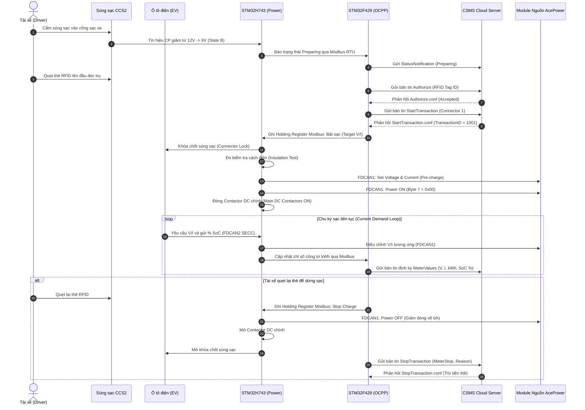
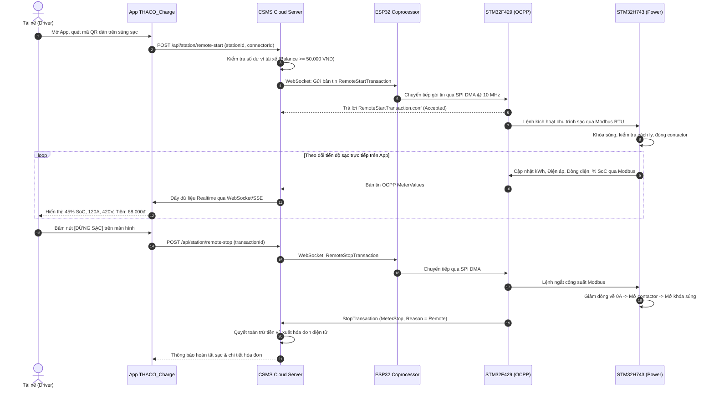
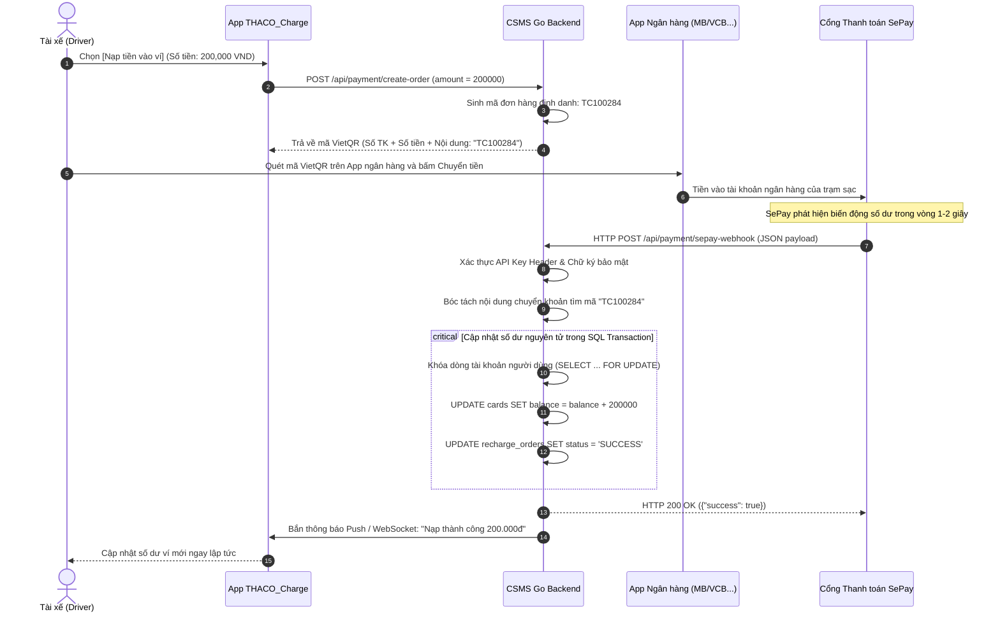
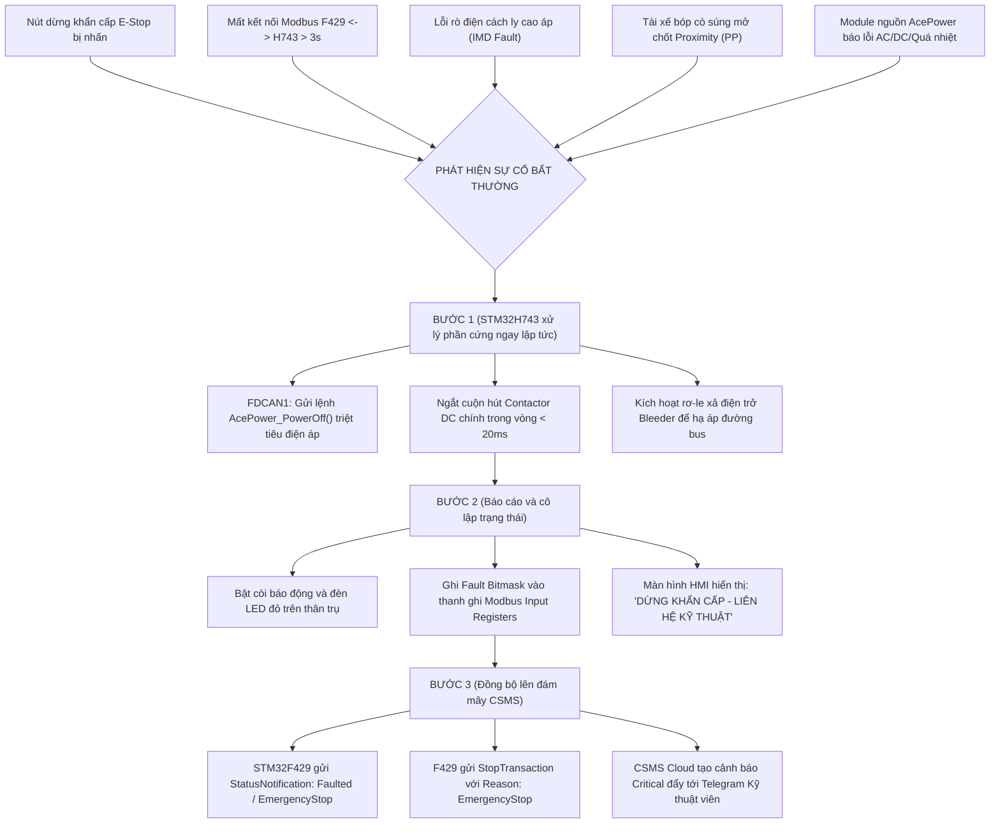
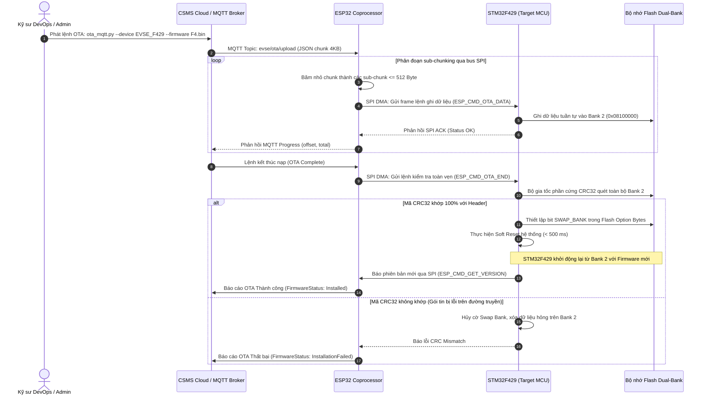

# SƠ ĐỒ CHU TRÌNH NGHIỆP VỤ THỰC TẾ HỆ THỐNG THACO EVSE
## (SYSTEM WORKFLOWS & INTERACTION FLOWCHARTS)

Tài liệu này trực quan hóa toàn bộ các luồng nghiệp vụ quan trọng nhất của trạm sạc: từ lúc tài xế cắm súng, quét thẻ/quét app, cấp nguồn, thanh toán SePay cho đến xử lý ngắt khẩn cấp và nạp firmware từ xa.

---

## 1. QUY TRÌNH 1: SẠC XE BẰNG THẺ RFID TẠI TRỤ

---

## 2. QUY TRÌNH 2: SẠC XE QUA ỨNG DỤNG DI ĐỘNG THACO_CHARGE

---

## 3. QUY TRÌNG 3: NẠP TIỀN TỰ ĐỘNG QUA CỔNG THANH TOÁN SEPAY VIETQR

---

## 4. QUY TRÌNH 4: NGẮT AN TOÀN KHẨN CẤP (FAIL-SAFE & EMERGENCY STOP)

---

## 5. QUY TRÌNH 5: NÂNG CẤP FIRMWARE TỪ XA LIVE DUAL-BANK OTA

